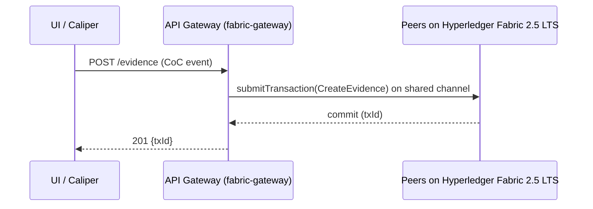
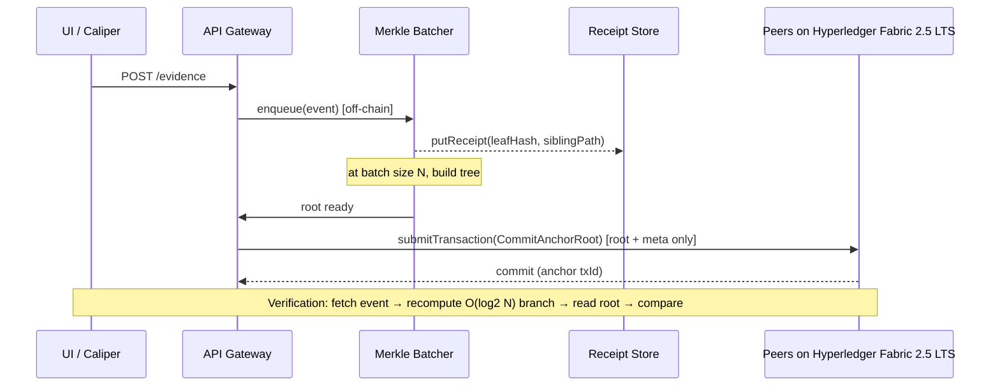
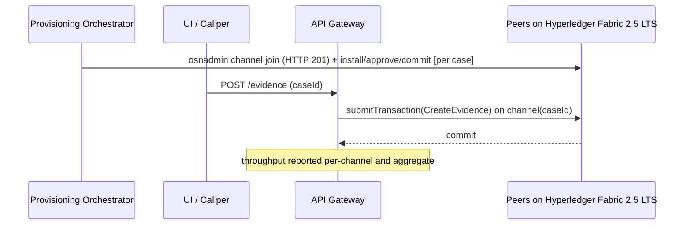
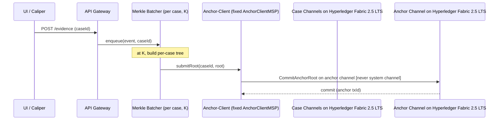

# GLEIPNIR — Architecture & Build-Plan Document

**A four-variant blockchain chain-of-custody (B-CoC) benchmarking system on Hyperledger Fabric 2.5 LTS, run locally via Docker.**
Prepared for: Netsakh Walewangko & Ika Rachmawati (BINUS Cyber Security), two-author undergraduate thesis team.
Document type: architecture + build plan (no starter code — interface signatures, directory trees, and function-responsibility descriptions only).

---

## TL;DR

- **Build a single modular monorepo** where the *only* thing that changes between the four variants (Standard, Anchoring, Parallel, Parallel-Anchored) is the write path to the ledger; the Go chaincode interface (`CreateEvidence`/`TransferCustody`/`AccessLog`/`DisposeEvidence` — renamed from `RemoveEvidence` at M26, CONTRACTS §12-10), the `@hyperledger/fabric-gateway` client API, and the Caliper 0.6.0 workload modules stay constant across all four. The variant is selected by configuration and routing, never by forking the contract or the workloads.
- **Treat lockb0x as a conceptual reference only** — adopt its *Codex Entry* record shape (`id`, `version`, `storage{protocol,location,integrity_proof,jurisdiction}`, `encryption{...}`, `identity{org,process,artifact,subject}`, `anchor{chain,tx_hash,hash_alg}`, `signatures[]`, `previous_id`) and its "signed evidence card + verification badge" UI idiom, but **explicitly de-couple** the concerns that lockb0x fuses into one .NET solution (storage + signing + anchor + verifier). In GLEIPNIR these become independent services with single responsibilities and their own READMEs.
- **The system answers one core research question** — the latency-vs-storage tradeoff of Merkle anchoring — so *verification/audit latency* (fetch event → recompute the O(log₂N) Merkle branch → verify root) is a first-class metric alongside throughput, write latency, and du-measured ledger/state size. Since M26 (supervisor brief 2026-09-22) the measured set also includes success/failure counts + failure rate with a failure-class breakdown, CPU/memory per container, p95 latency from per-transaction capture, **audit reconstruction time** per case and **anchoring delay** (event enqueue → root committed). Scalability claims are drawn **only** from the steady-state regime (≥10³ events/channel), never from the smoke test.

---

## Key Findings (grounding for the design)

These are the verified external facts the architecture is built on. Where a practice is asserted, it is tied to an official source.

1. **No system channel in 2.5.** Fabric 2.5 creates application channels via `configtxgen` (genesis block) + the `osnadmin channel join` REST call against each orderer's admin endpoint; a successful join returns **HTTP 201** with `{"name":...,"consensusRelation":"consenter","status":"active","height":1}` (Fabric `osnadmin channel` docs). The system channel is deprecated in 2.5 and removed in 3.0 — GLEIPNIR uses the term **"anchor channel"** for the dedicated cross-channel root-sink in the Parallel-Anchored variant and **never** "system channel."
2. **Gateway is the supported client path.** Fabric 2.4+ peers run the Fabric Gateway service; the `@hyperledger/fabric-gateway` Node client establishes a session with `connect({identity, signer, hash, client})`, then `gateway.getNetwork(channel).getContract(cc)` exposes `submitTransaction()` (endorse→order→commit) and `evaluateTransaction()` (read-only) (Fabric "Running a Fabric Application" docs; `@hyperledger/fabric-gateway` npm/API docs). This API requires Fabric v2.4 or later with a gateway-enabled peer.
3. **Caliper 0.6.0 uses the peer-gateway connector.** Caliper (`@hyperledger/caliper-core` / `caliper-cli` / `caliper-fabric`) v0.6.0 corresponds to the `caliper-benchmarks` **v0.6.0 tag dated 22 April 2024** (davidkel, commit ba7f322, GitHub Releases). It officially supports Node 18 and Node 20, binds to a Fabric 2.x SUT, and drives transactions through the peer-gateway connector; workload modules extend `WorkloadModuleBase` with `initializeWorkloadModule` / `submitTransaction` / `cleanupWorkloadModule` and issue work via `sutAdapter.sendRequests({contractId, contractFunction, contractArguments, invokerIdentity, readOnly})`.
4. **Caliper metric semantics.** Caliper reports per-round Succ/Fail counts, Send Rate (TPS), Latency max/min/avg (seconds, submit-to-commit), and Throughput (TPS). Note the throughput nuance the team must document: Caliper's `report.js` computes throughput as `(Succ+Fail)/(last commit − first submit)`, while the FAQ text says `Succ/(...)` — GLEIPNIR reports **successful-only throughput** explicitly to avoid this ambiguity (Caliper issue #1418).
5. **MVCC is the concurrency hazard.** Concurrent read-write to the *same* key fails validation with `MVCC_READ_CONFLICT`; the canonical mitigation is one-key-per-entity with `CreateCompositeKey`, so unrelated updates never collide (Fabric chaincode guidance; arXiv HiCoCS 2501.04265 uses composite keys as "virtual sub-brokers" to eliminate conflicts). GLEIPNIR applies this directly: append-only access-log sub-keys `(evidenceId, monotonicCounter)` instead of mutating a single evidence record.
6. **GoLevelDB is a deliberate external-validity limit.** Chosen over CouchDB to remove rich-query overhead and isolate ledger-write performance; the thesis must state that results do not generalize to CouchDB deployments.
7. **Reference performance envelope.** The LF Decentralized Trust "Benchmarking Hyperledger Fabric 2.5 Performance" blog (16 Feb 2023) used two peer orgs (1 peer each) + single Raft orderer, GoLevelDB, Go chaincode, `1 Of Any` endorsement, **SendBufferSize defaulting to 100 in 2.5**, and set the **gateway concurrency limit to 20,000** to avoid hitting concurrency limits. Fabric's own default `gatewayService` concurrency limit is **500** (sampleconfig `core.yaml`); GLEIPNIR keeps the default unless a run is deliberately probing that ceiling. This is the closest published baseline and should frame expectations (single-host results will be lower).
8. **ISO/IEC 27037:2012** defines four handling processes — **identification, collection, acquisition and preservation** of potential digital evidence — the clauses against which the four chaincode operations are annotated.

---

## Details

### 1. Overview & design principles

**Modularity-first rationale.** The governing constraint is that a developer — or an AI coding assistant — debugging one function should need to read **only that module**. Every module therefore has: (a) a one-sentence responsibility, (b) an explicit interface contract (signatures only), (c) an explicit "does NOT do" list, (d) enumerated failure modes, and (e) its own `README.md` stating purpose, public API, inputs/outputs, and which variant(s) use it. Dependencies flow one direction: `frontend → gateway → {fabric-gateway | services} → chaincode`. The frontend never talks to Fabric directly.

**The lockb0x relationship, stated precisely.** lockb0x is a *conceptual reference*, used for exactly two things and nothing else:

- **(a) The Codex Entry evidence-record schema.** GLEIPNIR's on-chain evidence record is *inspired by* the Codex Entry object. The lockb0x normative schema (IETF `draft-tomlinson-lockb0x`, Appendix B; mirrored in the C# `Lockb0x.Core` model) is:

  | Field | Type | Req. | GLEIPNIR mapping |
  |---|---|---|---|
  | `id` | string (uuid) | ✓ | `evidenceId` (UUIDv4) |
  | `version` | string | ✓ | schema/version tag |
  | `storage` | object `{protocol, location, integrity_proof, jurisdiction}` | ✓ | off-chain binary pointer + `integrity_proof` = ni-URI (RFC 6920) hash of the binary |
  | `encryption` | object `{alg, key_id, last_controlled_by}` | – | optional, carried if evidence is encrypted at rest |
  | `identity` | object `{org, process, artifact, subject}` | ✓ | `org`=owning MSP, `subject`=custodian |
  | `anchor` | object `{chain, tx_hash, hash_alg}` | ✓ | in Standard/Parallel: the Fabric txID that wrote the record; in Anchoring variants: the Merkle-root anchor tx |
  | `signatures` | array `{alg, kid, signature}` | ✓ | endorser/custodian signatures |
  | `previous_id` | string (uuid) | – | prior custody record → forms the custody chain |

  **Where lockb0x couples concerns and how GLEIPNIR restructures it:**

  | lockb0x coupling | Modular replacement in GLEIPNIR |
  |---|---|
  | `storage.integrity_proof` is produced *inside* the same code path that signs and anchors (Core+Signing+Anchor invoked together in the example flow) | Integrity hashing is the caller's responsibility; the **chaincode only stores** the record. Hashing/signing lives in the gateway BFF; anchoring lives in a **separate anchor-client service**. |
  | `anchor` is chain-agnostic but hard-wired to Stellar/Eth adapters in one solution | `anchor` is Fabric-native; the anchor sink is an **anchor channel**, addressed only by the anchor-client. |
  | Verifier is one monolithic pipeline (schema→canonicalize→integrity→signature→anchor→revision→certificate) | GLEIPNIR's **verification service** does exactly one measurable thing: fetch event → recompute O(log₂N) branch → verify root. Schema/signature checks are separate concerns not on the timed path. |
  | Storage adapters, signing, anchoring, and CLI share one `.sln` with cross-project references | Each becomes an independently runnable service (`/services/*`) with its own README and Docker service. |

- **(b) Frontend presentation patterns.** lockb0x renders a Codex Entry as a signed "evidence card" with a pass/fail **verification badge** (its Verifier reports stepwise: schema, canonicalization, integrity, signature, anchor). GLEIPNIR's CoC Demo UI reuses this idiom — an evidence card + a Merkle-verification badge — but nothing of lockb0x's implementation.

All Mermaid diagram labels say **"on Hyperledger Fabric 2.5 LTS"**, never "on lockb0x."

**Conjecture flags.** Any single-host throughput figure, and any claim that Parallel scales linearly with channel count, must be marked *conjecture until measured*. The single host is the binding constraint: the E2 channel grid (5–50, `benchmark/sweeps.yaml`) is bounded by the host's core count (Fabric's performance guidance: one CPU core per fully-loaded channel), and the E3 experiments run at the calibrated **baseline** channel count (the median of E2's healthy range, never its maximum — supervisor brief 2026-09-22; `docs/methodology/experiments.md`).

---

### 2. Repository layout

```
gleipnir/
├── README.md                         # top-level: what each dir is, build order pointer
├── network/                          # Fabric config — version-controlled, referenced by commit SHA
│   ├── configtx/configtx.yaml        # profiles incl. per-case app-channel + anchor-channel
│   ├── core.yaml                     # peer config (GoLevelDB, gatewayService limit)
│   ├── orderer.yaml                  # etcdraft
│   ├── crypto/                       # cryptogen / Fabric CA 1.5.19 enrollment scripts
│   ├── compose/
│   │   ├── compose-net.yaml          # peers, orderers
│   │   ├── compose-ca.yaml           # 2 CAs
│   │   └── compose-services.yaml     # batcher, receipt-store, anchor-client, case-registry, evidence-store, gateway, frontend
│   └── README.md
├── chaincode/
│   └── evidence/                     # Go 1.25.5 — the 4 ops + MVCC sub-key design
│       ├── contract.go               # interface + tx routing
│       ├── model.go                  # Codex-Entry-inspired record
│       ├── keys.go                   # composite-key builders
│       └── README.md
├── services/
│   ├── merkle-batcher/               # off-chain batch accumulation + tree build + root-commit trigger
│   │   └── README.md
│   ├── receipt-store/                # leaf hash + sibling path persistence (weaker integrity guarantee)
│   │   └── README.md
│   ├── anchor-client/                # cross-channel root submission, fixed identity/MSP/policy
│   │   └── README.md
│   └── verification/                 # audit-latency path: fetch → recompute branch → verify root
│       └── README.md
│   ├── case-registry/                # M13a: off-chain Case entity + evidence search read-model (SQLite)
│   │   └── README.md
│   ├── evidence-store/               # M13b: immutable off-chain evidence blobs + ni-URI proofs
│   │   └── README.md
├── gateway/                          # Node 20 fabric-gateway backend-for-frontend (REST)
│   ├── src/ (routes, connectors, variant-router, auth/users/sessions, serviceClients)
│   └── README.md
├── benchmark/                        # Caliper 0.6.0
│   ├── sweeps.yaml                   # single source of truth: E1–E3 grids, baseline constants, workload shape
│   ├── networks/                     # per-variant, per-channel network configs (parallel-c{C} rendered by rounds.py)
│   ├── benchmarks/                   # committed smoke-<variant>.yaml only; steady rounds render per run
│   ├── trace/generate.js             # M26 seeded transaction-trace generator (replayed identically across variants)
│   ├── workload/                     # trace.js, createEvidence/transferCustody/accessLog/disposeEvidence.js, read.js, verify.js, lib/txlog.js
│   ├── audit/reconstruct.js          # M26 audit-reconstruction harness (host-side, via the gateway)
│   └── README.md
├── frontend/                         # Evidence-library SPA (M14): auth/, components/, pages/{admin,investigator,shared}
│   └── README.md
├── orchestration/                    # variant select / provision / ledger reset / experiment driver / metrics
│   ├── up.sh  down.sh  reset-network.sh  backup-volumes.sh  provision-channel.sh
│   ├── rounds.py  experiment.py  checkpoint.py  collect.py  report.py
│   └── README.md
└── docs/                             # this document, contracts, as-built, methodology/experiments.md, audit/
```

**Methodology hook:** `/network` is version-controlled and every benchmark run records the **commit SHA** of `configtx.yaml`, `core.yaml`, `orderer.yaml` (and the compose files) in its results manifest, so results are reproducible against exact config.

---

### 3. Docker Compose topology

Organized as three Compose v2 files under `/network/compose`, brought up together (`docker compose -f compose-net.yaml -f compose-ca.yaml -f compose-services.yaml up`). Structure mirrors `fabric-samples/test-network/compose` but is renamed and extended.

| Service | Count | Notes |
|---|---|---|
| `peer0.org1` / `peer0.org2` | 2 | 1 peer/org acceptable single-host; GoLevelDB (no CouchDB container) |
| `orderer0/1/2` | 3 | etcdraft; **recommend 3 for a genuine Raft quorum** so the ordering path is representative. A 1-orderer dev fallback is acceptable only for smoke tests and must be labeled as such — a single-node Raft cannot exhibit quorum/replication cost and would understate ordering latency. |
| `ca_org1` / `ca_org2` | 2 | Fabric CA 1.5.19 |
| `cli`/tools | 1 | peer CLI + `osnadmin` + `configtxgen` for provisioning |
| `merkle-batcher` | 1 | Anchoring + Parallel-Anchored only |
| `receipt-store` | 1 | Anchoring + Parallel-Anchored only |
| `anchor-client` | 1 | Parallel-Anchored only |
| `case-registry` | 1 | all variants (base profile); off-chain Case entity + evidence read-model; SQLite on `case-registry-data` volume; `node:20.19-slim` (glibc for better-sqlite3 — documented deviation) |
| `evidence-store` | 1 | all variants (base profile); immutable evidence blobs on `evidence-blob-data` volume |
| `gateway` (BFF) | 1 | Node 20; the only component holding fabric-gateway sessions; user auth store on `gateway-auth-data` volume |
| `frontend` | 1 | static/SSR app, talks only to gateway |
| Caliper | attaches | run as a host process or a `hyperledger/caliper` container on the compose network; binds SUT `fabric:2.5`, points at the same TLS/MSP material |

**Named volumes for measurable storage metrics.** Ledger block-store and state DB must live at stable, named paths so `du` checkpoints are comparable across runs:

```yaml
volumes:
  peer0org1_ledger:   # → /var/hyperledger/production   (blockstore + GoLevelDB stateLeveldb)
  peer0org2_ledger:
  orderer0_ledger:    # → /var/hyperledger/production/orderer
```

The metrics collector runs `du -sb` against `/var/hyperledger/production/ledgersData/chains/…` (block store, per-channel) and `/var/hyperledger/production/ledgersData/stateLeveldb` (world state) inside each peer container at checkpoints.

**Caliper attachment.** Caliper connects as a gateway client from Org1 using the User1 identity; its network config references the peer's TLS CA cert, the client signed cert + key, and the target channel(s). For multi-channel (Parallel) runs, one network config per channel is generated by the provisioning orchestrator.

---

### 4. Backend module specifications

For each module: responsibility, I/O, interface contract (signatures only), explicit non-goals, failure modes, variant use.

#### 4.1 Chaincode (`/chaincode/evidence`, Go) — used by ALL variants
**Responsibility:** deterministically persist chain-of-custody audit records (and Merkle roots) to a channel's world state; nothing else.

Interface (Go, contractapi):
```go
CreateEvidence(ctx, evidenceId, codexEntryJSON string) error
TransferCustody(ctx, evidenceId, newCustodian, reason string) error
AccessLog(ctx, evidenceId, actor, action string) error
DisposeEvidence(ctx, evidenceId, reason string) error   // M26: was RemoveEvidence (CONTRACTS §12-10)
// Anchoring variants only — writes a root, not per-event records:
CommitAnchorRoot(ctx, batchId, merkleRoot, metaJSON string) error
// reads (evaluate):
ReadEvidence(ctx, evidenceId) (string, error)
GetAuditTrail(ctx, evidenceId) (string, error)   // range over sub-keys
```

**ISO/IEC 27037 annotation:**

| Op | 27037 process |
|---|---|
| `CreateEvidence` | **Identification** + first-record of collection — registers a source of potential evidence |
| `TransferCustody` | **Preservation** — documented custody transfer maintaining integrity |
| `AccessLog` | **Preservation** — records who accessed/what action (auditability) |
| `DisposeEvidence` | **Preservation** (disposition) — terminal status transition to `DISPOSED`; nothing is deleted, no further mutation (op tag `DISPOSE`) |

**MVCC sub-key design (the critical correctness point).** Access-log writes must NOT mutate one evidence record (that guarantees `MVCC_READ_CONFLICT` under concurrent load). Instead, each op appends an immutable event under a composite key:
```
CreateCompositeKey("evt", []string{evidenceId, zeroPad(monotonicCounter)})
```
The evidence "head" record stores metadata + the current counter high-watermark; per-event records are append-only, so concurrent `AccessLog` calls to the same evidence write to *distinct* keys and never conflict. `GetAuditTrail` uses `GetStateByPartialCompositeKey("evt", evidenceId)`. The monotonic counter is derived client-side/per-worker to avoid a shared hot counter key (which would itself be a conflict point).

**Does NOT:** store evidence binaries (always off-chain, all variants), hash payloads, sign, or reach other channels. **Failure modes:** `MVCC_READ_CONFLICT` (retryable), `ENDORSEMENT_POLICY_FAILURE`, phantom-read on range queries, key-not-found.

#### 4.2 Merkle batcher (`/services/merkle-batcher`) — Anchoring, Parallel-Anchored
**Responsibility:** accumulate events off-chain into batches and, at a batch boundary, build a Merkle tree and emit the root for on-chain commit.

Interface (Node):
```ts
enqueue(event: CoCEvent): Promise<{batchId, leafIndex}>
onBatchBoundary(): Promise<{batchId, merkleRoot, leaves: Hash[]}>   // size BATCH_SIZE, BATCH_FLUSH_MS timer, or POST /flush
buildTree(leaves: Hash[]): {root: Hash, layers: Hash[][]}
siblingPath(batchId, leafIndex): Promise<Hash[]>                    // O(log₂N)
status(): {variant, batchSize, flushTimeoutMs, queues, counters, batches: BatchRecord[]}   // M26
```
Batch size: **one grid for both anchored variants**, `batch_sizes: [10, 25, 50, 100, 200]` (`benchmark/sweeps.yaml`; env `BATCH_SIZE`, CONTRACTS §12-13) — Anchoring uses one `shared` queue, Parallel-Anchored one queue per case, at the same size. `BATCH_FLUSH_MS` (0 = size-only) is a held-constant control. Each receipt carries `evidenceId` and the CoC `event` as enqueued (the off-chain trail copy; leaf hash unchanged). Each closed batch keeps `openedAt`/`closedAt`/`committedAt`, `forced` and `delayMs {min, mean, max}` — the **anchoring delay** metric (CONTRACTS §5, §12-17). **Does NOT:** submit to the ledger (delegates to gateway/anchor-client), persist receipts (delegates to receipt-store), verify, or observe the block commit independently (`committedAt` = the submit returned). **Failure modes:** partial batch at run end (`POST /flush`), duplicate enqueue (409), root-submit failure (batch `degraded`, `committedAt` null), hash-alg mismatch.

#### 4.3 Receipt store (`/services/receipt-store`) — Anchoring, Parallel-Anchored
**Responsibility:** persist each event's off-chain witness = `{leafHash, siblingPath[], batchId, leafIndex, rootRef}` **plus** (M26) the CoC event copy `{evidenceId, event}`, and keep a plain per-evidence index so an evidence's off-chain trail can be listed back (CONTRACTS §12-11).

Interface:
```ts
putReceipt(eventId, receipt): Promise<void>            // also appends eventId to idx/<evidenceId>.txt
getReceipt(eventId): Promise<Receipt>
listByEvidence(evidenceId): Promise<Receipt[]>         // GET /receipts?evidenceId= ; first-PUT (leaf) order, [] if none
```
**Explicit integrity caveat (must appear in the thesis):** the receipt store does **not** carry on-chain integrity guarantees. Only the Merkle *root* is on-chain and tamper-evident; the sibling path, the event copy and the index live off-chain — no hashes, signatures or replication on any of them. This is an **availability exposure of the witness** (losing/corrupting a receipt means you cannot *reconstruct* a proof), **not an integrity exposure of the ledger** (the anchored root cannot be forged; a tampered event copy fails root verification because the verifier recomputes the leaf from it). **Does NOT:** compute trees, verify, or sort/reconcile the trail. **Failure modes:** receipt loss (→ unverifiable event), index loss (→ empty trail listing while per-event GETs still work), storage full, stale root reference.

#### 4.4 Anchor-client (`/services/anchor-client`) — Parallel-Anchored ONLY
**Responsibility:** submit per-case Merkle roots to the dedicated **anchor channel**, because Fabric chaincode in one channel cannot write to another.

Interface:
```ts
submitRoot(caseId, batchId, merkleRoot, meta): Promise<{txId}>
```
**Fixed, held-constant identity (specify explicitly and never vary across runs):** a dedicated `AnchorClientMSP` identity enrolled via Fabric CA 1.5.19; submits `CommitAnchorRoot` on the anchor channel under endorsement policy **`AND('AnchorClientMSP.member')`** (single-org endorsement, kept constant so anchoring cost is a controlled variable). **Does NOT:** build trees, touch per-case app channels, or store receipts. **Failure modes:** anchor-channel unavailable, endorsement failure, identity/MSP misconfiguration, `MVCC` on the root key (avoided by keying roots on `(caseId, batchId)`).

#### 4.5 Verification service (`/services/verification`) — the audit-latency metric path
**Responsibility:** measure verification/audit latency: fetch event → recompute O(log₂N) branch → verify against the anchored root.

Interface:
```ts
verifyEvent(eventId): Promise<{ok: boolean, latencyMs: number, leafSource: 'event'|'receipt', steps: {fetch, recompute, compareRoot}}>
```
Path: `receipt-store.getReceipt` → recompute the leaf from the receipt's `event` copy (M26; `leafSource: 'event'` — the stored `leafHash` is used only for pre-M26 receipts) and fold it to a root using the sibling path → `evaluateTransaction("ReadAnchorRoot", ...)` (via the gateway on Anchoring, the anchor-client on Parallel-Anchored) → compare. **This is a formal, required metric** — it is the numerator of the latency-vs-storage tradeoff the Anchoring study exists to quantify. The per-case counterpart — **audit reconstruction time** (fetch every evidence trail of a case, verify every event's branch, read each distinct root once) — is measured host-side by `benchmark/audit/reconstruct.js` through the gateway (`?proofs=1` + `/anchor-roots`), for all four variants (on-chain trail on Standard/Parallel; CONTRACTS §10). **Does NOT:** verify signatures/schema (out of the timed path; keeps the measurement about Merkle verification only), or trust the stored leaf when an event copy is present. **Failure modes:** missing receipt, root mismatch (tamper signal), malformed receipt (422), anchor-channel read error.

#### 4.6 Provisioning orchestrator (`/orchestration`) — Parallel, Parallel-Anchored
**Responsibility:** automate per-case channel lifecycle and generate matching Caliper configs.

Interface (shell/Python):
```
provision-channel.sh <caseId>   # configtxgen genesis → osnadmin channel join (expect HTTP 201)
                                 # → peer join → install/approve/commit chaincode
                                 # → emit benchmark/networks/<caseId>.yaml
teardown.sh <caseId>
```
Uses `osnadmin channel join` (mutual-TLS to each orderer admin endpoint); asserts **HTTP 201** on success. Channel counts come from `benchmark/sweeps.yaml` (E2 `channel_counts` 5–50, bounded by host cores; E3 at `baseline.channels`); `experiment.py` provisions whichever `case-NNN` channels a run needs and `reset-network.sh` (M26) gives every run a fresh ledger without touching the library volumes. **Does NOT:** run benchmarks or collect metrics. **Failure modes:** genesis profile mismatch, orderer not in consenter set, chaincode approval quorum not met, port exhaustion on single host.

#### 4.7 Metrics collector (`/orchestration/checkpoint.py`, `collect.py`, `report.py`)
**Responsibility:** aggregate Caliper outputs, the per-transaction logs, the batcher's batch records, the audit harness output and filesystem probes into a per-run manifest, then into per-experiment tables and charts.

Interface:
```
checkpoint.py <runPath> --label tK     # du -sb on blockstore (per channel) + GoLevelDB dir + receipt store → checkpoints.jsonl (t0 .. tN, one per round)
collect.py <run-dir> [--baseline R]    # caliper.log round table + docker resource stats, tx-w*.jsonl percentiles/failure classes,
                                       # OLS bytes/event over the checkpoint series, anchoring.json, audit.json → manifest.json
report.py --exp E [--out docs/results/E]   # CSV + Markdown tables (units in headers, mean ± SD over reps) + PNG charts per metric, one line per variant
```
Metrics captured (CONTRACTS §10 manifest schema): send rate (configured) and measured send rate; throughput, successful-only (per-channel derived + aggregate for multi-channel cells); write latency min/avg/max (Caliper) + p50/p95/p99 (per-transaction capture, per round and per operation type); success/failure counts, failure rate (%) and the failure classes `MVCC_READ_CONFLICT` / `ENDORSEMENT_POLICY_FAILURE` / `TIMEOUT` / `HTTP_4XX` / `HTTP_5XX` / `OTHER`; CPU (%) and memory (MB) per container from Caliper's docker monitor with `fabric` / `offchain` / `all` groups; verification latency (§4.5, the `VERIFY` op); audit reconstruction time per case (`reconstruct.js`); anchoring delay (batcher batch records, leafCount-weighted, forced batches also reported excluded); ledger size per channel (app + anchor channel), state DB size and off-chain receipt-store size at every checkpoint; bytes/event via OLS regression over the checkpoint series (≥ 3 points) with the t0→tN delta as cross-check. **Storage compression is reported as reduction in log-PAYLOAD bytes vs Standard, not a clean 1/N of the whole ledger** (block headers, endorsements, and metadata do not compress with N), with off-chain bytes shown alongside. **Does NOT:** generate load, or fold the verification service's own `verify.jsonl` into the manifest (a secondary trace). **Failure modes:** container path drift (mitigated by named volumes), clock skew, Caliper results table absent (run marked `incomplete`), fabric-mode failures carry no error string in the tx-log (classified from `caliper.log`).

#### 4.8 Case registry (`/services/case-registry`, port 4005) — evidence library (M13a), all variants
**Responsibility:** own the OFF-CHAIN Case entity (name/status/participant roster) and the evidence search read-model (`evidence_index`), plus the gateway's per-evidence authz pre-flight. Case-evidence linkage lives here and only here — no chaincode or Codex-Entry change. Case ids are `CASE-<uuid>`, deliberately disjoint from the Parallel variants' `case-NNN` channel key.

Interface (REST, internal-only via gateway, `X-Gleipnir-Internal-Token`):
```
POST/GET/PATCH /cases[/:caseId]                      # CRUD + participant/evidence rosters
POST/DELETE    /cases/:caseId/participants[/:userId] # grant/revoke (viewer|contributor)
POST/DELETE    /cases/:caseId/evidence[/:evidenceId] # categorize (409 cross-case) / uncategorize
POST/GET/PATCH /evidence-index[/:evidenceId]         # read-model rows; search with visibility scoping
GET            /internal/authz?userId=&evidenceId=   # {allowed, caseId, roleInCase}
```
Datastore: better-sqlite3 at `DATA_DIR/case-registry.db` (volume `case-registry-data`); image `node:20.19-slim` — deliberate glibc deviation for prebuilt native binaries (CONTRACTS §12-7). **Does NOT:** authenticate end users (gateway's job), store blobs, or touch Fabric; `evidence_index` is a cache — the ledger stays authoritative for status/custodian. **Failure modes:** 401 (internal token), 400/404/409 per CRUD semantics; a stale cache row is a display glitch, never an integrity problem.

#### 4.9 Evidence store (`/services/evidence-store`, port 4006) — evidence library (M13b), all variants
**Responsibility:** persist evidence BINARIES off-chain (the invariant across all four variants: bytes never go on-chain) and compute the RFC 6920 ni-URI integrity proof the ledger records. Blobs are **immutable** — one `PUT` per id, enforced with an exclusive-create write.

Interface (REST, internal-only via gateway, `X-Gleipnir-Internal-Token`):
```
PUT    /blobs/:evidenceId          # raw bytes → 201 {integrityProof,sizeBytes,storedAt}; 409 if exists; 413 over MAX_UPLOAD_BYTES
GET    /blobs/:evidenceId[/meta]   # attachment stream / sidecar JSON
GET    /blobs/:evidenceId/verify?expected=<ni-uri>   # recompute + compare
DELETE /blobs/:evidenceId          # ingest-failure rollback ONLY
```
Datastore: filesystem only — `DATA_DIR/<id>` blob + `<id>.meta.json` sidecar (volume `evidence-blob-data`); `niUri()` copied byte-identically from `gateway/src/ni.js` (CONTRACTS §4 discipline). **Does NOT:** index/search (case-registry's job), mutate stored blobs, or write on-chain. **Failure modes:** 400 (unsafe id / empty body), 404, 409 (immutable), 413, filesystem errors.

---

### 5. Frontend specification

**Stack: plain React + Vite (TypeScript) + react-router v6, served static behind Nginx in one small container.** Vite gives fast local builds and a trivial Docker image; nginx's SPA fallback makes deep links refresh-safe. The frontend **talks only to the API gateway** (REST/JSON), never to Fabric.

**M14 reframing:** the original two-scope toggle (dashboard / CoC demo) became a
multi-page evidence-library app with real login. The old demo's components
(`EvidenceCard`, `AuditTrail`, `MerkleBadge`, `SessionTrail`, the forms) live on
inside the library pages. The operator dashboard that M14 kept as an admin route was
REMOVED in M27 (CONTRACTS §12-19): the benchmark is driven by the desktop app
`orchestration/benchapp.pyw`, not by the web interface.

| Area | Pages/Components | Does |
|---|---|---|
| `auth/` | `AuthContext`, `LoginPage`, `RequireAuth`, `RequireRole` | session token (localStorage), login/logout, route guards; 401 anywhere drops the session |
| investigator | `IngestPage` | real file upload (multipart) → evidence-store bytes + on-chain ni-URI proof; optional case at ingest (contributor role) |
| investigator | `MyCasesPage`, `CaseDetailPage` | participant-scoped case list; case metadata + participant roster + evidence roster (file/type/size/uploader/status) |
| investigator | `EvidenceDetailPage` | `EvidenceCard` + `AuditTrail` + `MerkleBadge` + download/export + transfer/access forms; opening it demonstrates the server-side auto-`AccessLog(view)` |
| investigator | `SearchPage` | evidence-index + case search, participant-scoped server-side |
| admin | `UsersPage`, `CasesAdminPage` | user management (deactivate-not-delete); case creation, roster grants, categorize/uncategorize |

Routes: `/login` public; `/ingest`, `/cases[/:caseId]`, `/evidence/:evidenceId`,
`/search` require a session; `/admin/users`, `/admin/cases` require the admin
role (server-enforced too).

Keep it simple and usable; no state-management library beyond React context.

---

### 6. API gateway specification (`/gateway`, Node 20, REST)

The BFF holds the only `@hyperledger/fabric-gateway` sessions and encapsulates variant routing.

| Endpoint | Maps to | Variant routing / notes |
|---|---|---|
| `POST /evidence` | `CreateEvidence` | **Standard/Parallel:** `submitTransaction` direct. **Anchoring/Parallel-Anchored:** `batcher.enqueue`, root committed at boundary. **Multipart (M13c):** blob → evidence-store, head committed with the store's ni-URI proof, evidence-index row registered; the library caseId never reaches the chain |
| `POST /evidence/:id/transfer` | `TransferCustody` | same routing rule; user sessions need a writing case role |
| `POST /evidence/:id/access` | `AccessLog` | same routing rule; user sessions need a writing case role |
| `DELETE /evidence/:id` | `DisposeEvidence` (op `DISPOSE`, status `DISPOSED` — a status transition, never a deletion) | same routing rule; best-effort evidence-index status sync |
| `GET /evidence/:id` | `ReadEvidence` (evaluate) — **batched variants (M26):** head folded from the off-chain trail, `offChain: true` | direct; user sessions: authz-gated + synchronous auto-`AccessLog(view)` |
| `GET /evidence/:id/audit?proofs=1`, `GET /anchor-roots/:scopeId/:batchId` | off-chain trail with each event's Merkle witness; the on-chain root record | M26 audit-reconstruction surface (CONTRACTS §6, §12-12); any authenticated principal; the gateway verifies nothing itself |
| `GET /evidence/:id/download` | evidence-store stream | user sessions: authz-gated + auto-`AccessLog(download)` |
| `GET /evidence/:id/export` | `{record, auditTrail}` bundle | user sessions: authz-gated + auto-`AccessLog(export)` |
| `GET /evidence/:id/audit` | `GetAuditTrail` (evaluate) | direct; authz-gated, never auto-logged |
| `GET /evidence/:id/verify` | verification service | Anchoring variants only |
| `GET /evidence/search`, `/cases/search` | case-registry search | participant-scoped unless admin |
| `POST/GET/PATCH /cases[/:id]`, participants, categorize | case-registry proxy | create/update/roster/categorize admin-only |
| `POST /auth/login\|logout`, `GET /auth/me`, `/admin/users*` | users/sessions stores (M12) | user management admin-only |

**Variant selection changes routing, not contracts:** a single `variantRouter` reads the active variant and either calls `fabricGateway.submit()` (Standard/Parallel — with a `targetChannel` = per-case channel for Parallel) or `batcher.enqueue()` (Anchoring/Parallel-Anchored).

**Auth (M12 — the authorized reopening of the auth deferral):** two principals.
The static `GLEIPNIR_TOKEN` service path is contract-unchanged (guards everything
after `/healthz`, internal routes included; client-supplied actors honored —
Caliper/batcher/verification/smoke all use it). User sessions come from
`POST /auth/login` (opaque token, scrypt-hashed users in `AUTH_DATA_DIR`, roles
`admin`|`lead`|`investigator` enforced server-side since M18 — leads create and
manage their own cases, admins lose blob-content access off their cases
(CONTRACTS §12-8) — first admin seeded from
`ADMIN_USERNAME`/`ADMIN_PASSWORD`). Under a user session the audit actor is always
the authenticated username; per-evidence access is pre-flighted against
case-registry `/internal/authz`; view/download/export auto-append `AccessLog`
synchronously (never for the service token — benchmark reads must not write).
Still non-production-grade by design (single host, no TLS, no password policy).

---

### 7. Variant execution flows (Mermaid source)

**Variant 1 — Standard**


**Variant 2 — Anchoring (single channel + Merkle batcher + receipt store)**


**Variant 3 — Parallel (one channel per case)**


**Variant 4 — Parallel-Anchored (per-case channels + per-case batching → anchor channel)**


---

### 8. Benchmark integration

**How Caliper 0.6.0 attaches per variant.** One workspace under `/benchmark`; bind `fabric:fabric-gateway` (the peer-gateway connector; `fabric:2.5` is an alias). The **same workload modules** run against every variant — only the network config, the `mode` round argument and the gateway's routing differ (M26, supervisor brief 2026-09-22; CONTRACTS §10, §12-14):

- **Standard / Parallel** (`mode: fabric`): workloads call `sendRequests({contractId:'evidence', contractFunction, contractArguments, invokerIdentity:'User1', readOnly, channel?})`; for Parallel, the per-channel network config `networks/parallel-c{C}.yaml` is rendered by `orchestration/rounds.py`, load is spread round-robin across `case-001..case-00C` in ONE round, and results are reported aggregate + derived per-channel.
- **Anchoring / Parallel-Anchored** (`mode: rest`): the same workloads drive the gateway's REST enqueue path through the custom connector (`benchmark/connectors/rest/`); a "committed" write there is the gateway's `202` enqueue acknowledgement (BFF-path latency), and the ledger commit lag is the separate anchoring-delay metric. `verify.js` exercises the verification service so verification latency is measured under load.

**Trace replay (the determinism contract).** `benchmark/trace/generate.js` pre-generates one seeded transaction trace per configuration (`seed`, cases, channels, evidence per case, events per case per round, rounds, workers, mix, payload bytes — all from `sweeps.yaml`); `workload/trace.js` replays slice `k` of it per round, identically across all four variants. The per-operation rounds (`createEvidence.js`, `transferCustody.js`, `accessLog.js`, `disposeEvidence.js`, `read.js`, `verify.js`) serve the operation breakdown. All extend `WorkloadModuleBase` (`initializeWorkloadModule` / `submitTransaction` / `cleanupWorkloadModule`) and write one JSON line per timed transaction to `${GLEIPNIR_TXLOG_DIR}/tx-w<worker>.jsonl` from Caliper's own `TxStatus` (never on the timed path) — the source of p95, success/failure counts and failure classes.

**Rate control & metrics.** `fixed-rate` controllers; "send rate" is the configured input, "throughput" the measurement, TPS only a unit. Caliper reports Succ/Fail, Send Rate, Latency max/min/avg, Throughput and (docker monitor) per-container CPU/memory. Report **successful-only throughput** explicitly (per issue #1418 ambiguity). `MVCC_READ_CONFLICT` is a distinct, tabulated failure class rather than a hard error (Caliper issue #1397) — the append-only sub-key design should keep it near zero.

**Experiment automation** (`/orchestration/experiment.py`, rendering only via `rounds.py`; paper-facing procedure and level-selection rules in `docs/methodology/experiments.md`): **E0** pilot (smoke shape, all variants, functional only; `ramp` locates approximate saturation) → **E1** batch-size calibration (Anchoring + Parallel-Anchored over the ONE grid `batch_sizes`, with Standard/Parallel reference runs) → **E2** channel-count calibration (Parallel only over `channel_counts`; Parallel-Anchored inherits, Standard/Anchoring are single-channel by code) → **E3a** scalability vs send rate (all four at `baseline.channels`/`baseline.batch_size`, one round per send rate) and **E3b** vs cases (all four over `case_counts ≤ baseline.channels_max`) → **ops** per-operation breakdown at the E3 point (writes and reads in separate tables). Every cell is repeated `repetitions` (r = 3) times as **one network lifetime each** (`reset-network.sh` ledger-only reset), with storage checkpoints `t0..tN` around every round, a batcher flush + `/status` snapshot, audit reconstruction and `collect.py` per run; results under `benchmark/results/<exp>/<variant>/<levels>/r<rep>/`, tables/charts via `report.py`. Calibrated values are carried forward as **baseline** constants in `sweeps.yaml` (never "optimal").

**Two regimes (claim boundary):**
- **Smoke test** — `regimes.smoke`: 10 cases × 10–25 logs at 5 tx/s, functional correctness only (E0). Confirms the pipeline works; **no scalability claim may cite it.**
- **Steady state** — **≥10³ events per channel** (`regimes.steady.min_events_per_channel`); the **only** regime from which scalability/throughput/tradeoff claims are drawn. A run below the floor is labelled `sub-floor`, never `steady` (ops and ramp runs are, by design).

---

### 9. Build order / milestones (dependency-ordered)

| # | Milestone | Acceptance check |
|---|---|---|
| 1 | Network up | `docker compose up` → 2 peers, 3 orderers, 2 CAs healthy; `osnadmin channel join` returns **HTTP 201** for a test channel |
| 2 | Chaincode | `evidence` package installs/approves/commits; `CreateEvidence`→`ReadEvidence` round-trips; concurrent `AccessLog` produces distinct sub-keys with **zero MVCC conflicts** |
| 3 | Gateway | BFF `POST /evidence` commits via fabric-gateway; `GET /evidence/:id` reads back |
| 4 | Standard variant end-to-end | UI create→transfer→access→audit trail renders correctly |
| 5 | Caliper baseline | `createEvidence.js` runs at fixed-rate; report.json parses; throughput/latency populated |
| 6 | Anchoring (batcher + receipts) | Batch of N produces one on-chain root + N receipts; verification service returns `ok:true` and a latency figure |
| 7 | Provisioning automation (Parallel) | `provision-channel.sh` stands up channels for sweep {1,2,5}; per-channel Caliper configs generated |
| 8 | Anchor-client (Parallel-Anchored) | Per-case roots land on the **anchor channel** under fixed `AnchorClientMSP` policy; cross-channel isolation verified |
| 9 | Verification service | Tamper a receipt → `verifyEvent` returns `ok:false`; clean path returns `ok:true` + `latencyMs` |
| 10 | Frontend scopes | Operator dashboard runs a sweep and charts it; CoC demo shows evidence card + Merkle badge |
| 11 | Sweep automation | Full N/K/channel sweep with N-runs loop completes; manifest records config commit SHAs + du checkpoints |
| 12 | Auth & roles (library) | Login issues a session token; an admin-only route 403s an investigator token; `smoke-standard.sh` passes **unmodified** on the service-token path |
| 13 | Case registry & evidence store | Create case → grant participant → upload real bytes → assign to case → `GET /cases/:id` roster correct; non-participant denied |
| 14 | Frontend rebuild | Login routes to role-appropriate nav; ingest → categorize → case detail → evidence detail → download works for an investigator; admin sees Users/Case-Admin/Dashboard |
| 15 | Search & access-log completeness | Participant-scoped search correct; every view/download/export appends exactly one `AccessLog` event (synchronously) |
| 16 | Docs & closeout | `orchestration/smoke-library.sh` passes against `up.sh --variant standard`; CLAUDE.md / ARCHITECTURE / CONTRACTS / AS-BUILT cross-consistent |
| 17 | User `name` rename (library) | `displayName` → `name` across store/API/SPA (CONTRACTS §12-8); a pre-M17 `users.json` upgrades in place on boot and login still works; gateway tests + `smoke-library.sh` pass |
| 18 | 3-tier RBAC (library) | `lead` role lands (user + case level, CONTRACTS §12-8): a lead creates a case and manages its roster; an investigator cannot create; a pre-M18 `case-registry.db` rebuilds its CHECK in place; admin `GET .../download` off-case → 403 while view/audit/export stay 200; `smoke-library.sh` steps 12–14 pass |
| 19 | Forensic ingest metadata (library) | Per-case categories + label/seizedAt/acquisitionLocation/handedOverBy land off-chain (CONTRACTS §12-9): lead creates a category, ingest carries the fields to the read-model, the Codex-Entry head is byte-identical, a bad category 400s before any write; `smoke-library.sh` step 15 passes |
| 20 | Collaboration (library) | Examiner notes (append-only, immutable-by-API), the strict-enum evidence flag, and the synthesized case activity feed land off-chain (CONTRACTS §12-9): contributor notes + flags, viewer reads but cannot write, the feed shows all five event types, and none of it grows the on-chain trail; `smoke-library.sh` step 16 passes |
| 21 | UI kit + admin refresh (frontend) | In-repo primitives (Tabs/Stepper/Modal/Timeline/Badge, no component library) + `AuditTrailTimeline` land with the first frontend vitest tests (`npm test` joins the green bar); UsersPage becomes modal-driven with role badges; leads create cases from My Cases; admin designates a lead at creation |
| 22 | Ingest wizard (frontend) | `/ingest` becomes a 4-step wizard (case+category / metadata with ITEM-NNN auto-suggest / file + local WebCrypto ni-URI hash with progress / review): the local hash is compared against the returned `integrityProof` — match shows "integrity verified end-to-end", mismatch a danger banner; `lib/ni.ts` is vector-tested byte-identical to `gateway/src/ni.js` |
| 23 | Tabbed detail pages (frontend) | EvidenceDetail → Overview / Chain of Custody (`AuditTrailTimeline`, replacing the flat trail) / Examiner Notes; CaseDetail → Overview / Evidence (category+flag columns) / Activity (feed on Timeline) / Team (admin-or-case-lead only, add/remove via modal); flag control + notes composer render only for writers; admin Download hidden off-case; render-tested with a mocked client |
| 24 | CoC export + lead dashboard | `GET /cases/:id/coc-report?format=csv\|json` assembles all exhibit trails (hand-rolled RFC 4180 CSV; one auto-`AccessLog('coc-report')` per exhibit for sessions, none for the service token); `/cases/:id/report` renders the print-optimized court report outside the shell (browser print = PDF); `/lead/dashboard` shows lead cases, flagged evidence, merged team activity; `smoke-library.sh` step 17 passes |
| 25 | Team roster + persistent case activity (library, M25/M25b) | Case-registry seeds every new case with the preset categories Image/Video/Audio/Document/Text as ordinary lead-editable rows; `PATCH /cases/:id/participants/:userId` changes a participant's case role in place and 409s on the last lead; `GET /users/directory` is admin-or-lead only (investigator session and service token 403) and a lead session never sees admin accounts; `GET /cases/:id/activity` reads the persistent append-only `case_audit_log` — one actor-attributed row per management mutation, actor forwarded gateway→registry via `X-Gleipnir-Actor`; `DELETE /evidence/:id` requires case-lead (or the `uploader` pseudo-role on one's own uncategorized evidence) |
| 27 | Benchmark desktop app + dashboard removal | CONTRACTS §12-19: `orchestration/benchapp.pyw` edits every `sweeps.yaml` value in place (comments kept; `test_benchapp.py` round-trips every editable path byte-identically), previews/runs/resumes/cancels e0·ramp·e1·e2·e3a·e3b·ops·cell through WSL with live per-round rows in the supervisor's columns, lists history, exports the per-round CSV (UTF-8 BOM; decimal-comma option) and the mean ± SD tables/charts, suggests the E0/E1/E2 baselines by the methodology rules (written only on confirm, tagged), and backs up every volume before a ledger reset with a verified restore; the web `DashboardPage` and `/api/v1/runs` are gone (`/api/v1/runs` → 404; gateway 81/81, frontend 32/32 + build) |
| 26 | Experimental redesign (supervisor brief 2026-09-22) | CONTRACTS §12-10..17: `RemoveEvidence` → `DisposeEvidence` (`DISPOSE`/`DISPOSED`; `TestDisposeIsTerminal` passes, `smoke-standard.sh` asserts status `DISPOSED`); one `batch_sizes` grid + `BATCH_SIZE`/`BATCH_FLUSH_MS`; receipts carry `evidenceId` + `event`, the receipt store lists by evidence, and `GET /evidence/:id/audit?proofs=1` + `/anchor-roots` serve the off-chain trail on the anchored variants (gateway/batcher/receipt-store/verification suites green, `leafSource` reported); `trace/generate.js` is byte-deterministic (`benchmark npm test`); `rounds.py --static` regenerates the committed smoke/parallel-c* files with zero diff; `experiment.py --exp e3a --dry-run` prints the plan; `collect.py --selftest` passes; and one live E0 run per variant yields a `manifest.json` with `regime: smoke`, tx-log percentiles, failure classes, docker CPU/memory, an `audit.json` and (anchored) an `anchoring.json` with `delayMs` per batch |

---

### 10. Cross-references to thesis constraints

| Locked constraint | Where honored |
|---|---|
| **Anchor-channel terminology (never "system channel")** | §3, §4.4, §7 (Variant 4), §9 (#8); all Mermaid labels |
| **GoLevelDB external-validity limit** | §Key Findings 6; state-size probe in §4.7; must be stated as a threat to generalizability |
| **Receipt-store integrity caveat** | §4.3 — availability exposure of witness, not integrity of ledger |
| **Smoke-test vs steady-state claim boundary** | §8 — scalability claims only from ≥10³-event steady state; `sub-floor` label for runs below it |
| **configtx/core/orderer.yaml by commit SHA** | §2 methodology hook; §4.7 manifest; §9 (#11, #26) |
| **Three-experiment design (E1 → E2 → E3 + ops), one batch grid, "baseline" wording, send rate ≠ throughput** | §8; `benchmark/sweeps.yaml`; `docs/methodology/experiments.md`; CONTRACTS §10, §12-13/14 |
| **STRIDE surface exposed for the threat model** | The implementation deliberately surfaces the four analyzed components as named, separately-deployed units: **off-chain batcher** (§4.2), **receipt store** (§4.3, tampering/repudiation surface), **anchor-client identity/MSP** (§4.4, spoofing/elevation surface), and **chaincode lifecycle** (§4.1 + §9 approve/commit, tampering/DoS surface). Each is its own Docker service so the threat model maps 1:1 to a deployable artifact. |
| **Fabric Gateway concurrency** | §Key Findings 7 — default `gatewayService`=500; document if a run raises it toward the LF-benchmark 20,000 to probe the ceiling |

---

## Recommendations

**Stage 1 — get a correct spine before any benchmarking (Milestones 1–5).** Stand up the 3-orderer Raft network, the four-op chaincode with the append-only `(evidenceId, monotonicCounter)` sub-key design, the gateway BFF, and the Standard variant end-to-end. **Gate:** run 4 Caliper workers issuing concurrent `AccessLog` to the *same* evidence at ≥50 TPS and confirm **zero `MVCC_READ_CONFLICT`**. If conflicts appear, the sub-key design is wrong — fix it here, because every later variant inherits it.

**Stage 2 — Anchoring and the tradeoff metric (Milestones 6, 9).** Implement batcher + receipt-store + verification service. **Gate:** for N=100, one on-chain root must cover 100 receipts, and `verifyEvent` must return a real `latencyMs` and detect a tampered receipt. This is the point at which the thesis's central question becomes measurable.

**Stage 3 — Parallel and Parallel-Anchored (Milestones 7, 8).** Automate per-case channels and the fixed-identity anchor-client. **Gate:** the E2 channel grid provisions cleanly and per-channel throughput is reported separately from aggregate.

**Stage 4 — experiments + write-up (Milestones 10, 11, 26).** Run E0 → E1 → E2 → E3a/E3b → ops with the r = 3 repetition loop (§8); only now draw scalability conclusions, and only from the ≥10³-event steady-state regime.

**Thresholds that change the plan:**
- If single-host throughput collapses (e.g. latency runs away well below the LF-benchmark envelope) before reaching 10³ events, **reduce offered load and worker count** rather than adding channels — the host, not Fabric, is the bottleneck.
- If Parallel throughput does **not** rise with channel count on the single host, report that as the finding (channels contend for the same CPU/disk) — do **not** escalate to channels=10 (already deferred) chasing a multi-host result you cannot produce.
- If `MVCC_READ_CONFLICT` reappears under Parallel-Anchored, suspect a shared root/counter hot key in the anchor-client and re-key on `(caseId, batchId)`.

---

## Caveats

- **Single-host is the dominant external-validity limit.** Every throughput/latency number is a single-machine figure; the channel grid is bounded by the host's core count and E3 runs at the median of E2's healthy range precisely because past it one measures the host running out of CPU, not Fabric. Treat cross-variant *ratios* as more trustworthy than absolute throughput.
- **GoLevelDB choice** removes rich-query cost and isolates write performance, but results do not transfer to CouchDB deployments — state this plainly.
- **Storage "compression" is payload-relative.** Anchoring reduces *log-payload* bytes versus Standard, not the whole ledger by 1/N; block headers, endorsements, and per-block metadata do not shrink with batch size.
- **Receipt store is an availability, not integrity, dependency** — losing receipts makes events unverifiable but cannot forge the anchored root.
- **Caliper throughput semantics are ambiguous in the tool itself** (report.js vs FAQ, issue #1418); GLEIPNIR standardizes on successful-only throughput and must say so in the methodology.
- **Source-quality note:** the Codex Entry field list is authoritative (IETF `draft-tomlinson-lockb0x` Appendix B, cross-checked against the C# `Lockb0x.Core`), but the lockb0x reference implementation is explicitly early-stage (its own README lists Stellar anchoring as mock/in-memory and the CLI/API as not yet integrated) — so GLEIPNIR borrows the *schema shape and UI idiom only*, which is exactly the intended scope. The "3 vs 1 orderer" and "gateway concurrency 500 vs 20,000" figures are configuration choices, not universal constants; document whichever you actually run.
- **Conjecture, flagged as such:** any statement that Parallel scales linearly with channel count, or any projected steady-state throughput, is conjecture until measured on your hardware.