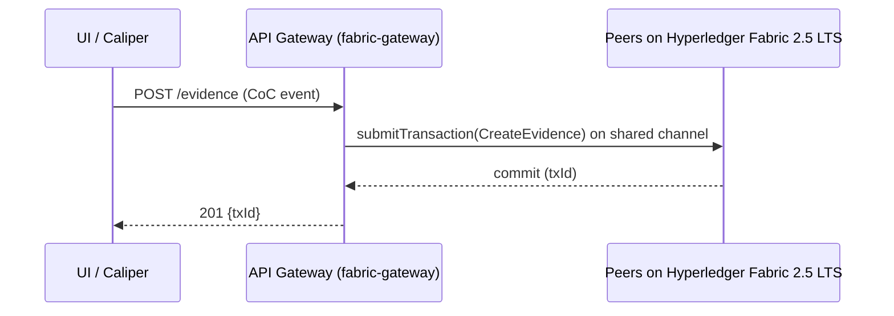
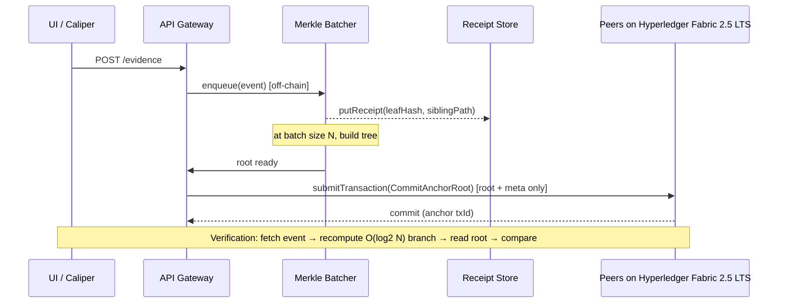
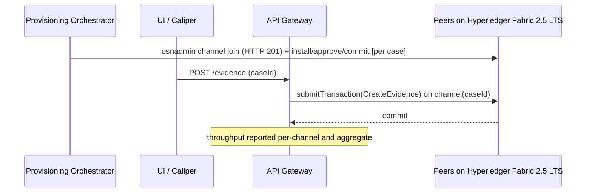
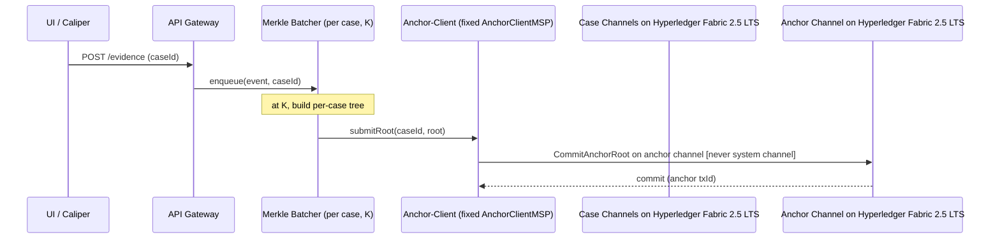

# GLEIPNIR — Architecture & Build-Plan Document

**A four-variant blockchain chain-of-custody (B-CoC) benchmarking system on Hyperledger Fabric 2.5 LTS, run locally via Docker.**
Prepared for: Netsakh Walewangko & Ika Rachmawati (BINUS Cyber Security), two-author undergraduate thesis team.
Document type: architecture + build plan (no starter code — interface signatures, directory trees, and function-responsibility descriptions only).

---

## TL;DR

- **Build a single modular monorepo** where the *only* thing that changes between the four variants (Standard, Anchoring, Parallel, Parallel-Anchored) is the write path to the ledger; the Go chaincode interface (`CreateEvidence`/`TransferCustody`/`AccessLog`/`RemoveEvidence`), the `@hyperledger/fabric-gateway` client API, and the Caliper 0.6.0 workload modules stay constant across all four. The variant is selected by configuration and routing, never by forking the contract or the workloads.
- **Treat lockb0x as a conceptual reference only** — adopt its *Codex Entry* record shape (`id`, `version`, `storage{protocol,location,integrity_proof,jurisdiction}`, `encryption{...}`, `identity{org,process,artifact,subject}`, `anchor{chain,tx_hash,hash_alg}`, `signatures[]`, `previous_id`) and its "signed evidence card + verification badge" UI idiom, but **explicitly de-couple** the concerns that lockb0x fuses into one .NET solution (storage + signing + anchor + verifier). In GLEIPNIR these become independent services with single responsibilities and their own READMEs.
- **The system answers one core research question** — the latency-vs-storage tradeoff of Merkle anchoring — so *verification/audit latency* (fetch event → recompute the O(log₂N) Merkle branch → verify root) is a first-class metric alongside throughput, write latency, and du-measured ledger/state size. Scalability claims are drawn **only** from the steady-state regime (≥10³ events/channel), never from the smoke test.

---

## Key Findings (grounding for the design)

These are the verified external facts the architecture is built on. Where a practice is asserted, it is tied to an official source.

1. **No system channel in 2.5.** Fabric 2.5 creates application channels via `configtxgen` (genesis block) + the `osnadmin channel join` REST call against each orderer's admin endpoint; a successful join returns **HTTP 201** with `{"name":...,"consensusRelation":"consenter","status":"active","height":1}` (Fabric `osnadmin channel` docs). The system channel is deprecated in 2.5 and removed in 3.0 — GLEIPNIR uses the term **"anchor channel"** for the dedicated cross-channel root-sink in the Parallel-Anchored variant and **never** "system channel."
2. **Gateway is the supported client path.** Fabric 2.4+ peers run the Fabric Gateway service; the `@hyperledger/fabric-gateway` Node client establishes a session with `connect({identity, signer, hash, client})`, then `gateway.getNetwork(channel).getContract(cc)` exposes `submitTransaction()` (endorse→order→commit) and `evaluateTransaction()` (read-only) (Fabric "Running a Fabric Application" docs; `@hyperledger/fabric-gateway` npm/API docs). This API requires Fabric v2.4 or later with a gateway-enabled peer.
3. **Caliper 0.6.0 uses the peer-gateway connector.** Caliper (`@hyperledger/caliper-core` / `caliper-cli` / `caliper-fabric`) v0.6.0 corresponds to the `caliper-benchmarks` **v0.6.0 tag dated 22 April 2024** (davidkel, commit ba7f322, GitHub Releases). It officially supports Node 18 and Node 20, binds to a Fabric 2.x SUT, and drives transactions through the peer-gateway connector; workload modules extend `WorkloadModuleBase` with `initializeWorkloadModule` / `submitTransaction` / `cleanupWorkloadModule` and issue work via `sutAdapter.sendRequests({contractId, contractFunction, contractArguments, invokerIdentity, readOnly})`.
4. **Caliper metric semantics.** Caliper reports per-round Succ/Fail counts, Send Rate (TPS), Latency max/min/avg (seconds, submit-to-commit), and Throughput (TPS). Note the throughput nuance the team must document: Caliper's `report.js` computes throughput as `(Succ+Fail)/(last commit − first submit)`, while the FAQ text says `Succ/(...)` — GLEIPNIR reports **successful-only throughput** explicitly to avoid this ambiguity (Caliper issue #1418).
5. **MVCC is the concurrency hazard.** Concurrent read-write to the *same* key fails validation with `MVCC_READ_CONFLICT`; the canonical mitigation is one-key-per-entity with `CreateCompositeKey`, so unrelated updates never collide (Fabric chaincode guidance; arXiv HiCoCS 2501.04265 uses composite keys as "virtual sub-brokers" to eliminate conflicts). GLEIPNIR applies this directly: append-only access-log sub-keys `(evidenceId, monotonicCounter)` instead of mutating a single evidence record.
6. **GoLevelDB is a deliberate external-validity limit.** Chosen over CouchDB to remove rich-query overhead and isolate ledger-write performance; the thesis must state that results do not generalize to CouchDB deployments.
7. **Reference performance envelope.** The LF Decentralized Trust "Benchmarking Hyperledger Fabric 2.5 Performance" blog (16 Feb 2023) used two peer orgs (1 peer each) + single Raft orderer, GoLevelDB, Go chaincode, `1 Of Any` endorsement, **SendBufferSize defaulting to 100 in 2.5**, and set the **gateway concurrency limit to 20,000** to avoid hitting concurrency limits. Fabric's own default `gatewayService` concurrency limit is **500** (sampleconfig `core.yaml`); GLEIPNIR keeps the default unless a run is deliberately probing that ceiling. This is the closest published baseline and should frame expectations (single-host results will be lower).
8. **ISO/IEC 27037:2012** defines four handling processes — **identification, collection, acquisition and preservation** of potential digital evidence — the clauses against which the four chaincode operations are annotated.

---

## Details

### 1. Overview & design principles

**Modularity-first rationale.** The governing constraint is that a developer — or an AI coding assistant — debugging one function should need to read **only that module**. Every module therefore has: (a) a one-sentence responsibility, (b) an explicit interface contract (signatures only), (c) an explicit "does NOT do" list, (d) enumerated failure modes, and (e) its own `README.md` stating purpose, public API, inputs/outputs, and which variant(s) use it. Dependencies flow one direction: `frontend → gateway → {fabric-gateway | services} → chaincode`. The frontend never talks to Fabric directly.

**The lockb0x relationship, stated precisely.** lockb0x is a *conceptual reference*, used for exactly two things and nothing else:

- **(a) The Codex Entry evidence-record schema.** GLEIPNIR's on-chain evidence record is *inspired by* the Codex Entry object. The lockb0x normative schema (IETF `draft-tomlinson-lockb0x`, Appendix B; mirrored in the C# `Lockb0x.Core` model) is:

  | Field | Type | Req. | GLEIPNIR mapping |
  |---|---|---|---|
  | `id` | string (uuid) | ✓ | `evidenceId` (UUIDv4) |
  | `version` | string | ✓ | schema/version tag |
  | `storage` | object `{protocol, location, integrity_proof, jurisdiction}` | ✓ | off-chain binary pointer + `integrity_proof` = ni-URI (RFC 6920) hash of the binary |
  | `encryption` | object `{alg, key_id, last_controlled_by}` | – | optional, carried if evidence is encrypted at rest |
  | `identity` | object `{org, process, artifact, subject}` | ✓ | `org`=owning MSP, `subject`=custodian |
  | `anchor` | object `{chain, tx_hash, hash_alg}` | ✓ | in Standard/Parallel: the Fabric txID that wrote the record; in Anchoring variants: the Merkle-root anchor tx |
  | `signatures` | array `{alg, kid, signature}` | ✓ | endorser/custodian signatures |
  | `previous_id` | string (uuid) | – | prior custody record → forms the custody chain |

  **Where lockb0x couples concerns and how GLEIPNIR restructures it:**

  | lockb0x coupling | Modular replacement in GLEIPNIR |
  |---|---|
  | `storage.integrity_proof` is produced *inside* the same code path that signs and anchors (Core+Signing+Anchor invoked together in the example flow) | Integrity hashing is the caller's responsibility; the **chaincode only stores** the record. Hashing/signing lives in the gateway BFF; anchoring lives in a **separate anchor-client service**. |
  | `anchor` is chain-agnostic but hard-wired to Stellar/Eth adapters in one solution | `anchor` is Fabric-native; the anchor sink is an **anchor channel**, addressed only by the anchor-client. |
  | Verifier is one monolithic pipeline (schema→canonicalize→integrity→signature→anchor→revision→certificate) | GLEIPNIR's **verification service** does exactly one measurable thing: fetch event → recompute O(log₂N) branch → verify root. Schema/signature checks are separate concerns not on the timed path. |
  | Storage adapters, signing, anchoring, and CLI share one `.sln` with cross-project references | Each becomes an independently runnable service (`/services/*`) with its own README and Docker service. |

- **(b) Frontend presentation patterns.** lockb0x renders a Codex Entry as a signed "evidence card" with a pass/fail **verification badge** (its Verifier reports stepwise: schema, canonicalization, integrity, signature, anchor). GLEIPNIR's CoC Demo UI reuses this idiom — an evidence card + a Merkle-verification badge — but nothing of lockb0x's implementation.

All Mermaid diagram labels say **"on Hyperledger Fabric 2.5 LTS"**, never "on lockb0x."

**Conjecture flags.** Any single-host throughput figure, and any claim that Parallel scales linearly with channel count, must be marked *conjecture until measured*. The single host is the binding constraint (hence channel sweep capped at {1,2,5}, with 10 deferred).

---

### 2. Repository layout

```
gleipnir/
├── README.md                         # top-level: what each dir is, build order pointer
├── network/                          # Fabric config — version-controlled, referenced by commit SHA
│   ├── configtx/configtx.yaml        # profiles incl. per-case app-channel + anchor-channel
│   ├── core.yaml                     # peer config (GoLevelDB, gatewayService limit)
│   ├── orderer.yaml                  # etcdraft
│   ├── crypto/                       # cryptogen / Fabric CA 1.5.19 enrollment scripts
│   ├── compose/
│   │   ├── compose-net.yaml          # peers, orderers
│   │   ├── compose-ca.yaml           # 2 CAs
│   │   └── compose-services.yaml     # batcher, receipt-store, anchor-client, gateway, frontend
│   └── README.md
├── chaincode/
│   └── evidence/                     # Go 1.25.5 — the 4 ops + MVCC sub-key design
│       ├── contract.go               # interface + tx routing
│       ├── model.go                  # Codex-Entry-inspired record
│       ├── keys.go                   # composite-key builders
│       └── README.md
├── services/
│   ├── merkle-batcher/               # off-chain batch accumulation + tree build + root-commit trigger
│   │   └── README.md
│   ├── receipt-store/                # leaf hash + sibling path persistence (weaker integrity guarantee)
│   │   └── README.md
│   ├── anchor-client/                # cross-channel root submission, fixed identity/MSP/policy
│   │   └── README.md
│   └── verification/                 # audit-latency path: fetch → recompute branch → verify root
│       └── README.md
├── gateway/                          # Node 20 fabric-gateway backend-for-frontend (REST)
│   ├── src/ (routes, connectors, variant-router)
│   └── README.md
├── benchmark/                        # Caliper 0.6.0
│   ├── networks/                     # per-variant, per-channel network configs
│   ├── benchmarks/                   # round configs; sweep defs for N, K, channel-count
│   ├── workload/                     # createEvidence.js, transferCustody.js, accessLog.js, verify.js
│   └── README.md
├── frontend/                         # Operator dashboard + CoC demo UI (one app, two scopes)
│   └── README.md
├── orchestration/                    # variant select / provision / teardown / metric checkpoint
│   ├── up.sh  down.sh  provision-channel.sh  checkpoint.py  sweep.py
│   └── README.md
└── docs/                             # this document, threat model, thesis cross-refs
```

**Methodology hook:** `/network` is version-controlled and every benchmark run records the **commit SHA** of `configtx.yaml`, `core.yaml`, `orderer.yaml` (and the compose files) in its results manifest, so results are reproducible against exact config.

---

### 3. Docker Compose topology

Organized as three Compose v2 files under `/network/compose`, brought up together (`docker compose -f compose-net.yaml -f compose-ca.yaml -f compose-services.yaml up`). Structure mirrors `fabric-samples/test-network/compose` but is renamed and extended.

| Service | Count | Notes |
|---|---|---|
| `peer0.org1` / `peer0.org2` | 2 | 1 peer/org acceptable single-host; GoLevelDB (no CouchDB container) |
| `orderer0/1/2` | 3 | etcdraft; **recommend 3 for a genuine Raft quorum** so the ordering path is representative. A 1-orderer dev fallback is acceptable only for smoke tests and must be labeled as such — a single-node Raft cannot exhibit quorum/replication cost and would understate ordering latency. |
| `ca_org1` / `ca_org2` | 2 | Fabric CA 1.5.19 |
| `cli`/tools | 1 | peer CLI + `osnadmin` + `configtxgen` for provisioning |
| `merkle-batcher` | 1 | Anchoring + Parallel-Anchored only |
| `receipt-store` | 1 | Anchoring + Parallel-Anchored only |
| `anchor-client` | 1 | Parallel-Anchored only |
| `gateway` (BFF) | 1 | Node 20; the only component holding fabric-gateway sessions |
| `frontend` | 1 | static/SSR app, talks only to gateway |
| Caliper | attaches | run as a host process or a `hyperledger/caliper` container on the compose network; binds SUT `fabric:2.5`, points at the same TLS/MSP material |

**Named volumes for measurable storage metrics.** Ledger block-store and state DB must live at stable, named paths so `du` checkpoints are comparable across runs:

```yaml
volumes:
  peer0org1_ledger:   # → /var/hyperledger/production   (blockstore + GoLevelDB stateLeveldb)
  peer0org2_ledger:
  orderer0_ledger:    # → /var/hyperledger/production/orderer
```

The metrics collector runs `du -sb` against `/var/hyperledger/production/ledgersData/chains/…` (block store, per-channel) and `/var/hyperledger/production/ledgersData/stateLeveldb` (world state) inside each peer container at checkpoints.

**Caliper attachment.** Caliper connects as a gateway client from Org1 using the User1 identity; its network config references the peer's TLS CA cert, the client signed cert + key, and the target channel(s). For multi-channel (Parallel) runs, one network config per channel is generated by the provisioning orchestrator.

---

### 4. Backend module specifications

For each module: responsibility, I/O, interface contract (signatures only), explicit non-goals, failure modes, variant use.

#### 4.1 Chaincode (`/chaincode/evidence`, Go) — used by ALL variants
**Responsibility:** deterministically persist chain-of-custody audit records (and Merkle roots) to a channel's world state; nothing else.

Interface (Go, contractapi):
```go
CreateEvidence(ctx, evidenceId, codexEntryJSON string) error
TransferCustody(ctx, evidenceId, newCustodian, reason string) error
AccessLog(ctx, evidenceId, actor, action string) error
RemoveEvidence(ctx, evidenceId, reason string) error
// Anchoring variants only — writes a root, not per-event records:
CommitAnchorRoot(ctx, batchId, merkleRoot, metaJSON string) error
// reads (evaluate):
ReadEvidence(ctx, evidenceId) (string, error)
GetAuditTrail(ctx, evidenceId) (string, error)   // range over sub-keys
```

**ISO/IEC 27037 annotation:**

| Op | 27037 process |
|---|---|
| `CreateEvidence` | **Identification** + first-record of collection — registers a source of potential evidence |
| `TransferCustody` | **Preservation** — documented custody transfer maintaining integrity |
| `AccessLog` | **Preservation** — records who accessed/what action (auditability) |
| `RemoveEvidence` | **Preservation** (disposition) — terminal state, no further mutation |

**MVCC sub-key design (the critical correctness point).** Access-log writes must NOT mutate one evidence record (that guarantees `MVCC_READ_CONFLICT` under concurrent load). Instead, each op appends an immutable event under a composite key:
```
CreateCompositeKey("evt", []string{evidenceId, zeroPad(monotonicCounter)})
```
The evidence "head" record stores metadata + the current counter high-watermark; per-event records are append-only, so concurrent `AccessLog` calls to the same evidence write to *distinct* keys and never conflict. `GetAuditTrail` uses `GetStateByPartialCompositeKey("evt", evidenceId)`. The monotonic counter is derived client-side/per-worker to avoid a shared hot counter key (which would itself be a conflict point).

**Does NOT:** store evidence binaries (always off-chain, all variants), hash payloads, sign, or reach other channels. **Failure modes:** `MVCC_READ_CONFLICT` (retryable), `ENDORSEMENT_POLICY_FAILURE`, phantom-read on range queries, key-not-found.

#### 4.2 Merkle batcher (`/services/merkle-batcher`) — Anchoring, Parallel-Anchored
**Responsibility:** accumulate events off-chain into batches and, at a batch boundary, build a Merkle tree and emit the root for on-chain commit.

Interface (Node):
```ts
enqueue(event: CoCEvent): Promise<{batchId, leafIndex}>
onBatchBoundary(): Promise<{batchId, merkleRoot, leaves: Hash[]}>   // triggered by size N (or K per-case)
buildTree(leaves: Hash[]): {root: Hash, layers: Hash[][]}
siblingPath(batchId, leafIndex): Promise<Hash[]>                    // O(log₂N)
```
Batch sizes: **N ∈ {10, 50, 100, 250}** (Anchoring); **K ∈ {5, 10, 25, 50}** per case (Parallel-Anchored). **Does NOT:** submit to the ledger (delegates to gateway/anchor-client), persist receipts (delegates to receipt-store), or verify. **Failure modes:** partial batch at run end (flush policy required), duplicate enqueue, hash-alg mismatch.

#### 4.3 Receipt store (`/services/receipt-store`) — Anchoring, Parallel-Anchored
**Responsibility:** persist each event's off-chain witness = `{leafHash, siblingPath[], batchId, leafIndex, rootRef}`.

Interface:
```ts
putReceipt(eventId, receipt): Promise<void>
getReceipt(eventId): Promise<Receipt>
```
**Explicit integrity caveat (must appear in the thesis):** the receipt store does **not** carry on-chain integrity guarantees. Only the Merkle *root* is on-chain and tamper-evident; the sibling path lives off-chain. This is an **availability exposure of the witness** (losing/corrupting a receipt means you cannot *reconstruct* a proof), **not an integrity exposure of the ledger** (the anchored root cannot be forged). **Does NOT:** compute trees or verify. **Failure modes:** receipt loss (→ unverifiable event), storage full, stale root reference.

#### 4.4 Anchor-client (`/services/anchor-client`) — Parallel-Anchored ONLY
**Responsibility:** submit per-case Merkle roots to the dedicated **anchor channel**, because Fabric chaincode in one channel cannot write to another.

Interface:
```ts
submitRoot(caseId, batchId, merkleRoot, meta): Promise<{txId}>
```
**Fixed, held-constant identity (specify explicitly and never vary across runs):** a dedicated `AnchorClientMSP` identity enrolled via Fabric CA 1.5.19; submits `CommitAnchorRoot` on the anchor channel under endorsement policy **`AND('AnchorClientMSP.member')`** (single-org endorsement, kept constant so anchoring cost is a controlled variable). **Does NOT:** build trees, touch per-case app channels, or store receipts. **Failure modes:** anchor-channel unavailable, endorsement failure, identity/MSP misconfiguration, `MVCC` on the root key (avoided by keying roots on `(caseId, batchId)`).

#### 4.5 Verification service (`/services/verification`) — the audit-latency metric path
**Responsibility:** measure verification/audit latency: fetch event → recompute O(log₂N) branch → verify against the anchored root.

Interface:
```ts
verifyEvent(eventId): Promise<{ok: boolean, latencyMs: number, steps: {fetch, recompute, compareRoot}}>
```
Path: `receipt-store.getReceipt` → recompute leaf→root using sibling path → `evaluateTransaction("ReadAnchorRoot", ...)` → compare. **This is a formal, required metric** — it is the numerator of the latency-vs-storage tradeoff the Anchoring study exists to quantify. **Does NOT:** verify signatures/schema (out of the timed path; keeps the measurement about Merkle verification only). **Failure modes:** missing receipt, root mismatch (tamper signal), anchor-channel read error.

#### 4.6 Provisioning orchestrator (`/orchestration`) — Parallel, Parallel-Anchored
**Responsibility:** automate per-case channel lifecycle and generate matching Caliper configs.

Interface (shell/Python):
```
provision-channel.sh <caseId>   # configtxgen genesis → osnadmin channel join (expect HTTP 201)
                                 # → peer join → install/approve/commit chaincode
                                 # → emit benchmark/networks/<caseId>.yaml
teardown.sh <caseId>
```
Uses `osnadmin channel join` (mutual-TLS to each orderer admin endpoint); asserts **HTTP 201** on success. Channel-count sweep {1, 2, 5}. **Does NOT:** run benchmarks or collect metrics. **Failure modes:** genesis profile mismatch, orderer not in consenter set, chaincode approval quorum not met, port exhaustion on single host.

#### 4.7 Metrics collector (`/orchestration/checkpoint.py`)
**Responsibility:** aggregate Caliper outputs + filesystem probes into a per-run manifest.

Interface:
```
checkpoint(runId, t)  # du on blockstore (per channel) + du on GoLevelDB dir
collect(runId)        # parse Caliper report.json → throughput, latency min/avg/max, succ/fail
regress(runId)        # linear regression of payload bytes over checkpoints → byte-per-log
```
Metrics captured: offered load; throughput (per-channel + aggregate); write latency min/avg/max (submit-to-commit); verification latency (from §4.5); success rate + failure-mode breakdown; ledger size/channel; state DB size; byte-per-log via regression over checkpoints. **Storage compression is reported as reduction in log-PAYLOAD bytes vs Standard, not a clean 1/N of the whole ledger** (block headers, endorsements, and metadata do not compress with N). **Does NOT:** generate load. **Failure modes:** container path drift (mitigated by named volumes), clock skew, Caliper report absent on zero-success rounds.

---

### 5. Frontend specification

**Recommended stack: plain React + Vite (TypeScript), served static behind Nginx in one small container.** Justification: the two scopes are a dashboard (charts + forms) and a CRUD/audit viewer — no SSR, SEO, or auth complexity that would justify Next.js or a heavier framework; Vite gives fast local builds and a trivial Docker image; React has first-class charting (Recharts/Chart.js) for the throughput/latency/storage views. A server-rendered stack would add a Node render server for no benefit in a localhost thesis demo. The frontend **talks only to the API gateway** (REST/JSON), never to Fabric.

**Scope A — Operator dashboard**

| Page/Component | Does |
|---|---|
| `VariantSelector` | pick Standard / Anchoring / Parallel / Parallel-Anchored |
| `SweepConfigForm` | set N ∈ {10,50,100,250}, K ∈ {5,10,25,50}, channels ∈ {1,2,5}, offered load, N-runs |
| `RunControl` | start/stop; shows live run status |
| `ThroughputChart` | per-channel + aggregate TPS |
| `LatencyChart` | write latency min/avg/max + verification latency |
| `StorageChart` | ledger + state size growth over checkpoints; byte-per-log slope |
| `RunHistory` / `RunCompare` | list past runs; side-by-side variant comparison |

**Scope B — CoC demo UI** (lockb0x Codex-Entry presentation idiom)

| Page/Component | Does |
|---|---|
| `CreateEvidenceForm` | create evidence (off-chain binary pointer + metadata) |
| `TransferCustodyForm` | reassign custodian |
| `AccessLogForm` | log an access/action |
| `EvidenceCard` | render one evidence record as a signed "Codex-style" card |
| `AuditTrail` | per-evidence event timeline (from `GetAuditTrail`) |
| `MerkleBadge` | verification status badge (Anchoring variants) — green/red from the verification service |

Keep it simple and usable; no state-management library beyond React context.

---

### 6. API gateway specification (`/gateway`, Node 20, REST)

The BFF holds the only `@hyperledger/fabric-gateway` sessions and encapsulates variant routing.

| Endpoint | Maps to | Variant routing |
|---|---|---|
| `POST /evidence` | `CreateEvidence` | **Standard/Parallel:** `submitTransaction` direct. **Anchoring/Parallel-Anchored:** `batcher.enqueue`, root committed at boundary |
| `POST /evidence/:id/transfer` | `TransferCustody` | same routing rule |
| `POST /evidence/:id/access` | `AccessLog` | same routing rule |
| `DELETE /evidence/:id` | `RemoveEvidence` | same routing rule |
| `GET /evidence/:id` | `ReadEvidence` (evaluate) | direct |
| `GET /evidence/:id/audit` | `GetAuditTrail` (evaluate) | direct |
| `GET /evidence/:id/verify` | verification service | Anchoring variants only |
| `POST /runs` / `GET /runs/:id` | orchestration + metrics | all |

**Variant selection changes routing, not contracts:** a single `variantRouter` reads the active variant and either calls `fabricGateway.submit()` (Standard/Parallel — with a `targetChannel` = per-case channel for Parallel) or `batcher.enqueue()` (Anchoring/Parallel-Anchored). Auth is minimal for local hosting: a static bearer token / dev CORS allowlist; documented as non-production.

---

### 7. Variant execution flows (Mermaid source)

**Variant 1 — Standard**


**Variant 2 — Anchoring (single channel + Merkle batcher + receipt store)**


**Variant 3 — Parallel (one channel per case)**


**Variant 4 — Parallel-Anchored (per-case channels + per-case batching → anchor channel)**


---

### 8. Benchmark integration

**How Caliper 0.6.0 attaches per variant.** One workspace under `/benchmark`; bind `fabric:2.5`; peer-gateway connector. The **same four workload modules** (`createEvidence.js`, `transferCustody.js`, `accessLog.js`, `verify.js`) run against every variant — only the network config and the gateway's routing differ:

- **Standard / Parallel:** workloads call `sendRequests({contractId:'evidence', contractFunction:'CreateEvidence', ...})`; for Parallel, `targetChannel`/per-channel network configs are generated by the orchestrator, and results are reported per-channel + aggregate.
- **Anchoring / Parallel-Anchored:** the create/transfer/access workloads drive the gateway's enqueue path; a dedicated `verify.js` workload exercises the verification service so verification latency is measured under load.

**Workload module structure** (all extend `WorkloadModuleBase`): `initializeWorkloadModule` (seed evidence IDs per worker, set counters), `submitTransaction` (assemble and `sendRequests`), `cleanupWorkloadModule` (teardown).

**Rate control & metrics.** Use `fixed-rate` (offered-load sweeps) and `fixed-load` (closed-loop) controllers; Caliper reports Succ/Fail, Send Rate, Latency max/min/avg, Throughput. Report **successful-only throughput** explicitly (per issue #1418 ambiguity). Optionally treat `MVCC_READ_CONFLICT` as a distinct, tabulated failure class rather than a hard error (Caliper issue #1397 documents this expected-behavior debate) — but the append-only sub-key design should make it rare.

**Sweep automation** (`/orchestration/sweep.py`): iterate N ∈ {10,50,100,250}, K ∈ {5,10,25,50}, channels ∈ {1,2,5}; for each cell, run the **N-runs repetition loop** (repeat each configuration to get mean ± spread for statistical validity) and checkpoint storage between rounds.

**Two regimes (claim boundary):**
- **Smoke test** — 10 cases × 10–25 logs, functional correctness only. Confirms the pipeline works; **no scalability claim may cite it.**
- **Steady state** — **≥10³ events per channel**; the **only** regime from which scalability/throughput/tradeoff claims are drawn.

---

### 9. Build order / milestones (dependency-ordered)

| # | Milestone | Acceptance check |
|---|---|---|
| 1 | Network up | `docker compose up` → 2 peers, 3 orderers, 2 CAs healthy; `osnadmin channel join` returns **HTTP 201** for a test channel |
| 2 | Chaincode | `evidence` package installs/approves/commits; `CreateEvidence`→`ReadEvidence` round-trips; concurrent `AccessLog` produces distinct sub-keys with **zero MVCC conflicts** |
| 3 | Gateway | BFF `POST /evidence` commits via fabric-gateway; `GET /evidence/:id` reads back |
| 4 | Standard variant end-to-end | UI create→transfer→access→audit trail renders correctly |
| 5 | Caliper baseline | `createEvidence.js` runs at fixed-rate; report.json parses; throughput/latency populated |
| 6 | Anchoring (batcher + receipts) | Batch of N produces one on-chain root + N receipts; verification service returns `ok:true` and a latency figure |
| 7 | Provisioning automation (Parallel) | `provision-channel.sh` stands up channels for sweep {1,2,5}; per-channel Caliper configs generated |
| 8 | Anchor-client (Parallel-Anchored) | Per-case roots land on the **anchor channel** under fixed `AnchorClientMSP` policy; cross-channel isolation verified |
| 9 | Verification service | Tamper a receipt → `verifyEvent` returns `ok:false`; clean path returns `ok:true` + `latencyMs` |
| 10 | Frontend scopes | Operator dashboard runs a sweep and charts it; CoC demo shows evidence card + Merkle badge |
| 11 | Sweep automation | Full N/K/channel sweep with N-runs loop completes; manifest records config commit SHAs + du checkpoints |

---

### 10. Cross-references to thesis constraints

| Locked constraint | Where honored |
|---|---|
| **Anchor-channel terminology (never "system channel")** | §3, §4.4, §7 (Variant 4), §9 (#8); all Mermaid labels |
| **GoLevelDB external-validity limit** | §Key Findings 6; state-size probe in §4.7; must be stated as a threat to generalizability |
| **Receipt-store integrity caveat** | §4.3 — availability exposure of witness, not integrity of ledger |
| **Smoke-test vs steady-state claim boundary** | §8 — scalability claims only from ≥10³-event steady state |
| **configtx/core/orderer.yaml by commit SHA** | §2 methodology hook; §4.7 manifest; §9 (#11) |
| **STRIDE surface exposed for the threat model** | The implementation deliberately surfaces the four analyzed components as named, separately-deployed units: **off-chain batcher** (§4.2), **receipt store** (§4.3, tampering/repudiation surface), **anchor-client identity/MSP** (§4.4, spoofing/elevation surface), and **chaincode lifecycle** (§4.1 + §9 approve/commit, tampering/DoS surface). Each is its own Docker service so the threat model maps 1:1 to a deployable artifact. |
| **Fabric Gateway concurrency** | §Key Findings 7 — default `gatewayService`=500; document if a run raises it toward the LF-benchmark 20,000 to probe the ceiling |

---

## Recommendations

**Stage 1 — get a correct spine before any benchmarking (Milestones 1–5).** Stand up the 3-orderer Raft network, the four-op chaincode with the append-only `(evidenceId, monotonicCounter)` sub-key design, the gateway BFF, and the Standard variant end-to-end. **Gate:** run 4 Caliper workers issuing concurrent `AccessLog` to the *same* evidence at ≥50 TPS and confirm **zero `MVCC_READ_CONFLICT`**. If conflicts appear, the sub-key design is wrong — fix it here, because every later variant inherits it.

**Stage 2 — Anchoring and the tradeoff metric (Milestones 6, 9).** Implement batcher + receipt-store + verification service. **Gate:** for N=100, one on-chain root must cover 100 receipts, and `verifyEvent` must return a real `latencyMs` and detect a tampered receipt. This is the point at which the thesis's central question becomes measurable.

**Stage 3 — Parallel and Parallel-Anchored (Milestones 7, 8).** Automate per-case channels and the fixed-identity anchor-client. **Gate:** channel sweep {1,2,5} provisions cleanly and per-channel throughput is reported separately from aggregate.

**Stage 4 — sweep + write-up (Milestones 10, 11).** Run the full N/K/channel sweep with the N-runs repetition loop; only now draw scalability conclusions, and only from the ≥10³-event steady-state regime.

**Thresholds that change the plan:**
- If single-host throughput collapses (e.g. latency runs away well below the LF-benchmark envelope) before reaching 10³ events, **reduce offered load and worker count** rather than adding channels — the host, not Fabric, is the bottleneck.
- If Parallel throughput does **not** rise with channel count on the single host, report that as the finding (channels contend for the same CPU/disk) — do **not** escalate to channels=10 (already deferred) chasing a multi-host result you cannot produce.
- If `MVCC_READ_CONFLICT` reappears under Parallel-Anchored, suspect a shared root/counter hot key in the anchor-client and re-key on `(caseId, batchId)`.

---

## Caveats

- **Single-host is the dominant external-validity limit.** Every throughput/latency number is a single-machine figure; the channel sweep is capped at {1,2,5} precisely because one host cannot fairly exercise 10 channels. Treat cross-variant *ratios* as more trustworthy than absolute TPS.
- **GoLevelDB choice** removes rich-query cost and isolates write performance, but results do not transfer to CouchDB deployments — state this plainly.
- **Storage "compression" is payload-relative.** Anchoring reduces *log-payload* bytes versus Standard, not the whole ledger by 1/N; block headers, endorsements, and per-block metadata do not shrink with batch size.
- **Receipt store is an availability, not integrity, dependency** — losing receipts makes events unverifiable but cannot forge the anchored root.
- **Caliper throughput semantics are ambiguous in the tool itself** (report.js vs FAQ, issue #1418); GLEIPNIR standardizes on successful-only throughput and must say so in the methodology.
- **Source-quality note:** the Codex Entry field list is authoritative (IETF `draft-tomlinson-lockb0x` Appendix B, cross-checked against the C# `Lockb0x.Core`), but the lockb0x reference implementation is explicitly early-stage (its own README lists Stellar anchoring as mock/in-memory and the CLI/API as not yet integrated) — so GLEIPNIR borrows the *schema shape and UI idiom only*, which is exactly the intended scope. The "3 vs 1 orderer" and "gateway concurrency 500 vs 20,000" figures are configuration choices, not universal constants; document whichever you actually run.
- **Conjecture, flagged as such:** any statement that Parallel scales linearly with channel count, or any projected steady-state TPS, is conjecture until measured on your hardware.