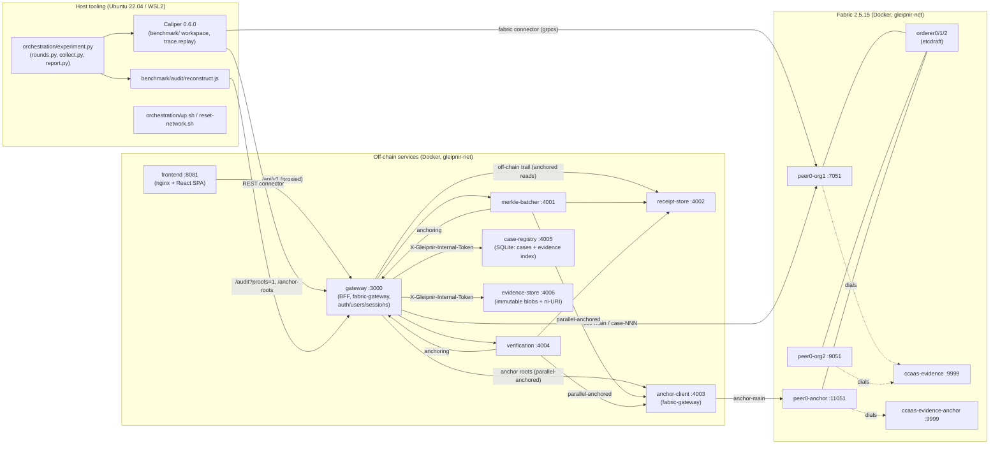
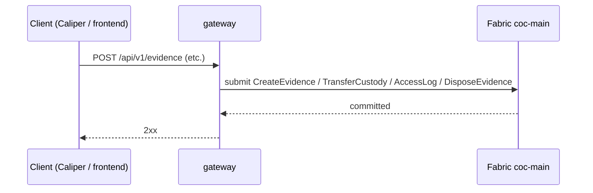
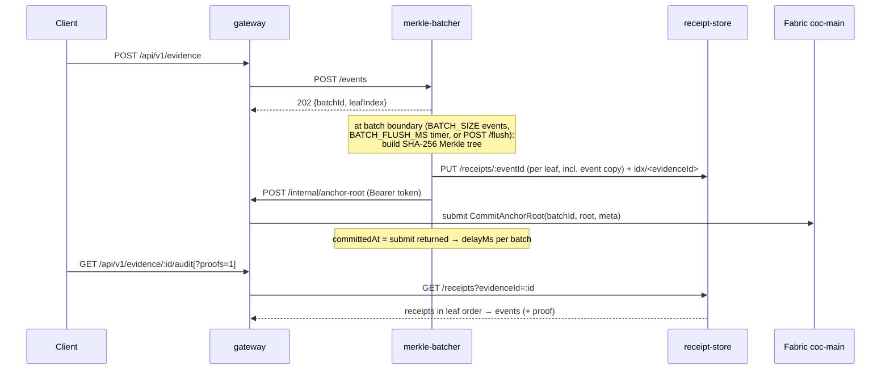
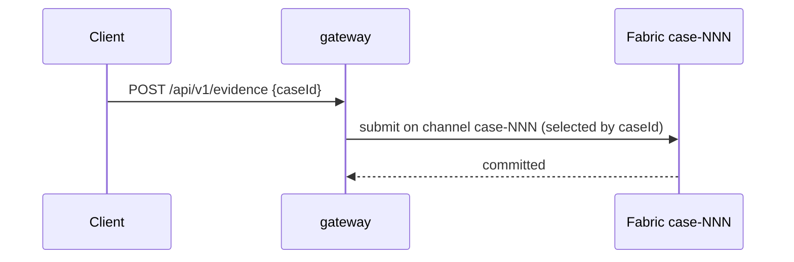
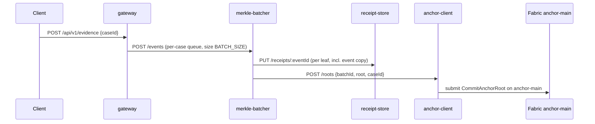
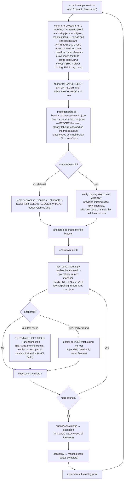

# GLEIPNIR — As-Built Architecture

**Status:** describes the system as implemented and live-verified at commit
`8bb4c4e` (2026-07-10), **updated 2026-07-16 for the M12–M16 evidence
library** (gateway auth & roles, case-registry, evidence-store, multi-page
frontend) and **2026-07-17 for M17–M24** (User wire field `displayName` →
`name`; 3-tier RBAC `admin`/`lead`/`investigator` with lead-owned cases and
the admin blob-content restriction; per-case evidence categories + off-chain
forensic ingest metadata; examiner notes/flags/activity feed; the in-repo UI
kit + modal admin pages; the 4-step ingest wizard with client-side ni-URI
verification; the tabbed case/evidence detail pages; the per-case CoC report
(CSV + print) and the lead dashboard — CONTRACTS §12-8/§12-9). **Further
updated 2026-08-03** to fill in the M25/M25b library additions (team-roster
picker, in-place case-role change, persistent case activity feed) that had
landed in code and CONTRACTS.md but not yet in this document's route table
and frontend catalogue, and to add §9 covering the `owasp-top10-review`
branch's web-app-tier security hardening (N1–N6). **Updated 2026-09-22 for
M26**, the experimental redesign mandated by the supervisor brief
(`GLEIPNIR_Supervisor_Guidance_Consolidated_2026-09-22.md`; decision record
CONTRACTS §12-10..17): `RemoveEvidence` → `DisposeEvidence`; one batch-size
grid (`BATCH_SIZE`/`BATCH_FLUSH_MS`); receipts carry the event copy and the
receipt store indexes them per evidence, so the anchored variants read their
trail off-chain; the benchmark became a seeded trace-replay harness with
per-transaction capture; `sweep.py`/`generate-rounds.js` were replaced by
`rounds.py` + `experiment.py` (E0/ramp/E1/E2/E3a/E3b/ops) with a ledger-only
reset per run; and audit reconstruction time, anchoring delay, CPU/memory,
failure classes and p95 joined the metrics. This document is descriptive, not
normative; the paper-facing procedure lives in `docs/methodology/experiments.md`.

| Document | Role |
|---|---|
| `docs/ARCHITECTURE.md` | The binding **build plan** (written before implementation; milestones, module specs) |
| `docs/CONTRACTS.md` | The binding **interface contracts** (§1–§12; cited below rather than restated) |
| **`docs/AS-BUILT.md`** (this file) | The system **as implemented**: modules, dependencies, ports, data flows |
| `docs/audit/REPORT.md` + `docs/audit/*` | The **verification record**: static audit (F1–F71), live E2E (F72–F73), variant smokes (F74–F76) |
| `docs/audit/security-review.md` | The **S1–S20 security pass** — first systematic security review, all fixable items resolved |
| `docs/audit/owasp-top10-review.md` | The **OWASP Top 10 (2021) pass** over the web-app tier — six new fixes (N1–N6), summarized in §9 |
| `docs/methodology/experiments.md` | The **paper-facing methodology** (M26): 2×2 frame, variable table, E0–E3 + ops procedures, level-selection rules, run budget, flowcharts, threats to validity, defaults to confirm with D |

GLEIPNIR benchmarks four blockchain chain-of-custody (B-CoC) architectural
variants on a single Hyperledger Fabric 2.5 LTS substrate, measured with
Hyperledger Caliper, on one Docker host. The evidence-record schema and
evidence-card UI idiom are conceptually inspired by lockb0x; the build
substrate is Fabric 2.5 LTS exclusively.

---

## 1. System overview



**The controlled experiment.** The four variants differ **only in how audit
event records are written to the ledger**. The chaincode, the gateway API,
and the Caliper workload modules are byte-identical across all four; the
variant is selected by one environment value (`VARIANT`) that changes the
gateway's write routing (CONTRACTS §9). This invariant is the basis of the
thesis's like-for-like comparison. Evidence **binaries** are off-chain in
every variant — what varies is whether audit *event records* go directly
on-chain or are Merkle-anchored.

## 2. Pinned stack

| Component | Version | Where pinned |
|---|---|---|
| Hyperledger Fabric (peer, orderer, tools) | **2.5.15** | `network/compose/.env` `FABRIC_TAG`/`TOOLS_TAG` |
| Hyperledger Fabric CA | **1.5.19** | `.env` `CA_TAG` |
| Hyperledger Caliper CLI | **0.6.0** (exact) | `benchmark/package.json` |
| Caliper SUT binding | `fabric:fabric-gateway` → `@hyperledger/fabric-gateway ^1.5.0`, `@grpc/grpc-js ^1.10.3` | `benchmark/package.json` + lockfile (recorded in `benchmark/README.md`) |
| Node.js (services runtime) | **20.19** | `node:20.19-alpine` in seven service Dockerfiles; `node:20.19-slim` for case-registry (better-sqlite3 v12 has no Node-20 prebuilt → from-source build on glibc — CONTRACTS §12-7) |
| Gateway extras (M13c) | `multer ^2` (multipart ingest) | `gateway/package.json` |
| Case-registry datastore | `better-sqlite3 ^12.4.1` | `services/case-registry/package.json` |
| Go (chaincode) | **1.25.5** toolchain (`go 1.25` language) | `golang:1.25.5` in `chaincode/evidence/Dockerfile`; `go.mod` |
| Client SDK (gateway, anchor-client) | `@hyperledger/fabric-gateway` **1.11.0** (exact), `@grpc/grpc-js ^1.14.0` | respective `package.json` |
| World state | **GoLevelDB** (CouchDB excluded by design) | `network/core.yaml` |
| Frontend | React ^18.3.1, react-router-dom ^6, Vite ^5.4.11, TypeScript ~5.6.3 | `frontend/package.json` |
| Benchmark app | Python 3.11 + tkinter (Tk 8.6), PyYAML; drives `experiment.py` inside WSL | `orchestration/benchapp.pyw`, `orchestration/benchcore.py` |
| Orchestration | Python 3.10+, PyYAML ≥6.0 | `orchestration/requirements.txt` |

Two `@hyperledger/fabric-gateway` versions coexist deliberately: the
**services** (gateway, anchor-client) pin `1.11.0` in their own images, while
the **Caliper workspace** binds `^1.5.0` — the version its 0.6.0 fabric
connector was released against — in `benchmark/node_modules`. They never share
a runtime.

## 3. The four variants

Participation matrix (✔ = the container runs in that variant; compose profiles
per CONTRACTS §8):

| Container | standard | anchoring | parallel | parallel-anchored |
|---|:-:|:-:|:-:|:-:|
| orderers ×3, peer0-org1/org2, ccaas-evidence, cli, gateway, frontend, ca-org1/org2/orderer | ✔ | ✔ | ✔ | ✔ |
| case-registry, evidence-store (evidence library, M13) | ✔ | ✔ | ✔ | ✔ |
| merkle-batcher, receipt-store, verification | | ✔ | | ✔ |
| peer0-anchor, ca-anchor, ccaas-evidence-anchor, anchor-client | | | | ✔ |

The library **UI flows** target Standard + Anchoring only (CONTRACTS §12-7);
the two library containers run in the base profile everywhere so the compose
topology stays variant-invariant.

Channels: `coc-main` (standard, anchoring), `case-001…case-00N` (parallel
variants, one per case), `anchor-main` (the **anchor channel**,
parallel-anchored only).

### 3.1 Standard — baseline

One shared channel; one transaction per audit event.



### 3.2 Anchoring — off-chain Merkle batching to the shared channel

Events are batched off-chain (batch size `BATCH_SIZE`, one grid for both
anchored variants — M26); only the SHA-256 Merkle root plus minimal metadata is
committed on-chain. Each event keeps an off-chain receipt: leaf hash +
O(log₂N) sibling path **plus the CoC event copy** (`evidenceId`, `event`), and
the receipt store indexes receipts per evidence — that index is the anchored
variants' audit trail (there is no per-event record on the channel). The
client's "committed" write is the gateway's `202` enqueue; the ledger commit
lag is the **anchoring delay** the batcher records per batch
(`openedAt`/`closedAt`/`committedAt`, `delayMs`).



### 3.3 Parallel — one channel per case

Direct per-event commits, but each case gets a dedicated channel provisioned
at runtime (`osnadmin channel join` + install/approve/commit per channel).



### 3.4 Parallel-Anchored — per-case batching to the anchor channel

Per-case channels + per-case Merkle batching (the same `BATCH_SIZE` grid as
Anchoring — the paper's separate K grid was unified at M26, CONTRACTS §12-13);
per-case roots are committed to the dedicated anchor channel by the off-chain
**anchor-client**, because chaincode in one channel cannot write to another.
Reads (`/evidence/:id`, `/audit`) come from the receipt-store index exactly as
in §3.2, with the `case-NNN` caseId still validated; `GET /anchor-roots/…` is
proxied to the anchor-client.
The anchor-client identity (`anchorclient`, `AnchorClientMSP`) and the
anchor-channel endorsement policy are fixed constants across all runs.



### 3.5 Verification and audit-reconstruction paths (both anchoring variants)

Verification/audit latency is a first-class measured metric (thesis RQ2):
fetch receipt → recompute the leaf from the event copy and fold the Merkle
branch → compare against the anchored root. The response says which leaf
source was used (`leafSource: "event"` since M26; `"receipt"` only for
legacy receipts without an event copy).

```mermaid
sequenceDiagram
    participant C as Client
    participant G as gateway
    participant V as verification
    participant R as receipt-store
    participant X as gateway or anchor-client
    C->>G: GET /api/v1/evidence/:id/verify?eventId=…
    G->>V: GET /verify/:eventId
    V->>R: GET /receipts/:eventId (fetchMs)
    Note over V: leaf = SHA-256(canonical event copy);<br/>fold sibling path (recomputeMs)
    V->>X: GET anchor root for (scopeId, batchId)
    Note over V: compare roots (compareRootMs)
    V-->>C: {ok, latencyMs, leafSource, steps}
```

**Audit reconstruction time** (M26, all four variants) is measured host-side
by `benchmark/audit/reconstruct.js` per case: fetch every evidence trail of
the case through the gateway, and on the anchored variants recompute every
event's leaf + branch (`?proofs=1`) and read each distinct root once via
`GET /api/v1/anchor-roots/:scopeId/:batchId` (cached per scope+batch). On
Standard/Parallel the trail is on-chain and there is no Merkle step
(`method: on-chain-trail` vs `merkle-branch`). Output → `audit.json` per run.

```mermaid
sequenceDiagram
    participant A as reconstruct.js (host)
    participant G as gateway
    participant R as receipt-store
    participant X as coc-main (ReadAnchorRoot) or anchor-client
    loop each evidence of the case
        A->>G: GET /api/v1/evidence/:id/audit?proofs=1[&caseId=]
        G->>R: GET /receipts?evidenceId=:id
        G-->>A: events + proof {leafHash, siblingPath, batchId, leafIndex, rootRef}
    end
    loop each distinct (scopeId, batchId)
        A->>G: GET /api/v1/anchor-roots/:scopeId/:batchId
        G->>X: ReadAnchorRoot
    end
    Note over A: recompute leaf → fold → compare; ms per case
```

## 4. Module catalogue

### 4.1 `chaincode/evidence` — Go smart contract (ccaas)

- **Responsibility:** deterministically persist CoC audit records and Merkle
  roots to a channel's world state; nothing else. Identical binary serves all
  channels and variants.
- **Interface** (CONTRACTS §3) — the four CoC operations, each annotated in
  code with its ISO/IEC 27037 clause: `CreateEvidence(evidenceId,
  codexEntryJSON)`, `TransferCustody(evidenceId, newCustodian, reason)`,
  `AccessLog(evidenceId, actor, action)`, `DisposeEvidence(evidenceId,
  reason)` (M26 rename of `RemoveEvidence`: a terminal status transition to
  `DISPOSED`, op tag `DISPOSE`, nothing deleted; `CC_VERSION` stays `1.0` —
  ccaas serves the rebuilt binary under the same package id); the anchoring
  pair `CommitAnchorRoot(batchId, merkleRoot, metaJSON)` /
  `ReadAnchorRoot(scopeId, batchId)`; and reads `ReadEvidence(evidenceId)`,
  `GetAuditTrail(evidenceId)`.
- **Record schema:** Codex-Entry-inspired (see ARCHITECTURE §4). Audit events
  are written under composite sub-keys `(evidenceId, monotonicCounter)` — one
  key per event, never rewrites of a shared record key — so concurrent
  `AccessLog` writes cannot MVCC-conflict **structurally** (no client retry
  loops exist anywhere in the system).
- **Deployment:** Chaincode-as-a-Service. The peer never compiles the
  contract; it dials a standalone gRPC server (`EXPOSE 9999`) built from
  `golang:1.25.5` into `gcr.io/distroless/static-debian12:nonroot`. ccaas is
  used *because* of the Go 1.25.5 pin — the peer's in-image `fabric-ccenv`
  toolchain is a different Go version.
- **Direct Go dependencies** (`go.mod`): `fabric-chaincode-go/v2
  v2.3.1-0.20260319210430-56968fdc7833`, `fabric-contract-api-go/v2 v2.2.1`,
  `fabric-protos-go-apiv2 v0.3.7`, `google.golang.org/protobuf v1.36.11`.
- **Does not:** store binaries, hash payloads (gateway computes
  `integrity_proof`), reach other channels, or use rich queries (GoLevelDB:
  key-value + partial-composite-key scans only).

### 4.2 `gateway/` — API gateway (BFF), port 3000

- **Responsibility:** holds the only fabric-gateway sessions to the
  application channels; computes evidence `integrity_proof` ni-URIs;
  encapsulates all variant routing (CONTRACTS §9); and (M12) authenticates
  two kinds of principal — the unchanged static `GLEIPNIR_TOKEN` service
  path, and user sessions with server-enforced roles. The frontend and the
  Caliper REST connector talk only to this service.
- **Routes** (`src/app.js`; auth per CONTRACTS §6 — service token or session,
  except `/healthz` and `/auth/login`):

| Route | Behavior |
|---|---|
| `POST /api/v1/auth/login`, `POST /auth/logout`, `GET /auth/me` | session lifecycle (M12); users in `AUTH_DATA_DIR/users.json`, scrypt hashes |
| `GET/POST /api/v1/admin/users`, `PATCH /admin/users/:id`, `POST …/reset-password` | user management — admin session only |
| `GET /api/v1/users/directory` | admin-or-lead session (M25); roster picker for team assignment — leads never see admin accounts |
| `POST /api/v1/evidence` | `CreateEvidence` submit, or batcher enqueue (anchoring variants); multipart (M13c) → evidence-store blob + head with store proof + evidence-index row (library caseId never on-chain) |
| `POST /api/v1/evidence/:id/transfer` | `TransferCustody` or enqueue; user sessions: case-role gated |
| `POST /api/v1/evidence/:id/access` | `AccessLog` or enqueue; user sessions: case-role gated |
| `DELETE /api/v1/evidence/:id` | `DisposeEvidence` or enqueue (op `DISPOSE`; index status `DISPOSED`); M25: needs case-lead role (or the `uploader` pseudo-role for one's own uncategorized evidence); best-effort index status sync |
| `GET /api/v1/evidence/:id` | `ReadEvidence` (evaluate) — on the anchored variants (M26) the head is folded from the off-chain trail (`offChain: true`; 404 when no events); user sessions: authz + synchronous auto-`AccessLog(view)` |
| `GET /api/v1/anchor-roots/:scopeId/:batchId` | M26: the anchor-root record for audit reconstruction; any authenticated principal. anchoring → `ReadAnchorRoot` on `coc-main`; parallel-anchored → proxy anchor-client `GET /roots/…` (status forwarded); standard/parallel → 404 `no anchor roots in this variant` |
| `GET /api/v1/evidence/:id/download` | stream from evidence-store; authz-gated with `{content:true}` — **admin bypass does not apply** (M18/§12-8: admins lose blob-content access off their own cases); auto-`AccessLog(download)` |
| `GET /api/v1/evidence/:id/export` | `{record, auditTrail}` bundle; auto-`AccessLog(export)` |
| `GET /api/v1/evidence/:id/audit[?proofs=1]` | `GetAuditTrail` (evaluate) — on the anchored variants (M26) the CoC events from the receipt-store index in receipt order, `?proofs=1` attaching each event's `proof {leafHash, siblingPath, batchId, leafIndex, rootRef}` verbatim (the gateway verifies nothing); authz-gated, never auto-logged |
| `GET /api/v1/evidence/:id/verify?eventId=` | proxy → verification `/verify/:eventId`; not variant-restricted at the gateway itself — on Standard the call 502s because `verification:4004` only ships with the anchoring variants (not SSRF, tracked separately in `docs/audit/owasp-top10-review.md` A10); the SPA never calls it under Standard |
| `PATCH /api/v1/evidence/:id/details` | M19 forensic metadata (label/seizedAt/acquisitionLocation/handedOverBy); write-gated (contributor+), never auto-logged |
| `GET/POST /api/v1/evidence/:id/notes` | M20 examiner notes — append-only, immutable-by-API; read/write case-role gated |
| `PUT /api/v1/evidence/:id/flag` | M20 strict-enum triage flag (`HIGH_PRIORITY`/`PROCESSED`/`NEEDS_LEAD_REVIEW`); write-gated |
| `GET /api/v1/evidence/search`, `GET /api/v1/cases/search` | case-registry search, participant-scoped unless admin |
| `POST/GET/PATCH /api/v1/cases[/:id]` | case-registry proxy; **create** = admin-or-lead (lead auto-added as case lead); **update** = admin-or-that-case's-lead (`ensureCaseLead`) |
| `POST/PATCH/DELETE /api/v1/cases/:id/participants[/:userId]` | roster grant/revoke; PATCH (M25) is in-place role change; admin-or-case-lead; removing/demoting the last lead is 409 for leads (admin may) |
| `POST/DELETE /api/v1/cases/:id/evidence[/:evidenceId]` | categorize/uncategorize; admin-or-case-lead |
| `GET/POST/PATCH/DELETE /api/v1/cases/:id/categories[/:categoryId]` | M19 per-case evidence taxonomy; read = case visibility, manage = admin-or-case-lead |
| `GET /api/v1/cases/:id/coc-report?format=csv\|json` | M24 chain-of-custody report — assembles every exhibit's trail; one synchronous `AccessLog('coc-report')` per exhibit for user sessions only (never for the service token) |
| `GET /api/v1/cases/:id/activity` | M20/M25b persistent `case_audit_log` feed (roster + categorize + note + flag events); case-visibility, never auto-logged |
| `POST /internal/anchor-root` | submit `CommitAnchorRoot` on `coc-main` (anchoring); `requireService` — no user session, admin included, may call this |
| `GET /internal/anchor-root/:scopeId/:batchId` | evaluate `ReadAnchorRoot` on `coc-main`; same service-only gate |
| `GET /healthz` | `{ok:true, variant}` (unauthenticated) |

Every response carries gateway-origin security headers (N2, §9) regardless
of auth outcome; a malformed request body gets a generic JSON error rather
than a stack trace (N6, §9); sessions die at the earlier of an 8 h absolute
TTL or a 30 min sliding idle timeout (N3, §9).

- **Dependencies:** `@grpc/grpc-js ^1.14.0`, `@hyperledger/fabric-gateway
  1.11.0`, `express ^4.21.2`, `multer ^2` (M13c). M26 adds two injected
  deps: `receipts` (`src/receiptsClient.js`, `listByEvidence` against
  `RECEIPT_STORE_URL`) and `anchorClientUrl` (`ANCHOR_CLIENT_URL`).
- **Actor attribution (M12):** under a user session the audit actor is always
  the authenticated username; the service-token path keeps client-supplied
  actors (Caliper realism). Auto-AccessLog never fires for the service token.
- **Does not:** persist binaries itself (multipart bytes go to
  evidence-store; the JSON path's `payloadBase64` is hashed then discarded,
  unchanged), build or verify Merkle trees or branches (`?proofs=1` and
  `/anchor-roots` only hand the witness and the root to the caller), write
  the anchor channel, write the library caseId on-chain, or execute or record
  benchmark runs (the M12 run-request store was removed in M27; the benchmark
  is driven by `orchestration/benchapp.pyw` → `experiment.py`).

### 4.3 `services/merkle-batcher` — port 4001

- **Responsibility:** accumulate events into per-scope batches (scope =
  `shared` for anchoring, `caseId` for parallel-anchored); at a batch
  boundary build a SHA-256 Merkle tree, persist one receipt per leaf, submit
  the single root for commit — and (M26) record the timestamps that define
  the **anchoring delay**. Batch size from env `BATCH_SIZE` (one grid for
  both anchored variants; `BATCH_N`/`BATCH_K` are read only as a legacy
  fallback when it is unset); boundary = size, or `BATCH_FLUSH_MS` timer
  (0 = off, the experiment constant), or `POST /flush`. Batch ids are
  namespaced by `BATCH_EPOCH` (experiment.py sets `<runId>-<unix>` per run)
  so re-runs against a persistent ledger never reuse a committed
  `(scope, batchId)` key.
- **Routes:** `POST /events` → `202 {batchId, leafIndex}`; `POST /flush`
  (forces boundaries — run-end partial-batch policy; used untimed by the
  verify workload; returns the `/status` body after settling); `GET /status`
  → `{variant, batchSize, flushTimeoutMs, queues, counters:{openScopes,
  closedBatches, committed, failed, forced, receiptDegraded, degraded},
  degraded, batches[]}`; `GET /healthz`.
- **Batch record** (per closed batch, process lifetime): `openedAt` (first
  enqueue), `closedAt` (boundary), `committedAt` (the root submission
  returned — the gateway/anchor-client await the Fabric commit, so the delay
  includes the submit round-trip; null if it failed), `forced`, `delayMs
  {min, mean, max}` over the batch's per-event enqueue timestamps. One log
  line per committed batch repeats them. The receipt PUT carries
  `evidenceId` and `event` (the CoC event as enqueued) beside the witness;
  `leafHash` is unchanged.
- **Dependencies:** `express ^4.21.2` only.
- **Calls:** receipt-store `PUT /receipts/:eventId`; gateway
  `POST /internal/anchor-root` (anchoring) **or** anchor-client `POST /roots`
  (parallel-anchored).
- **Does not:** submit to the ledger itself, verify proofs, or observe the
  block commit independently of the submit round-trip.

### 4.4 `services/receipt-store` — port 4002

- **Responsibility:** persist each event's off-chain witness
  `{leafHash, siblingPath[], batchId, leafIndex, rootRef}` **plus the CoC
  event copy** (`evidenceId`, `event` — M26) as one JSON file per `eventId`
  under the `receipt-data` named volume (`/data`), and keep a plain
  per-evidence index (`/data/idx/<evidenceId>.txt`, one eventId per line,
  first-PUT order) so the anchored variants' audit trail can be listed back.
- **Routes:** `PUT /receipts/:eventId` (indexes when the body carries a
  valid `evidenceId`; idempotent across the batcher's two PUTs),
  `GET /receipts/:eventId`, `GET /receipts?evidenceId=X` → JSON array of full
  receipts in index order (`[]` if none; 400 if missing/invalid),
  `GET /healthz`.
- **Dependencies:** `express ^4.21.2` only.
- **Deliberately un-hardened** (thesis-critical): no hash chains, no
  signatures, no replication — on the receipts **or** the index or the event
  copies. Its weaker-than-on-chain integrity guarantee is a *measured property
  of the anchoring design* — an availability exposure of the witness (index
  loss = empty trail listing), not an integrity exposure of the ledger (a
  tampered event copy fails root verification because verifiers recompute
  the leaf from it) — and a stated thesis caveat. Hardening it would destroy
  the property being measured.

### 4.5 `services/verification` — port 4004

- **Responsibility:** execute and time the RQ2 verification procedure:
  fetch receipt (`fetchMs`) → recompute the leaf from the receipt's `event`
  copy and fold the O(log₂N) branch (`recomputeMs`) → compare against the
  anchored root (`compareRootMs`).
- **Routes:** `GET /verify/:eventId` → `{ok, reason?, latencyMs, leafSource:
  "event"|"receipt", steps}` (M26: `"event"` = leaf recomputed inside
  `recomputeMs`; `"receipt"` = stored `leafHash`, legacy receipts only);
  `GET /healthz`. Distinguishes `root-mismatch` (tamper signal, 200
  `ok:false`) from `missing-receipt`/`missing-anchor-root` (404),
  `malformed-receipt` (422 — the hex-64 `leafHash` shape check still runs even
  when `event` is present), and upstream errors (502). With
  `VERIFY_METRICS_PATH` set (compose: `/verify-metrics/verify.jsonl` on the
  `verify-metrics` volume) each completed verify appends `{ts, eventId, ok,
  leafSource, fetchMs, recomputeMs, compareRootMs, latencyMs}` — a secondary
  trace; the manifest's verify numbers come from the `VERIFY` op in the
  Caliper tx-log.
- **Dependencies:** `express ^4.21.2` only. The Merkle recomputation is
  byte-identical to the batcher's construction (CONTRACTS §4).
- **Does not:** verify signatures or schema — deliberately excluded from the
  timed path to isolate Merkle-verification cost — or trust the stored leaf
  when an event copy is present.

### 4.6 `services/anchor-client` — port 4003

- **Responsibility:** the only writer of the anchor channel. Submits per-case
  roots via `CommitAnchorRoot` on `anchor-main` under the fixed
  `anchorclient` identity (`AnchorClientMSP`), because chaincode cannot write
  across channels. Parallel-anchored only.
- **Routes:** `POST /roots` → `201 {txId}`; `GET /roots/:caseId/:batchId`;
  `GET /healthz`.
- **Dependencies:** `@grpc/grpc-js ^1.14.0`, `@hyperledger/fabric-gateway
  1.11.0` (no express — hand-rolled `node:http` router, ESM).
- **Does not:** build Merkle trees, touch application channels, store
  receipts.

### 4.7 `services/case-registry` — port 4005 (evidence library, M13a)

- **Responsibility:** the OFF-CHAIN case layer — Case entity (name/status/
  participant roster) + the evidence search read-model (`evidence_index`) +
  the gateway's per-evidence authz pre-flight (`GET /internal/authz`).
  Case ids `CASE-<uuid>` are structurally disjoint from the Parallel channel
  key `case-NNN`; the library caseId never reaches the chain.
- **Routes:** cases CRUD + participants + categorize/uncategorize;
  evidence-index register/read/sync/search (`visibleToUserId` scoping =
  participant cases + own uncategorized uploads); all behind
  `X-Gleipnir-Internal-Token` (internal-only, via gateway).
- **Datastore:** `better-sqlite3 ^12.4.1` at `DATA_DIR/case-registry.db`
  (volume `case-registry-data`); image `node:20.19-slim` — the documented
  deviation (no Node-20 prebuilt in v12 → from-source build on glibc;
  CONTRACTS §12-7).
- **Does not:** authenticate end users, store blobs, touch Fabric.
  `evidence_index` is a cache — the ledger stays authoritative for
  status/custodian.

### 4.8 `services/evidence-store` — port 4006 (evidence library, M13b)

- **Responsibility:** persist evidence BINARIES off-chain (the all-variant
  invariant) and compute the RFC 6920 ni-URI proof the ledger records;
  `niUri()` copied byte-identically from `gateway/src/ni.js`.
- **Routes:** `PUT/GET/DELETE /blobs/:evidenceId`, `GET …/meta`,
  `GET …/verify?expected=`; blobs are **immutable** (exclusive-create; second
  PUT → 409); `DELETE` exists solely for the gateway's ingest-failure
  rollback. Internal-only via `X-Gleipnir-Internal-Token`.
- **Datastore:** filesystem — `DATA_DIR/<id>` blob + `<id>.meta.json` sidecar
  (volume `evidence-blob-data`). Dependencies: `express ^4.21.2` only.
- **Does not:** index or search (case-registry's job), mutate stored bytes,
  write on-chain.

### 4.9 `frontend/` — SPA behind nginx, port 8081

- **Responsibility (M14, extended through M25b):** the multi-page
  evidence-library app — login + role-aware nav (`auth/`), 3-tier RBAC
  (`admin`/`lead`/`investigator`, M18) layered on per-case roles
  (`viewer`/`contributor`/`lead`). Investigator pages: a 4-step ingest wizard
  (case+category / metadata with `ITEM-NNN` auto-suggest / file + local
  WebCrypto ni-URI hash with progress / review — M22, comparing the local
  hash against the server's `integrityProof`), my-cases, a tabbed case detail
  (Overview / Evidence / Activity — M21/M23), a tabbed evidence detail
  (Overview / Chain of custody via `AuditTrailTimeline` / Examiner notes —
  M20/M21/M23, with an auto-logged inline preview for image/video/audio/
  PDF/text added M25), and search. Lead-tier: `/lead/dashboard` (M24) — led
  cases, flagged evidence, merged team activity, roster add/remove. Admin
  pages: users (modal-driven, role badges — M21) and case administration
  (the operator dashboard was removed in M27 — CONTRACTS §12-19). The `Op`
  type is `CREATE | TRANSFER | ACCESS | DISPOSE` and the status `DISPOSED`
  (pills tolerate legacy `REMOVED` rows; `AuditTrailTimeline` marks
  `DISPOSE`). A
  print-optimized per-case CoC report (`/cases/:id/report`, M24) renders
  outside the normal app shell (browser print → PDF).
- **UI kit (M21):** in-repo primitives only — no external component library
  (`components/ui/`: Tabs, Stepper, Modal, Timeline, Badge) — styled on
  `styles.css` tokens, covered by the first frontend vitest tests.
- **Role gating is UX-only.** `RequireAuth`/`RequireRole` guard routes
  client-side for navigation convenience; every one of those rules is
  re-enforced server-side by the gateway and case-registry (§4.2, §4.7) — a
  hidden nav item is not a security control.
- **Network path:** a single `GatewayClient` (`src/api.ts`, owned by
  `AuthContext`) with base `/api/v1`; nginx proxies `location /api/` to
  `http://gateway:3000` and `try_files` keeps deep links refresh-safe. The
  frontend never contacts Fabric or the off-chain services directly.
- **Runtime dependencies:** `react ^18.3.1`, `react-dom ^18.3.1`,
  `react-router-dom ^6`; built with `vite ^5.4.11` /
  `typescript ~5.6.3` into a static bundle served by `nginx:alpine`.
- **Does not:** apply to the Parallel / Parallel-Anchored variants — the
  library UI targets Standard and Anchoring only; Parallel variants are
  exercised through the benchmark path (`orchestration/benchapp.pyw` /
  `experiment.py`).

## 5. Fabric network topology

**Organizations & MSPs:** `Org1MSP` + `Org2MSP` (application peers),
`OrdererMSP` (three orderers, etcdraft), `AnchorClientMSP` (anchor org:
endorsing peer + the fixed `anchorclient` identity; parallel-anchored only).
The anchor org has its own *peer* because `anchor-main`'s endorsement policy
`AND('AnchorClientMSP.member')` requires an endorser of that MSP — a client
identity alone cannot endorse.

**Container inventory** (project `gleipnir`, network `gleipnir-net`; pinned
images from `.env`):

| Container | Image / build | Host ports | Volume | Profile |
|---|---|---|---|---|
| orderer0/1/2.example.com | `fabric-orderer:2.5.15` | 7050/8050/9050 (grpc), 7053/8053/9053 (admin), 9443/9444/9445 (ops) | orderer{0,1,2}-ledger | base |
| peer0.org1.example.com | `fabric-peer:2.5.15` | 7051, ops 9446 | peer0org1-ledger | base |
| peer0.org2.example.com | `fabric-peer:2.5.15` | 9051, ops 9447 | peer0org2-ledger | base |
| peer0.anchor.example.com | `fabric-peer:2.5.15` | 11051, ops 9448 | peer0anchor-ledger | parallel-anchored |
| ca-org1 / ca-org2 / ca-anchor / ca-orderer | `fabric-ca:1.5.19` | 7054 / 8054 / 9054 / 10054 | bind mounts | base (ca-anchor: parallel-anchored) |
| ccaas-evidence, ccaas-evidence-anchor | build `chaincode/evidence` | none (internal :9999) | — | base / parallel-anchored |
| gleipnir-cli | `fabric-tools:2.5.15` | none (repo at `/opt/gleipnir`) | — | base |
| gleipnir-gateway | build `gateway/` | 3000 | crypto ro | base |
| gleipnir-frontend | build `frontend/` | 8081 | — | base |
| gleipnir-merkle-batcher / receipt-store / verification | build `services/*` | 4001 / 4002 / 4004 | receipt-data (:4002), verify-metrics (:4004, M26) | anchoring, parallel-anchored |
| gleipnir-anchor-client | build `services/anchor-client` | 4003 | crypto ro | parallel-anchored |

**Channels & configtx** (`network/configtx/configtx.yaml`): two profiles only —
`AppChannel` (orgs Org1+Org2; template for `coc-main` and every `case-NNN`)
and `AnchorChannel` (single org `AnchorClientMSP`; backs `anchor-main`).
There is **no consortium/genesis section**: channels are created exclusively
through the Fabric 2.5 channel-participation API (`osnadmin channel join`
against all three orderer admin endpoints, asserting HTTP 201 on each).
Application endorsement on app channels is `OR('Org1MSP.peer','Org2MSP.peer')`;
on the anchor channel `AND('AnchorClientMSP.member')` — held constant across
all runs as a controlled variable. Orderer: etcdraft ×3, BatchTimeout 2s,
MaxMessageCount 10.

**Node configs:** `network/core.yaml` and `network/orderer.yaml` are verbatim
Fabric 2.5.15 sampleconfig with enumerated deltas only — core.yaml pins the
world state to **goleveldb** (rich queries are therefore impossible by
construction) and enables the `ccaas` external builder; orderer.yaml sets
`BootstrapMethod: none` (channel participation). Both files are
version-controlled from the first commit and their git blob SHAs are embedded
in every run manifest.

**Crypto** (`network/crypto/registerEnroll.sh`): all material is produced by
Fabric-CA enrollment (no cryptogen) into the standard layout under
`network/organizations/` (gitignored), with NodeOUs enabled. Client identities
get a stable `keystore/priv_sk` copy because the Caliper network configs read
that fixed path.

## 6. Orchestration & measurement pipeline

Host prerequisites (orchestration/README): Ubuntu 22.04 / WSL2, Docker +
Compose v2, `fabric-ca-client` 1.5.x, `curl`, `jq`, Node 20 (`npx caliper`),
Python 3.10+ with PyYAML (`matplotlib` optional — charts only). All Fabric
admin operations run inside the `gleipnir-cli` fabric-tools container.

| Script | Role |
|---|---|
| `up.sh --variant V [--channels N] [--skip-crypto]` | enroll crypto → compose up (variant→profiles) → health-wait ops ports → package/install ccaas once per org → create channels (osnadmin, 3×201 asserted) → approve+commit → start services |
| `down.sh [--wipe]` | stop all profiles; `--wipe` also removes ALL named volumes (library included), generated crypto and channel artifacts — never run without the authors' go-ahead |
| `reset-network.sh --variant V --channels C` | M26 **ledger-only reset** between runs: refuses without `GLEIPNIR_ALLOW_LEDGER_WIPE=1`; prints and removes only `gleipnir_{orderer0,orderer1,orderer2,peer0org1,peer0org2,peer0anchor}-ledger`, `gleipnir_receipt-data`, `gleipnir_verify-metrics`; deletes `network/channel-artifacts`, unsets the ccaas ids, re-runs `up.sh --skip-crypto`; never touches `gateway-auth-data`, `case-registry-data`, `evidence-blob-data`, CA state or `network/organizations` |
| `backup-volumes.sh <dir> [--restore]` | tar every `gleipnir_*` named volume via `alpine` (one file each); `--restore` REPLACES each volume's contents and refuses while a container uses it — the desktop app runs it before every ledger reset |
| `benchapp.pyw` + `benchcore.py` | the desktop benchmark app (M27, CONTRACTS §12-19): input boxes bound to `sweeps.yaml`, Preview/Run/Resume/Cancel per experiment through WSL, live per-round results, history, CSV export, suggested baselines, automatic backup/restore; `test_benchapp.py` |
| `lib.sh` | shared helpers: `compose`/`cli`/`peer_env`, `create_channel`, `join_peer`, `package_ccaas`, `set_env_var`, `wait_raft_leader`, `wait_healthz` (accepts peers' permanent-503 docker check, audit F74) |
| `provision-channel.sh case-NNN` | idempotent per-case channel provisioning (parallel variants); emits the Caliper network config from `case-template.yaml`; experiment.py calls it for channels the running stack lacks |
| `teardown-channel.sh case-NNN` | `osnadmin channel remove` from all orderers |
| `smoke-standard.sh` | functional gate: create → transfer → access ×2 → audit==4 → dispose → head status `DISPOSED` → transfer-after-dispose must fail |
| `rounds.py --static` | the ONLY renderer of Caliper benchconfigs and network configs from `sweeps.yaml`: writes `benchmark/benchmarks/smoke-<variant>.yaml` + `benchmark/networks/parallel-c{C}.yaml` (GENERATED headers); library `render_round()` / `network_config()` / `smoke_rounds()` / `ops_rounds()` / `trace_round()` for experiment.py |
| `experiment.py --exp e0\|ramp\|e1\|e2\|e3a\|e3b\|ops\|cell [--variant V]* [--reps N] [--resume] [--dry-run] [--reuse-network] [--no-monitor] [--no-audit] [--verbose] [--send-rate R…] [--batch-size B] [--cases N] [--seed …] [--rounds …] [--events-per-case …] (+ the other control flags)` | the campaign driver (factor + control flags `--exp cell` only, CONTRACTS §12-18; `[run i/n]` progress + ETA, one result line per round, `results/<exp>/<exp>-results.csv` rewritten after every run): plans cells × repetitions, runs the lifecycle below per run (one network lifetime each, **fresh ledger by default**; `--reuse-network` opts out for one warned ad-hoc run, `--fresh-network` still parses as a no-op), loud failures, `runlog.jsonl` |
| `checkpoint.py <runPath> --label tK` | storage checkpoint via `docker exec du -sb` against the **named volumes**: per-channel block store, per-peer GoLevelDB state dir, receipt store `/data` → `checkpoints.jsonl` (`t0` before the first round, `t<k+1>` after every round) |
| `collect.py <run-dir> [--baseline R]` / `--selftest` | run dir → `manifest.json`: round table + docker resource stats from `caliper.log`, per-tx percentiles/failure classes from `tx-w*.jsonl`, OLS storage regression, anchoring + audit summaries |
| `report.py --exp E [--out docs/results/E] [--no-charts] [--decimal-comma]` | ALWAYS the per-round Excel CSV `benchmark/results/E/E-results.csv` (any E incl. e0/ramp/cell; supervisor column order; UTF-8 BOM); for e1–ops also per-experiment CSV + Markdown tables (units in headers, mean ± SD over reps; Markdown = one table per variant, ONE latency column `avg (min–max), p95` of means) + PNG charts (one per metric, one line per variant; E1 with Standard/Parallel reference lines, its batch-size-free reference rows printed as `ref` rather than the literal `None`; E3a with the saturation rule flagged → `e3a-saturation.json`; ops → `ops-writes.*` / `ops-reads.*`). The per-round tables (e3a, ops) open with a note that on-chain/off-chain bytes per event, audit time and anchoring delay are measured once per RUN, so the same value repeats on every row |

**Experiment plans** (`experiment.py --exp`; every cell × `repetitions`, r = 3
unless overridden; e0/ramp always 1 rep):

| exp | variants | swept | fixed | rounds per run |
|---|---|---|---|---|
| `e0` | all 4 | — | `regimes.smoke` shape at 5 tx/s; parallel* on one channel per smoke case (10) | per-op smoke rounds (+ `smoke-access-shared-gate` on standard, `smoke-verify` on anchored) + `smoke-trace` + audit; regime `smoke` |
| `ramp` | all 4 | send rate | `ramp.events_per_case_per_round` | one `rate<R>` round per send rate; prints throughput vs send rate + suggested `baseline.send_rate_tps` (confirm with D) |
| `e1` | anchoring (1 ch), parallel-anchored (`baseline.channels`) + standard/parallel **reference** runs (`levels.reference`) | `batch_sizes` | `baseline.send_rate_tps` | `workload.rounds` trace slices `slice<k>` |
| `e2` | parallel | `channel_counts` | `baseline.send_rate_tps` | slices; cases = channels (one channel per case) |
| `e3a` | all 4 | send rate | `baseline.batch_size`, `baseline.channels` | one `rate<R>` round per send rate, ascending |
| `e3b` | all 4 | `case_counts` ≤ `baseline.channels_max` | `baseline.send_rate_tps` | slices; parallel* channels = cases, standard/anchoring 1 |
| `ops` | all 4 | operation | E3 point | `create transfer access dispose` (writes), `read-evidence read-trail` (reads), `verify-event` (anchored) |
| `cell` | all 4 (or `--variant`) | — (one ad-hoc cell) | CLI `--send-rate`/`--batch-size`/`--cases` (= channels on parallel*), else `sweeps.yaml` baseline | several send rates → one `rate<R>` round each, ascending; one → `workload.rounds` slices; `results/cell/`, exported to the per-round CSV only (no aggregated table) |



**Metrics contract** (per run, machine-readable at
`benchmark/results/<exp>/<variant>/<levels>/r<rep>/manifest.json`; schema in
CONTRACTS §10): configured send rate and measured send rate; per-round
throughput with a **successful-only** recomputation (Caliper's reported
denominator includes failures), aggregate **and** derived per-channel for
multi-channel cells; latency min/avg/max (Caliper) + p50/p95/p99 per round
and per operation type (from the per-transaction JSONL); success/failure
counts, failure rate (%) and the classes `MVCC_READ_CONFLICT`,
`ENDORSEMENT_POLICY_FAILURE`, `TIMEOUT`, `HTTP_4XX`, `HTTP_5XX`, `OTHER`
— all over the **timed** tx-log records only, plus, on a round that had
failures, a separate `failureClassesLogScan` (a `caliper.log` regex scan with
the same three fabric classes and a raw `fabricStatusCodes` map, reported
alongside and never merged in, because the pinned peer-gateway connector sets
no per-transaction error string); `untimedWrites` per round — the successful
write ops logged `timed: false`, i.e. the untimed pool/verify seeding; CPU (%)
/ memory (MB) per container from Caliper's docker monitor with `fabric` /
`offchain` / `all` groups; storage from the `t0..tN` checkpoint series — per-channel
block-store deltas (app + anchor channel), GoLevelDB state delta, off-chain
receipt-store delta, `bytesPerEventRegression` (OLS, ≥ 3 points, `r2: null`
for a flat series rather than a flattering `1.0`) with the delta as
cross-check, both over a denominator of **timed successful writes +
`untimedWrites`** (the seeds commit real transactions, so their bytes are in
the series and their events belong in the divisor); if the last checkpoint has
no block-store rows for the hosting peer, `storage` is omitted with a printed
warning and report.py prints `-` rather than "0 bytes/event"; anchoring delay
(s; leafCount-weighted, forced batches
also reported excluded); audit reconstruction time per case; and provenance
(`gitCommit`, blob SHAs of the six network config files, `sweeps.yaml` SHA,
trace hash + params, Caliper version/binding/connector, Fabric tag, host
cores/memory). With `--baseline <standard-run>`, collect.py adds
`payloadCompressionVsBaseline` — computed as the reduction in on-chain
**bytes per event** vs Standard, never reported as a clean 1/N of total
ledger size. Anchored-variant write latency on the REST path is enqueue
latency (the gateway's 202); commit lag is the anchoring-delay metric.

**Run identity:** `runId = <exp>/<variant>/<levels>/r<rep>` with `levels =
batch<N>-ch<C>-cases<K>[-ref]` (fixed key order; `cell` appends `-rate<R>…` and, with control
overrides, `-x<hash>`). Regime labels: `smoke`
(e0 only, under `results/e0/`), `steady` (write events on the least-loaded channel — nominal at plan time, then the generated trace's actual count — ≥
`regimes.steady.min_events_per_channel` = 10³) or `sub-floor` (below it).
`ops` and `ramp` runs are labelled `sub-floor` unconditionally, never by the
floor rule: that rule divides by channel count and would have labelled the
same workload `steady` on the single-channel variants and `sub-floor` on the
multi-channel ones. Smoke and steady data never share a directory.
"Baseline" constants in `sweeps.yaml` are calibrated by E0/E1/E2, never
"optimal".

## 7. Benchmark workspace (`benchmark/`)

`sweeps.yaml` is the **single source of truth** for all experiment constants
(M26 schema; verbatim in CONTRACTS §10):

```yaml
seed: 20260922            # PRNG seed of the transaction trace — identical across all variants
workers: 4                # Caliper worker processes (constant)
repetitions: 3            # r; mean ± SD over repetitions
batch_sizes: [10, 25, 50, 100, 200]               # E1 — ONE grid for Anchoring and Parallel-Anchored
channel_counts: [5, 10, 20, 30, 40, 50]           # E2 — Parallel only; bounded by host cores
send_rates_tps: [10, 25, 50, 75, 100, 150, 200]   # E3a — configured send rate (input, not output)
case_counts: [5, 10, 20, 30, 40, 50]              # E3b — trimmed to ≤ baseline.channels_max
baseline: { send_rate_tps: 50, batch_size: 50, channels: 20, channels_max: 50 }   # calibrated by E0/E1/E2 — PLACEHOLDERS until then; "baseline", never "optimal"; channels = the set case count (parallel*: one channel per case)
workload:
  evidence_per_case: 20
  events_per_case_per_round: 200  # cases*200/workers must be an integer
  rounds: 5                       # trace slices per run (E3a: one slice per send rate)
  mix: { transfer_weight: 0.15, access_weight: 0.85, dispose_fraction: 0.5 }
  payload_bytes: 256
  audit_cases: 5
anchoring: { flush_timeout_ms: 0 }   # size-only batching, constant
monitor:   { interval_s: 5 }         # Caliper docker monitor
regimes:
  smoke:  { cases: 10, evidence_per_case: 2, logs_per_case_min: 10, logs_per_case_max: 25, send_rate_tps: 5 }
  steady: { min_events_per_channel: 1000 }   # below → "sub-floor", never "steady"
ramp: { events_per_case_per_round: 40 }
```

`benchmark/` has **no generator of its own** any more: `orchestration/rounds.py
--static` renders the committed `benchmarks/smoke-<variant>.yaml` (4 files) and
`networks/parallel-c{1,5,10,20,30,40,50}.yaml` from it (GENERATED headers,
drift-checked), and `experiment.py` renders every steady round into
`results/…/rounds/<label>/bench.yaml` at run time. Each benchconfig is one
round + a `monitors.resource` docker block (container names with the leading
slash Caliper matches verbatim).

**Transaction trace** (`trace/generate.js`, `npm run gen:trace`): a pure
function of `(seed, cases, channels, evidencePerCase, eventsPerCasePerRound,
rounds, workers, mix, payloadBytes)` with a mulberry32 PRNG — same params →
byte-identical `traces/<hash>.json` (gitignored; hash recorded in
`run.json`). Evidence `e` is owned by worker `e mod workers`, its ops sit in
that worker's sequence in lifecycle order CREATE → (TRANSFER|ACCESS)* →
[DISPOSE], each worker holds exactly `rounds × S` items (`S = cases ×
eventsPerCasePerRound / workers`), and round `k` replays `[k·S, (k+1)·S)`.
`caseId = case-NNN`, `NNN = ((dataCase−1) mod channels)+1`, is the channel
routing key. All four variants replay the same file; only `mode` differs.

**Two Caliper connectors, by design:**

- **fabric** (peer-gateway binding, `mode: fabric`) — `networks/coc-main.yaml`,
  `parallel-c{C}.yaml`, `case-template.yaml`: Caliper submits directly to
  the peer over grpcs as `User1@org1`; measures raw Fabric
  submit-to-commit. Used by standard and parallel.
- **REST (custom, `mode: rest`)** — `benchmark/connectors/rest/index.js`
  (`RestGatewayConnector extends ConnectorBase`), wired via
  `networks/rest-gateway.yaml`: drives the gateway's HTTP API with the bearer
  token; measures the full BFF path — for the anchored variants a "commit" is
  the gateway's `202` enqueue, and non-2xx → `SetStatusFail` + `SetErrMsg(0,
  'HTTP <status>')` so failures classify. Used by anchoring, parallel-anchored,
  and all verify rounds.

**Workload modules** (`benchmark/workload/`, identical across variants; round
arguments per CONTRACTS §10): `trace.js` (mixed-workload replay of one trace
slice — E1/E2/E3), `createEvidence.js`, `transferCustody.js`, `accessLog.js`
(keeps the legacy `shared` scenario = the MVCC correctness gate: many workers,
one evidenceId, zero conflicts expected via composite keys),
`disposeEvidence.js` (per-operation write rounds), `read.js` (`ReadEvidence`
/ `GetAuditTrail`; `readOnly: true` in fabric mode, service-token GETs in rest
mode — never auto-logged), `verify.js` (seeds events, forces `/flush`
untimed, then times the verify endpoint; anchored only), and `lib/`
(`payloads.js` builders + `case-NNN` round-robin selector + payload filler,
`pool.js` untimed seeding + `flushBatcher`, `txlog.js`). In rest mode
`read.js` flushes the batcher after seeding too (same shared helper): the
anchored variants answer reads from the off-chain trail, which exists only
once a batch closes, so unflushed seeds would have made the reads table
measure 404s and empty arrays. Multi-channel rounds spread offered
load round-robin across **all** provisioned case channels in one Caliper run.
`rounds.py render_bench` puts `mode`, `label`, `channels` and `variant` in
**every** round's arguments — the case-spread is suppressed by variant name,
so a round without `variant` would fall back to `case-001` and point
Standard at a channel its network config does not contain.

**Per-transaction capture** (`lib/txlog.js`): every timed transaction writes
`{"round","op":"CREATE|TRANSFER|ACCESS|DISPOSE|READ_EVIDENCE|READ_TRAIL|VERIFY",
"caseId","evidenceId","tCreate","tFinal","latencyMs","ok","err","timed"}` to
`${GLEIPNIR_TXLOG_DIR}/tx-w<worker>.jsonl` from Caliper's own `TxStatus`,
buffered off the timed path — the source of p95, success/failure counts and
failure classes. `timed: false` lines are the untimed pool seeding
(`log(..., timed = false)`) and `verify.js`'s seeding (`logUntimed(...)`,
which goes over plain `fetch` and so has no timestamps): real ledger writes
that were never measured, counted in the storage bytes-per-event denominator
and excluded from every timing, throughput and failure statistic. Known
limit: the 0.6.0 peer-gateway connector sets no error string, so fabric-mode
`err` is `null` and collect.py classifies those failures from `caliper.log`.

**Audit reconstruction** (`audit/reconstruct.js`, `npm run audit`; host-side,
gateway only): the first `audit_cases` data-cases of the trace, timed per
case with `hrtime` — on-chain trail on Standard/Parallel, `?proofs=1` + leaf
recompute + sibling-path fold + one cached root read per `(scopeId, batchId)`
on the anchored variants (`audit/merkle.js` is a byte-identical copy of the
services' Merkle file, pinned by `test/merkle-identity.test.js`). Output
`{variant, method, traceHash, cases[], summary{msPerCase{mean,sd,min,max},
msPerEvent, okRate}}` → `audit.json`.

## 8. Deliberate design properties (do not "fix")

These are experimental controls; each was audited as an invariant:

1. **Receipt store is un-hardened** — its exposure is a measured property and
   thesis caveat (§4.4).
2. **Evidence binaries are off-chain in every variant** — only audit records
   / roots go on-chain.
3. **Anchoring is plain SHA-256 Merkle-root anchoring** — no ZK proofs, no
   rollup constructions, sibling-path verification only.
4. **MVCC conflict avoidance is structural** — composite event sub-keys, not
   retry loops (§4.1).
5. **Smoke and steady regimes never mix** — `smoke-*` artifacts are labelled
   and excluded from all performance claims.
6. **GoLevelDB only** — key-value chaincode by construction; adding CouchDB
   would invalidate the storage measurements.
7. **One batch grid, one trace, "baseline" not "optimal"** (M26) — batch
   size is identical across the anchored variants, channel count across the
   parallel variants (Standard/Anchoring are single-channel by code), the
   seeded trace is replayed byte-identically across all four, and calibrated
   constants are carried forward as baselines. Anchored-variant write latency
   is enqueue latency; anchoring delay is reported beside it, never folded in.

## 9. Security posture (`owasp-top10-review` branch)

A prior systematic pass (`docs/audit/security-review.md`, S1–S20) resolved
every fixable web-app-tier finding. A follow-on OWASP Top 10 (2021) review
(`docs/audit/owasp-top10-review.md`, 2026-07-24) re-verified the S-fixes live
against the running **standard** variant and found six residual gaps, all now
fixed (N1–N6) and unit-tested — none touch the chaincode, the frozen
contracts, or the service-token/benchmark write path:

| # | Category | Fix | Where |
|---|---|---|---|
| **N1** | A02 Cryptographic Failures | Service/internal bearer-token comparisons (`===`/`!==`) were the only non-constant-time secret comparisons in the codebase. Replaced with a length-guarded `safeEqual()` (fixed-digest hash → `crypto.timingSafeEqual`) in gateway, case-registry, evidence-store. | `gateway/src/auth.js`, `services/case-registry/src/index.js`, `services/evidence-store/src/index.js` |
| **N2** | A05 Security Misconfiguration | The gateway's own origin (`:3000`) shipped bare responses — no security headers — if reached directly, bypassing the nginx edge. Added `nosniff` / `X-Frame-Options: DENY` / `Referrer-Policy: no-referrer` / strict `default-src 'none'` CSP middleware. | `gateway/src/app.js` |
| **N3** | A07 Auth Failures | Sessions were absolute-TTL-only (8 h) — a token on an unattended terminal stayed valid the full window. Added a sliding idle timeout (default 30 min, `SESSION_IDLE_TTL_SECONDS`), refreshed per authenticated request, dying at the earlier of the two clocks. | `gateway/src/sessions.js` |
| **N4** | A09 Logging & Monitoring | No security-relevant *failure* was logged anywhere (failed logins, lockouts, authz denials, `/internal/anchor-root` probing) — only successful on-chain writes are visible in the audit trail. Added a structured JSON stderr sink; logs only failures, never secrets (unit-verified no-secret guarantee). | `gateway/src/securityLog.js` |
| **N5** | A06 Vulnerable Components | First `npm audit` pass on the repo; patched non-pinned runtime advisories (`body-parser`, `protobufjs`) via lockfile-only `npm audit fix` across gateway/anchor-client/merkle-batcher/receipt-store/verification → 0 vulns. Pinned versions (`fabric-gateway 1.11.0`, `caliper-cli 0.6.0`) untouched. | lockfiles only |
| **N6** | A05 / A09 | A malformed JSON request body returned Express's default HTML error page with a full stack trace and container filesystem paths — S15's per-route sanitizer never saw it because `express.json()` throws before routing. Added a terminal error-handling middleware: generic JSON body to the client, detail logged server-side. | `gateway/src/app.js` |

**Documented, not fixed — intentional design properties (do not "fix"):**
D1 the receipt store's un-hardened witness (§4.4, §8) · D2 committed non-production
default secrets in `network/compose/.env` (reproducible local-dev artifact) ·
D3 plaintext HTTP + non-empty-only password policy (single-host,
non-production posture) · D4 the §12-8 admin blob barrier is
self-serviceable but fully auditable, not a hard prevention control · **C1
(stop-and-ask, untouched)** the single shared `GLEIPNIR_TOKEN` authenticates
every route including internal ones — frozen by the Caliper/smoke-script
dependency on it; changing it needs an explicit contract amendment.

Final verification (Chunk 11): gateway unit suites 45/45, evidence-store 9/9,
`smoke-library.sh` 17/17, a 79-check live functional battery 78/79 (the one
gap a known harness-ordering artifact, not an app defect), and the manual
23-exhibit test fixture confirmed untouched (0 events added by the review
itself). Full detail, live-probe transcripts, and the OWASP-category-by-
category writeup live in `docs/audit/owasp-top10-review.md`.

## 10. Repository layout

```
Gleipnir/
├── CLAUDE.md                 # build rulebook (invariants, pins, bans)
├── chaincode/evidence/       # Go ccaas contract + Dockerfile
├── gateway/                  # BFF service (Node 20, express, fabric-gateway, auth/users/sessions)
├── services/
│   ├── merkle-batcher/       # batching + Merkle tree construction
│   ├── receipt-store/        # off-chain witness store (deliberately un-hardened)
│   ├── verification/         # RQ2 timed verification path
│   ├── anchor-client/        # sole writer of the anchor channel
│   ├── case-registry/        # M13a: off-chain Case entity + evidence read-model (SQLite, node:20.19-slim)
│   └── evidence-store/       # M13b: immutable evidence blobs + ni-URI proofs
├── frontend/                 # React SPA (evidence library) behind nginx
├── network/
│   ├── compose/              # compose-net/-ca/-services.yaml + .env (pins)
│   ├── configtx/             # AppChannel + AnchorChannel profiles
│   ├── crypto/               # registerEnroll.sh (Fabric-CA, no cryptogen)
│   ├── core.yaml             # peer sampleconfig (goleveldb pin)
│   └── orderer.yaml          # orderer sampleconfig (BootstrapMethod: none)
├── orchestration/            # up/down/reset-network/backup-volumes/provision, rounds.py/experiment.py/checkpoint/collect/report, benchapp.pyw (desktop app)
├── benchmark/                # Caliper 0.6.0 workspace (sweeps.yaml = truth)
│   ├── benchmarks/           # committed smoke-<variant>.yaml (rendered by rounds.py --static)
│   ├── networks/             # connector configs (fabric + custom REST; parallel-c{C} rendered)
│   ├── connectors/rest/      # custom Caliper REST connector
│   ├── trace/                # seeded transaction-trace generator
│   ├── audit/                # audit-reconstruction harness (+ pinned merkle.js copy)
│   ├── workload/             # trace replay + per-op + read + verify modules, lib/txlog.js
│   ├── traces/               # generated <hash>.json traces (gitignored)
│   └── results/              # <exp>/<variant>/<levels>/r<rep>/ + runlog.jsonl (gitignored)
└── docs/                     # ARCHITECTURE (plan), CONTRACTS, methodology/experiments.md, audit/, this file
```

## 11. Provenance & citation

- **Code:** cite the repository at a commit SHA. The core architecture
  described in §1–§8 was live-verified at `8bb4c4e`; the security posture in
  §9 was verified through the `owasp-top10-review` branch, chunk 11 final
  commit `13e9685`. History is never rewritten; cited SHAs remain valid.
- **Configuration:** every run manifest embeds `gitCommit` plus the git blob
  SHAs of `configtx.yaml`, `core.yaml`, `orderer.yaml` and the three compose
  files, the `sweeps.yaml` blob SHA, the trace hash + params, the Caliper
  version/binding/connector, the Fabric tag and the host's cores/memory
  (M26), so any datapoint is traceable to the exact configuration and
  transaction sequence that produced it.
- **Stack:** all images and packages are version-pinned (§2); `:latest` is
  never used (it resolves to Fabric 3.x).
- **Verification trail:** `docs/audit/REPORT.md` consolidates the six-chunk
  static audit, the chunk-7 live bring-up, and the step-2 variant smokes,
  including every finding (F1–F76) and its resolution. `docs/audit/
  security-review.md` (S1–S20) and `docs/audit/owasp-top10-review.md`
  (N1–N6, §9 above) cover the security-specific passes.
