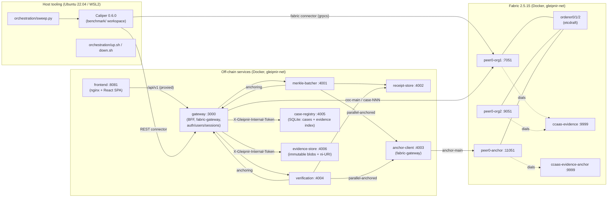
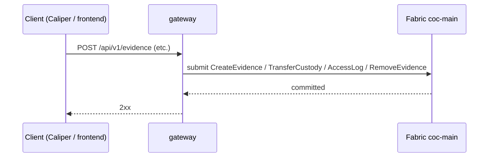
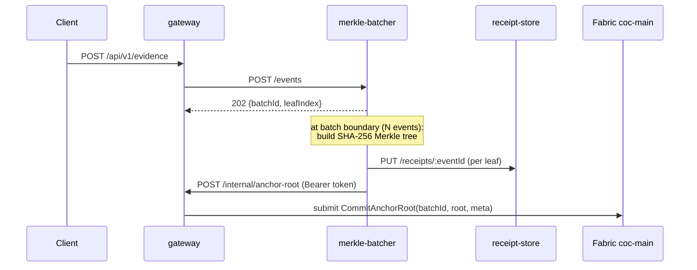
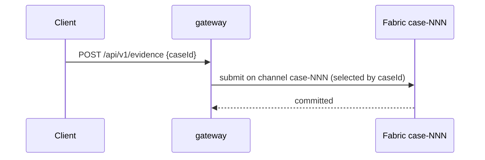
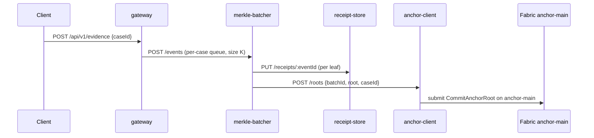
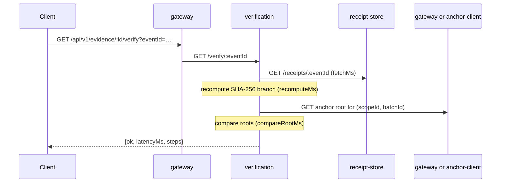
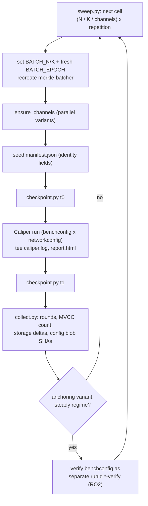

# GLEIPNIR — As-Built Architecture

**Status:** describes the system as implemented and live-verified at commit
`8bb4c4e` (2026-07-10), **updated 2026-07-16 for the M12–M16 evidence
library** (gateway auth & roles, case-registry, evidence-store, multi-page
frontend). This document is descriptive, not normative.

| Document | Role |
|---|---|
| `docs/ARCHITECTURE.md` | The binding **build plan** (written before implementation; milestones, module specs) |
| `docs/CONTRACTS.md` | The binding **interface contracts** (§1–§12; cited below rather than restated) |
| **`docs/AS-BUILT.md`** (this file) | The system **as implemented**: modules, dependencies, ports, data flows |
| `docs/audit/REPORT.md` + `docs/audit/*` | The **verification record**: static audit (F1–F71), live E2E (F72–F73), variant smokes (F74–F76) |

GLEIPNIR benchmarks four blockchain chain-of-custody (B-CoC) architectural
variants on a single Hyperledger Fabric 2.5 LTS substrate, measured with
Hyperledger Caliper, on one Docker host. The evidence-record schema and
evidence-card UI idiom are conceptually inspired by lockb0x; the build
substrate is Fabric 2.5 LTS exclusively.

---

## 1. System overview



**The controlled experiment.** The four variants differ **only in how audit
event records are written to the ledger**. The chaincode, the gateway API,
and the Caliper workload modules are byte-identical across all four; the
variant is selected by one environment value (`VARIANT`) that changes the
gateway's write routing (CONTRACTS §9). This invariant is the basis of the
thesis's like-for-like comparison. Evidence **binaries** are off-chain in
every variant — what varies is whether audit *event records* go directly
on-chain or are Merkle-anchored.

## 2. Pinned stack

| Component | Version | Where pinned |
|---|---|---|
| Hyperledger Fabric (peer, orderer, tools) | **2.5.15** | `network/compose/.env` `FABRIC_TAG`/`TOOLS_TAG` |
| Hyperledger Fabric CA | **1.5.19** | `.env` `CA_TAG` |
| Hyperledger Caliper CLI | **0.6.0** (exact) | `benchmark/package.json` |
| Caliper SUT binding | `fabric:fabric-gateway` → `@hyperledger/fabric-gateway ^1.5.0`, `@grpc/grpc-js ^1.10.3` | `benchmark/package.json` + lockfile (recorded in `benchmark/README.md`) |
| Node.js (services runtime) | **20.19** | `node:20.19-alpine` in seven service Dockerfiles; `node:20.19-slim` for case-registry (better-sqlite3 v12 has no Node-20 prebuilt → from-source build on glibc — CONTRACTS §12-7) |
| Gateway extras (M13c) | `multer ^2` (multipart ingest) | `gateway/package.json` |
| Case-registry datastore | `better-sqlite3 ^12.4.1` | `services/case-registry/package.json` |
| Go (chaincode) | **1.25.5** toolchain (`go 1.25` language) | `golang:1.25.5` in `chaincode/evidence/Dockerfile`; `go.mod` |
| Client SDK (gateway, anchor-client) | `@hyperledger/fabric-gateway` **1.11.0** (exact), `@grpc/grpc-js ^1.14.0` | respective `package.json` |
| World state | **GoLevelDB** (CouchDB excluded by design) | `network/core.yaml` |
| Frontend | React ^18.3.1, react-router-dom ^6, Vite ^5.4.11, TypeScript ~5.6.3, recharts ^2.13.3 | `frontend/package.json` |
| Orchestration | Python 3.10+, PyYAML ≥6.0 | `orchestration/requirements.txt` |

Two `@hyperledger/fabric-gateway` versions coexist deliberately: the
**services** (gateway, anchor-client) pin `1.11.0` in their own images, while
the **Caliper workspace** binds `^1.5.0` — the version its 0.6.0 fabric
connector was released against — in `benchmark/node_modules`. They never share
a runtime.

## 3. The four variants

Participation matrix (✔ = the container runs in that variant; compose profiles
per CONTRACTS §8):

| Container | standard | anchoring | parallel | parallel-anchored |
|---|:-:|:-:|:-:|:-:|
| orderers ×3, peer0-org1/org2, ccaas-evidence, cli, gateway, frontend, ca-org1/org2/orderer | ✔ | ✔ | ✔ | ✔ |
| case-registry, evidence-store (evidence library, M13) | ✔ | ✔ | ✔ | ✔ |
| merkle-batcher, receipt-store, verification | | ✔ | | ✔ |
| peer0-anchor, ca-anchor, ccaas-evidence-anchor, anchor-client | | | | ✔ |

The library **UI flows** target Standard + Anchoring only (CONTRACTS §12-7);
the two library containers run in the base profile everywhere so the compose
topology stays variant-invariant.

Channels: `coc-main` (standard, anchoring), `case-001…case-00N` (parallel
variants, one per case), `anchor-main` (the **anchor channel**,
parallel-anchored only).

### 3.1 Standard — baseline

One shared channel; one transaction per audit event.



### 3.2 Anchoring — off-chain Merkle batching to the shared channel

Events are batched off-chain (batch size **N**); only the SHA-256 Merkle root
plus minimal metadata is committed on-chain. Each event keeps an off-chain
receipt: leaf hash + O(log₂N) sibling path.



### 3.3 Parallel — one channel per case

Direct per-event commits, but each case gets a dedicated channel provisioned
at runtime (`osnadmin channel join` + install/approve/commit per channel).



### 3.4 Parallel-Anchored — per-case batching to the anchor channel

Per-case channels + per-case Merkle batching (batch size **K**); per-case
roots are committed to the dedicated anchor channel by the off-chain
**anchor-client**, because chaincode in one channel cannot write to another.
The anchor-client identity (`anchorclient`, `AnchorClientMSP`) and the
anchor-channel endorsement policy are fixed constants across all runs.



### 3.5 Verification path (both anchoring variants)

Verification/audit latency is a first-class measured metric (thesis RQ2):
fetch receipt → recompute Merkle branch → compare against the anchored root.



## 4. Module catalogue

### 4.1 `chaincode/evidence` — Go smart contract (ccaas)

- **Responsibility:** deterministically persist CoC audit records and Merkle
  roots to a channel's world state; nothing else. Identical binary serves all
  channels and variants.
- **Interface** (CONTRACTS §3) — the four CoC operations, each annotated in
  code with its ISO/IEC 27037 clause: `CreateEvidence(evidenceId,
  codexEntryJSON)`, `TransferCustody(evidenceId, newCustodian, reason)`,
  `AccessLog(evidenceId, actor, action)`, `RemoveEvidence(evidenceId,
  reason)`; the anchoring pair `CommitAnchorRoot(batchId, merkleRoot,
  metaJSON)` / `ReadAnchorRoot(scopeId, batchId)`; and reads
  `ReadEvidence(evidenceId)`, `GetAuditTrail(evidenceId)`.
- **Record schema:** Codex-Entry-inspired (see ARCHITECTURE §4). Audit events
  are written under composite sub-keys `(evidenceId, monotonicCounter)` — one
  key per event, never rewrites of a shared record key — so concurrent
  `AccessLog` writes cannot MVCC-conflict **structurally** (no client retry
  loops exist anywhere in the system).
- **Deployment:** Chaincode-as-a-Service. The peer never compiles the
  contract; it dials a standalone gRPC server (`EXPOSE 9999`) built from
  `golang:1.25.5` into `gcr.io/distroless/static-debian12:nonroot`. ccaas is
  used *because* of the Go 1.25.5 pin — the peer's in-image `fabric-ccenv`
  toolchain is a different Go version.
- **Direct Go dependencies** (`go.mod`): `fabric-chaincode-go/v2
  v2.3.1-0.20260319210430-56968fdc7833`, `fabric-contract-api-go/v2 v2.2.1`,
  `fabric-protos-go-apiv2 v0.3.7`, `google.golang.org/protobuf v1.36.11`.
- **Does not:** store binaries, hash payloads (gateway computes
  `integrity_proof`), reach other channels, or use rich queries (GoLevelDB:
  key-value + partial-composite-key scans only).

### 4.2 `gateway/` — API gateway (BFF), port 3000

- **Responsibility:** holds the only fabric-gateway sessions to the
  application channels; computes evidence `integrity_proof` ni-URIs;
  encapsulates all variant routing (CONTRACTS §9); and (M12) authenticates
  two kinds of principal — the unchanged static `GLEIPNIR_TOKEN` service
  path, and user sessions with server-enforced roles. The frontend and the
  Caliper REST connector talk only to this service.
- **Routes** (`src/app.js`; auth per CONTRACTS §6 — service token or session,
  except `/healthz` and `/auth/login`):

| Route | Behavior |
|---|---|
| `POST /api/v1/auth/login`, `POST /auth/logout`, `GET /auth/me` | session lifecycle (M12); users in `AUTH_DATA_DIR/users.json`, scrypt hashes |
| `GET/POST /api/v1/admin/users`, `PATCH /admin/users/:id`, `POST …/reset-password` | user management — admin session only |
| `POST /api/v1/evidence` | `CreateEvidence` submit, or batcher enqueue (anchoring variants); multipart (M13c) → evidence-store blob + head with store proof + evidence-index row (library caseId never on-chain) |
| `POST /api/v1/evidence/:id/transfer` | `TransferCustody` or enqueue; user sessions: case-role gated |
| `POST /api/v1/evidence/:id/access` | `AccessLog` or enqueue; user sessions: case-role gated |
| `DELETE /api/v1/evidence/:id` | `RemoveEvidence` or enqueue; best-effort index status sync |
| `GET /api/v1/evidence/:id` | `ReadEvidence` (evaluate); user sessions: authz + synchronous auto-`AccessLog(view)` |
| `GET /api/v1/evidence/:id/download` | stream from evidence-store; auto-`AccessLog(download)` |
| `GET /api/v1/evidence/:id/export` | `{record, auditTrail}` bundle; auto-`AccessLog(export)` |
| `GET /api/v1/evidence/:id/audit` | `GetAuditTrail` (evaluate); authz-gated, never auto-logged |
| `GET /api/v1/evidence/:id/verify?eventId=` | proxy → verification `/verify/:eventId` |
| `GET /api/v1/evidence/search`, `GET /api/v1/cases/search` | case-registry search, participant-scoped unless admin |
| `POST/GET/PATCH /api/v1/cases[/:id]` + participants + evidence | case-registry proxy; management admin-only |
| `POST/GET /api/v1/runs`, `GET /api/v1/runs/:id` | run-request store (dashboard); `POST` admin-session-only |
| `POST /internal/anchor-root` | submit `CommitAnchorRoot` on `coc-main` (anchoring) |
| `GET /internal/anchor-root/:scopeId/:batchId` | evaluate `ReadAnchorRoot` on `coc-main` |
| `GET /healthz` | `{ok:true, variant}` (unauthenticated) |

- **Dependencies:** `@grpc/grpc-js ^1.14.0`, `@hyperledger/fabric-gateway
  1.11.0`, `express ^4.21.2`, `multer ^2` (M13c).
- **Actor attribution (M12):** under a user session the audit actor is always
  the authenticated username; the service-token path keeps client-supplied
  actors (Caliper realism). Auto-AccessLog never fires for the service token.
- **Does not:** persist binaries itself (multipart bytes go to
  evidence-store; the JSON path's `payloadBase64` is hashed then discarded,
  unchanged), build or verify Merkle trees, write the anchor channel, write
  the library caseId on-chain, or execute benchmark runs (`POST /runs`
  records a request; execution is host-side).

### 4.3 `services/merkle-batcher` — port 4001

- **Responsibility:** accumulate events into per-scope batches (scope =
  `shared` for anchoring, `caseId` for parallel-anchored); at a batch
  boundary build a SHA-256 Merkle tree, persist one receipt per leaf, submit
  the single root for commit. Batch sizes from env `BATCH_N` / `BATCH_K`;
  batch ids are namespaced by `BATCH_EPOCH` so re-runs against a persistent
  ledger never reuse a committed `(scope, batchId)` key.
- **Routes:** `POST /events` → `202 {batchId, leafIndex}`; `POST /flush`
  (forces boundaries — used untimed by the verify workload); `GET /status`;
  `GET /healthz`.
- **Dependencies:** `express ^4.21.2` only.
- **Calls:** receipt-store `PUT /receipts/:eventId`; gateway
  `POST /internal/anchor-root` (anchoring) **or** anchor-client `POST /roots`
  (parallel-anchored).
- **Does not:** submit to the ledger itself, or verify proofs.

### 4.4 `services/receipt-store` — port 4002

- **Responsibility:** persist each event's off-chain witness
  `{leafHash, siblingPath[], batchId, leafIndex, rootRef}` as one JSON file
  per `eventId` under the `receipt-data` named volume (`/data`).
- **Routes:** `PUT /receipts/:eventId`, `GET /receipts/:eventId`,
  `GET /healthz`.
- **Dependencies:** `express ^4.21.2` only.
- **Deliberately un-hardened** (thesis-critical): no hash chains, no
  signatures, no replication. Its weaker-than-on-chain integrity guarantee is
  a *measured property of the anchoring design* — an availability exposure of
  the witness, not an integrity exposure of the ledger — and a stated thesis
  caveat. Hardening it would destroy the property being measured.

### 4.5 `services/verification` — port 4004

- **Responsibility:** execute and time the RQ2 verification procedure:
  fetch receipt (`fetchMs`) → recompute the O(log₂N) branch (`recomputeMs`)
  → compare against the anchored root (`compareRootMs`).
- **Routes:** `GET /verify/:eventId` → `{ok, reason?, latencyMs, steps}`;
  `GET /healthz`. Distinguishes `root-mismatch` (tamper signal, 200
  `ok:false`) from `missing-receipt`/`missing-anchor-root` (404),
  `malformed-receipt` (422), and upstream errors (502).
- **Dependencies:** `express ^4.21.2` only. The Merkle recomputation is
  byte-identical to the batcher's construction (CONTRACTS §4).
- **Does not:** verify signatures or schema — deliberately excluded from the
  timed path to isolate Merkle-verification cost.

### 4.6 `services/anchor-client` — port 4003

- **Responsibility:** the only writer of the anchor channel. Submits per-case
  roots via `CommitAnchorRoot` on `anchor-main` under the fixed
  `anchorclient` identity (`AnchorClientMSP`), because chaincode cannot write
  across channels. Parallel-anchored only.
- **Routes:** `POST /roots` → `201 {txId}`; `GET /roots/:caseId/:batchId`;
  `GET /healthz`.
- **Dependencies:** `@grpc/grpc-js ^1.14.0`, `@hyperledger/fabric-gateway
  1.11.0` (no express — hand-rolled `node:http` router, ESM).
- **Does not:** build Merkle trees, touch application channels, store
  receipts.

### 4.7 `services/case-registry` — port 4005 (evidence library, M13a)

- **Responsibility:** the OFF-CHAIN case layer — Case entity (name/status/
  participant roster) + the evidence search read-model (`evidence_index`) +
  the gateway's per-evidence authz pre-flight (`GET /internal/authz`).
  Case ids `CASE-<uuid>` are structurally disjoint from the Parallel channel
  key `case-NNN`; the library caseId never reaches the chain.
- **Routes:** cases CRUD + participants + categorize/uncategorize;
  evidence-index register/read/sync/search (`visibleToUserId` scoping =
  participant cases + own uncategorized uploads); all behind
  `X-Gleipnir-Internal-Token` (internal-only, via gateway).
- **Datastore:** `better-sqlite3 ^12.4.1` at `DATA_DIR/case-registry.db`
  (volume `case-registry-data`); image `node:20.19-slim` — the documented
  deviation (no Node-20 prebuilt in v12 → from-source build on glibc;
  CONTRACTS §12-7).
- **Does not:** authenticate end users, store blobs, touch Fabric.
  `evidence_index` is a cache — the ledger stays authoritative for
  status/custodian.

### 4.8 `services/evidence-store` — port 4006 (evidence library, M13b)

- **Responsibility:** persist evidence BINARIES off-chain (the all-variant
  invariant) and compute the RFC 6920 ni-URI proof the ledger records;
  `niUri()` copied byte-identically from `gateway/src/ni.js`.
- **Routes:** `PUT/GET/DELETE /blobs/:evidenceId`, `GET …/meta`,
  `GET …/verify?expected=`; blobs are **immutable** (exclusive-create; second
  PUT → 409); `DELETE` exists solely for the gateway's ingest-failure
  rollback. Internal-only via `X-Gleipnir-Internal-Token`.
- **Datastore:** filesystem — `DATA_DIR/<id>` blob + `<id>.meta.json` sidecar
  (volume `evidence-blob-data`). Dependencies: `express ^4.21.2` only.
- **Does not:** index or search (case-registry's job), mutate stored bytes,
  write on-chain.

### 4.9 `frontend/` — SPA behind nginx, port 8081

- **Responsibility (M14):** the multi-page evidence-library app — login +
  role-aware nav (`auth/`), investigator pages (ingest with real file upload,
  my-cases, case detail, evidence detail with audit trail + per-event Merkle
  badge + download/export, search), admin pages (users, case admin, and the
  operator dashboard: variant selector, sweep configuration, run
  requests/history, throughput/latency/storage charts — recharts).
- **Network path:** a single `GatewayClient` (`src/api.ts`, owned by
  `AuthContext`) with base `/api/v1`; nginx proxies `location /api/` to
  `http://gateway:3000` and `try_files` keeps deep links refresh-safe. The
  frontend never contacts Fabric or the off-chain services directly.
- **Runtime dependencies:** `react ^18.3.1`, `react-dom ^18.3.1`,
  `react-router-dom ^6`, `recharts ^2.13.3`; built with `vite ^5.4.11` /
  `typescript ~5.6.3` into a static bundle served by `nginx:alpine`.

## 5. Fabric network topology

**Organizations & MSPs:** `Org1MSP` + `Org2MSP` (application peers),
`OrdererMSP` (three orderers, etcdraft), `AnchorClientMSP` (anchor org:
endorsing peer + the fixed `anchorclient` identity; parallel-anchored only).
The anchor org has its own *peer* because `anchor-main`'s endorsement policy
`AND('AnchorClientMSP.member')` requires an endorser of that MSP — a client
identity alone cannot endorse.

**Container inventory** (project `gleipnir`, network `gleipnir-net`; pinned
images from `.env`):

| Container | Image / build | Host ports | Volume | Profile |
|---|---|---|---|---|
| orderer0/1/2.example.com | `fabric-orderer:2.5.15` | 7050/8050/9050 (grpc), 7053/8053/9053 (admin), 9443/9444/9445 (ops) | orderer{0,1,2}-ledger | base |
| peer0.org1.example.com | `fabric-peer:2.5.15` | 7051, ops 9446 | peer0org1-ledger | base |
| peer0.org2.example.com | `fabric-peer:2.5.15` | 9051, ops 9447 | peer0org2-ledger | base |
| peer0.anchor.example.com | `fabric-peer:2.5.15` | 11051, ops 9448 | peer0anchor-ledger | parallel-anchored |
| ca-org1 / ca-org2 / ca-anchor / ca-orderer | `fabric-ca:1.5.19` | 7054 / 8054 / 9054 / 10054 | bind mounts | base (ca-anchor: parallel-anchored) |
| ccaas-evidence, ccaas-evidence-anchor | build `chaincode/evidence` | none (internal :9999) | — | base / parallel-anchored |
| gleipnir-cli | `fabric-tools:2.5.15` | none (repo at `/opt/gleipnir`) | — | base |
| gleipnir-gateway | build `gateway/` | 3000 | crypto ro, `benchmark/results` | base |
| gleipnir-frontend | build `frontend/` | 8081 | — | base |
| gleipnir-merkle-batcher / receipt-store / verification | build `services/*` | 4001 / 4002 / 4004 | receipt-data (:4002 only) | anchoring, parallel-anchored |
| gleipnir-anchor-client | build `services/anchor-client` | 4003 | crypto ro | parallel-anchored |

**Channels & configtx** (`network/configtx/configtx.yaml`): two profiles only —
`AppChannel` (orgs Org1+Org2; template for `coc-main` and every `case-NNN`)
and `AnchorChannel` (single org `AnchorClientMSP`; backs `anchor-main`).
There is **no consortium/genesis section**: channels are created exclusively
through the Fabric 2.5 channel-participation API (`osnadmin channel join`
against all three orderer admin endpoints, asserting HTTP 201 on each).
Application endorsement on app channels is `OR('Org1MSP.peer','Org2MSP.peer')`;
on the anchor channel `AND('AnchorClientMSP.member')` — held constant across
all runs as a controlled variable. Orderer: etcdraft ×3, BatchTimeout 2s,
MaxMessageCount 10.

**Node configs:** `network/core.yaml` and `network/orderer.yaml` are verbatim
Fabric 2.5.15 sampleconfig with enumerated deltas only — core.yaml pins the
world state to **goleveldb** (rich queries are therefore impossible by
construction) and enables the `ccaas` external builder; orderer.yaml sets
`BootstrapMethod: none` (channel participation). Both files are
version-controlled from the first commit and their git blob SHAs are embedded
in every run manifest.

**Crypto** (`network/crypto/registerEnroll.sh`): all material is produced by
Fabric-CA enrollment (no cryptogen) into the standard layout under
`network/organizations/` (gitignored), with NodeOUs enabled. Client identities
get a stable `keystore/priv_sk` copy because the Caliper network configs read
that fixed path.

## 6. Orchestration & measurement pipeline

Host prerequisites (orchestration/README): Ubuntu 22.04 / WSL2, Docker +
Compose v2, `fabric-ca-client` 1.5.x, `curl`, `jq`, Python 3.10+ with PyYAML.
All Fabric admin operations run inside the `gleipnir-cli` fabric-tools
container.

| Script | Role |
|---|---|
| `up.sh --variant V [--channels N]` | enroll crypto → compose up (variant→profiles) → health-wait ops ports → package/install ccaas once per org → create channels (osnadmin, 3×201 asserted) → approve+commit → start services |
| `down.sh [--wipe]` | stop all profiles; `--wipe` also removes named volumes, generated crypto and channel artifacts |
| `lib.sh` | shared helpers: `compose`/`cli`/`peer_env`, `create_channel`, `join_peer`, `package_ccaas`, `wait_healthz` (accepts peers' permanent-503 docker check, audit F74) |
| `provision-channel.sh case-NNN` | idempotent per-case channel provisioning (parallel variants); emits the Caliper network config from `case-template.yaml` |
| `teardown-channel.sh case-NNN` | `osnadmin channel remove` from all orderers |
| `smoke-standard.sh` | functional gate: create → transfer → access ×2 → audit==4 → remove → transfer-after-remove must fail |
| `sweep.py --variant V --regime steady\|smoke` | the cell × repetition driver (below) |
| `checkpoint.py <runId> --label t` | storage checkpoint via `docker exec du -sb` against the **named volumes**: per-channel block store, per-peer GoLevelDB state dir, receipt store `/data` → `checkpoints.jsonl` |
| `collect.py <runId> [--baseline R]` | parses `caliper.log` round tables; merges metrics into `manifest.json` |



**Metrics contract** (per run, machine-readable at
`benchmark/results/<runId>/manifest.json`): offered load, per-round
throughput with a **successful-only** recomputation (Caliper's reported
denominator includes failures), latency min/avg/max (submit-to-commit),
failure classes with `MVCC_READ_CONFLICT` counted from the log,
verification/audit latency (own runId), per-channel block-store deltas +
GoLevelDB state delta + `bytesPerEventBlockstore`, and provenance
(`gitCommit`, blob SHAs of the six network config files). With `--baseline
<standard-run>`, collect.py adds `payloadCompressionVsBaseline` — computed as
the reduction in **log-payload bytes** vs Standard, never reported as a clean
1/N of total ledger size. Multi-channel cells report aggregate **and**
derived per-channel throughput.

**Run identity:** steady runIds are `run-<variant>-<cell>-r<rep>`; smoke runs
are prefixed `smoke-` and are never mixed with steady data (functional
correctness only). Steady regime: ≥10³ events per channel, 3 repetitions per
cell (`sweeps.yaml`).

## 7. Benchmark workspace (`benchmark/`)

`sweeps.yaml` is the **single source of truth** for all sweep constants:

```yaml
anchoring_batch_N: [10, 50, 100, 250]
parallel_anchored_batch_K: [5, 10, 25, 50]
channel_counts: [1, 2, 5]        # 10 deliberately cut — single host
offered_load_tps: [25, 50, 100]  # conjecture until measured; tune per host
repetitions: 3                   # N-runs loop for mean ± spread
regimes:
  smoke:  { cases: 10, logs_per_case_min: 10, logs_per_case_max: 25 }
  steady: { min_events_per_channel: 1000 }
```

All 16 round files under `benchmarks/` **and** the multi-channel network
configs `networks/parallel-c{1,2,5}.yaml` are generated from it by
`npm run gen:rounds` (`generate-rounds.js`); each carries a "GENERATED — do
not edit by hand" header, and regeneration is drift-checked (zero diff at
this commit).

**Two Caliper connectors, by design:**

- **fabric** (peer-gateway binding) — `networks/coc-main.yaml`,
  `parallel-c{1,2,5}.yaml`, `case-template.yaml`: Caliper submits directly to
  the peer over grpcs as `User1@org1`; measures raw Fabric
  submit-to-commit. Used by standard and parallel.
- **REST (custom)** — `benchmark/connectors/rest/index.js`
  (`RestGatewayConnector extends ConnectorBase`), wired via
  `networks/rest-gateway.yaml`: drives the gateway's HTTP API with the bearer
  token; measures the full BFF path including batching. Used by anchoring,
  parallel-anchored, and all verify rounds.

**Workload modules** (`benchmark/workload/`, identical across variants):
`createEvidence.js`, `transferCustody.js` (pool-seeded), `accessLog.js`
(`shared` scenario = the MVCC correctness gate: many workers, one evidenceId,
zero conflicts expected via composite keys; `spread` = per-worker pools),
`verify.js` (seeds events, forces `/flush` untimed, then times the verify
endpoint), and `lib/payloads.js` (shared builders + `case-NNN` round-robin
selector). Multi-channel rounds spread offered load round-robin across **all**
provisioned case channels in one Caliper run.

## 8. Deliberate design properties (do not "fix")

These are experimental controls; each was audited as an invariant:

1. **Receipt store is un-hardened** — its exposure is a measured property and
   thesis caveat (§4.4).
2. **Evidence binaries are off-chain in every variant** — only audit records
   / roots go on-chain.
3. **Anchoring is plain SHA-256 Merkle-root anchoring** — no ZK proofs, no
   rollup constructions, sibling-path verification only.
4. **MVCC conflict avoidance is structural** — composite event sub-keys, not
   retry loops (§4.1).
5. **Smoke and steady regimes never mix** — `smoke-*` artifacts are labelled
   and excluded from all performance claims.
6. **GoLevelDB only** — key-value chaincode by construction; adding CouchDB
   would invalidate the storage measurements.

## 9. Repository layout

```
Gleipnir/
├── CLAUDE.md                 # build rulebook (invariants, pins, bans)
├── chaincode/evidence/       # Go ccaas contract + Dockerfile
├── gateway/                  # BFF service (Node 20, express, fabric-gateway, auth/users/sessions)
├── services/
│   ├── merkle-batcher/       # batching + Merkle tree construction
│   ├── receipt-store/        # off-chain witness store (deliberately un-hardened)
│   ├── verification/         # RQ2 timed verification path
│   ├── anchor-client/        # sole writer of the anchor channel
│   ├── case-registry/        # M13a: off-chain Case entity + evidence read-model (SQLite, node:20.19-slim)
│   └── evidence-store/       # M13b: immutable evidence blobs + ni-URI proofs
├── frontend/                 # React SPA (evidence library + admin dashboard) behind nginx
├── network/
│   ├── compose/              # compose-net/-ca/-services.yaml + .env (pins)
│   ├── configtx/             # AppChannel + AnchorChannel profiles
│   ├── crypto/               # registerEnroll.sh (Fabric-CA, no cryptogen)
│   ├── core.yaml             # peer sampleconfig (goleveldb pin)
│   └── orderer.yaml          # orderer sampleconfig (BootstrapMethod: none)
├── orchestration/            # up/down/provision/sweep/checkpoint/collect
├── benchmark/                # Caliper 0.6.0 workspace (sweeps.yaml = truth)
│   ├── benchmarks/           # generated round files (16)
│   ├── networks/             # connector configs (fabric + custom REST)
│   ├── connectors/rest/      # custom Caliper REST connector
│   └── workload/             # the 4 shared workload modules + lib
└── docs/                     # ARCHITECTURE (plan), CONTRACTS, audit/, this file
```

## 10. Provenance & citation

- **Code:** cite the repository at a commit SHA (this document describes
  `8bb4c4e`). History is never rewritten; cited SHAs remain valid.
- **Configuration:** every run manifest embeds `gitCommit` plus the git blob
  SHAs of `configtx.yaml`, `core.yaml`, `orderer.yaml` and the three compose
  files, so any datapoint is traceable to the exact configuration that
  produced it.
- **Stack:** all images and packages are version-pinned (§2); `:latest` is
  never used (it resolves to Fabric 3.x).
- **Verification trail:** `docs/audit/REPORT.md` consolidates the six-chunk
  static audit, the chunk-7 live bring-up, and the step-2 variant smokes,
  including every finding (F1–F76) and its resolution.
