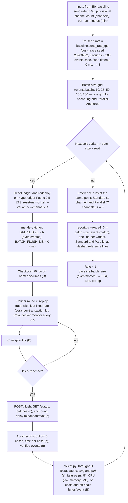
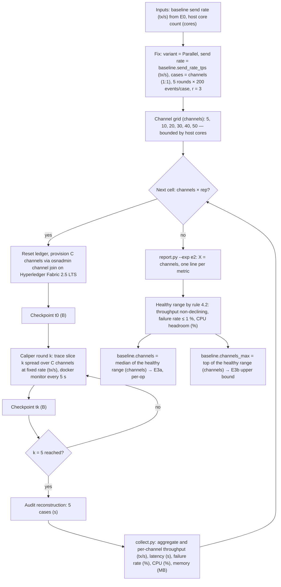
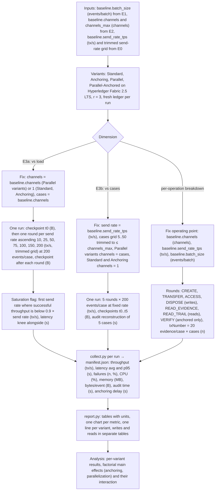

# GLEIPNIR — Experimental Methodology (E0–E3)

Paper-facing methodology layer for the M26 experimental redesign. Derived from the
supervisor brief of 2026-09-22 (`GLEIPNIR_Supervisor_Guidance_Consolidated_2026-09-22.md`
§5) and the binding build brief. Every constant named here lives in
`benchmark/sweeps.yaml` (single source of truth); every rule here is what
`orchestration/experiment.py`, `collect.py` and `report.py` implement. Values marked
`[PLACEHOLDER]` are filled from measured results; decisions marked **confirm with D**
are documented defaults (§8), not settled facts.

Terminology used throughout: *send rate* = the configured offered load (input);
*throughput* = committed transactions per second as measured (output); *TPS* / *tx/s*
is a unit only; *baseline* = the calibrated value carried forward (never "best");
*anchor channel* = the dedicated channel that receives Merkle roots in
Parallel-Anchored.

---

## 1. Experimental frame — a 2×2 factorial

| | Parallelization **off** (one shared channel) | Parallelization **on** (one channel per case) |
|---|---|---|
| Anchoring **off** (one transaction per event) | **Standard** | **Parallel** |
| Anchoring **on** (events batched off-chain, Merkle root on-chain) | **Anchoring** | **Parallel-Anchored** (per-case roots committed to the anchor channel by the anchor-client) |

Factor A = Anchoring {off, on}; Factor B = Parallelization {off, on}. The variant
changes *only how audit events reach the ledger*; chaincode interface, gateway API,
transaction trace and Caliper workload modules are identical across the four cells.
Results are reported per variant and, where the design allows, as factorial main
effects (anchoring, parallelization) and their interaction.

What the code enforces (a violation aborts the run):

| Constraint | Enforced by |
|---|---|
| Batch size is **identical** across the two A-on variants (one grid `batch_sizes`, one `baseline.batch_size`) | `experiment.py` reads a single key; merkle-batcher env `BATCH_SIZE` |
| Channel count is **identical** across the two B-on variants (`baseline.channels`) | `experiment.py` plan; `reset-network.sh --channels C` |
| Standard and Anchoring are **single-channel** (`channels = 1`, all cases route to the shared channel) | `experiment.py` forces `channels=1` for both |
| Same transaction sequence in every cell — only the channel routing key `case-NNN` differs | seeded trace `benchmark/trace/generate.js`; `trace.hash` in `run.json` |
| Anchor-client identity, MSP and endorsement policy constant across runs | `orchestration/up.sh`, CONTRACTS §2 |

---

## 2. Variables

### 2.1 Independent variables (swept)

| Variable | Unit | Levels (`sweeps.yaml` key) | Swept in | Fixed in |
|---|---|---|---|---|
| Architecture variant | — | Standard, Anchoring, Parallel, Parallel-Anchored | E3a, E3b, per-op breakdown | E1 (Anchoring, Parallel-Anchored, + Standard/Parallel reference runs); E2 (Parallel only) |
| Send rate (configured offered load) | tx/s | 10, 25, 50, 75, 100, 150, 200 (`send_rates_tps`; trimmed after E0) | E3a | E1, E2, E3b, per-op: `baseline.send_rate_tps` (sub-saturation, from E0) `[PLACEHOLDER 50]` |
| Channel count | channels | 5, 10, 20, 30, 40, 50 (`channel_counts`; bounded by host cores) | E2 (Parallel) | E3a, per-op: `baseline.channels` (E2 median) `[PLACEHOLDER 20]`; E1: E0 provisional value; Standard and Anchoring: always 1 |
| Case count | cases | 5, 10, 20, 30, 40, 50 (`case_counts`, trimmed to ≤ `baseline.channels_max`) | E3b | elsewhere `cases = channels` (1:1); the same case count for every variant in a cell |
| Batch size (N = K) | events/batch | 10, 25, 50, 100, 200 (`batch_sizes`, one grid for both anchored variants) | E1 | E3a, E3b, per-op: `baseline.batch_size` `[PLACEHOLDER 50]`; not applicable to Standard and Parallel |

### 2.2 Controlled variables (fixed and recorded in every `run.json`)

| Quantity | Value | Unit | Source of record |
|---|---|---|---|
| Workload mix | CREATE = 1 per evidence; remaining events TRANSFER 0.15 / ACCESS 0.85; DISPOSE ends 0.5 of evidence | fraction | `workload.mix` |
| PRNG seed and trace | seed 20260922, mulberry32; trace pre-generated and replayed identically in all variants | — | `seed`; `run.json trace.hash` + params |
| Evidence payload (synthetic Codex-Entry filler, hashed into `storage.integrity_proof`) | 256 | B | `workload.payload_bytes` |
| Evidence items per case | 20 | evidence/case | `workload.evidence_per_case` |
| Events per case per round | 200 | events/(case·round) | `workload.events_per_case_per_round` |
| Rounds per run | 5 (E1, E2, E3b); one round per send rate (E3a); one per operation (per-op) | rounds | `workload.rounds` |
| Steady-state floor | ≥ 1000 cumulative events per channel per run; a run below is labelled `sub-floor`, never `steady` (5 × 200 × 1 = 1000 at 1:1) | events/channel | `regimes.steady.min_events_per_channel` |
| Repetitions | r = 3; statistic = mean ± SD over repetitions | runs/cell | `repetitions` |
| Caliper workers | 4 | processes | `workers` |
| Block-cutting parameters | BatchTimeout 2 s; MaxMessageCount 10; AbsoluteMaxBytes 99 MB; PreferredMaxBytes 512 KB | s / messages / MB / KB | `network/configtx/configtx.yaml` (cited by commit SHA) |
| Endorsement policies | app channels `OR('Org1MSP.peer','Org2MSP.peer')`; anchor channel `AND('AnchorClientMSP.member')` | — | `orchestration/up.sh`, CONTRACTS §2 |
| Chaincode version | `1.0` (`CC_VERSION`; the git SHA pins the code) | — | `orchestration/lib.sh` |
| Anchor-client identity | enroll ID `anchorclient`, MSP `AnchorClientMSP`, client type | — | CONTRACTS §2 |
| Batcher flush policy | `BATCH_FLUSH_MS = 0` (size-only batching; partial batch flushed once at run end) | ms | `anchoring.flush_timeout_ms` |
| Resource-monitor interval | 5 | s | `monitor.interval_s` |
| Audit cases per run | 5 (first five data-cases of the trace) | cases | `workload.audit_cases` |
| Host | single machine; cores and memory recorded per run | cores / GB | `run.json provenance.host` |
| Software stack | Fabric 2.5.15; Caliper 0.6.0 (`fabric:fabric-gateway` binding); Node 20.19; Go 1.25.5; Fabric CA 1.5.19; GoLevelDB; two peer orgs; Raft (3 orderers); `@hyperledger/fabric-gateway` | — | `run.json provenance`, CLAUDE.md |
| Ledger state at t0 | fresh ledgers every run (`reset-network.sh`: teardown + redeploy between runs) | — | `run.json` |

### 2.3 Dependent variables (measured)

| Metric | Unit | Instrument | Notes |
|---|---|---|---|
| Throughput | TPS (tx/s) | Caliper round summary (`### All test results ###`), recomputed **successful-only** by `collect.py` (Caliper issue #1418: reported value uses Succ + Fail) | per-channel (derived) and aggregate for Parallel variants |
| Latency avg (min–max) | s | Caliper round summary | submit → commit for on-chain writes; see §7 for anchored variants |
| Latency p95 (also p50, p99) | s | per-transaction JSONL (`tx-w*.jsonl`) written by the workloads from Caliper `TxStatus` timestamps | |
| Success count / failure count / failure rate | n / n / % | Caliper round summary (Succ/Fail) + per-transaction log for failure classes (`MVCC_READ_CONFLICT`, `ENDORSEMENT_POLICY_FAILURE`, `TIMEOUT`, `HTTP_4XX`, `HTTP_5XX`, `OTHER`) | |
| CPU utilisation | % | Caliper docker resource monitor, 5 s samples (`### docker resource stats ###`) | per container; groups `fabric`, `offchain`, `all` (sum of averages) |
| Memory | MB | same | avg and max |
| On-chain storage per event | B/event | `du` at checkpoints t0..tN on named Docker volumes (`checkpoint.py`) → OLS slope over ≥ 3 points (`collect.py`), t0→tN delta as cross-check | app-channel block stores + anchor channel + GoLevelDB state per peer |
| Off-chain storage per event | B/event | same checkpoints on the receipt-store volume | receipts + event copies; reported **alongside** on-chain bytes, never netted |
| Audit reconstruction time | s/case | `benchmark/audit/reconstruct.js` via the gateway, `process.hrtime.bigint()` | Standard/Parallel: fetch trails; anchored: fetch events → recompute Merkle branches → verify roots (one root read per batch); mean/SD/min/max over 5 cases |
| Anchoring delay | s | merkle-batcher batch-record timestamps (`committedAt − enqueue`), collected through `/status` → `anchoring.json` | min/mean/max, weighted by leaf count; forced (end-of-run) batches excluded |

Storage compression is reported as the reduction in on-chain **log-payload** bytes per
event versus Standard, with off-chain bytes shown next to it — never as 1/N of total
ledger size.

---

## 3. Experiments

### E0 — Pilot (functional only; never reported as performance)

| Item | Value |
|---|---|
| Purpose | validate the harness on every variant and operation; locate approximate saturation; measure per-run wall time for the budget |
| Part 1 — smoke | 4 variants × 1 rep; 10 cases × 2 evidence, 10–25 logs per case, 5 tx/s; per-operation rounds + `verify` (anchored) + audit reconstruction; artifacts labelled `smoke` under `results/e0/` |
| Part 2 — ramp | 4 variants × 1 rep; one round per send rate over the full `send_rates_tps` grid at 40 events/(case·round); prints throughput vs send rate |
| Outputs | `baseline.send_rate_tps` (sub-saturation); trimmed `send_rates_tps`; provisional `baseline.channels` below the core limit; per-run minutes |

### E1 — Batch-size calibration

| Item | Value |
|---|---|
| Variants | Anchoring (1 channel), Parallel-Anchored (`baseline.channels`, provisional E0 value) |
| Swept | batch size ∈ {10, 25, 50, 100, 200} events/batch, one grid for both variants |
| Fixed | send rate = `baseline.send_rate_tps`; 5 rounds × 200 events/case; cases = `baseline.channels` for every variant; flush timeout 0 ms; r = 3 |
| Reference | Standard (1 channel) and Parallel (`baseline.channels`) × 3 reps at the same point (`levels.reference: true`) — horizontal reference lines in the charts |
| Dependent variables | throughput; latency; on-chain and off-chain bytes/event; audit reconstruction time; anchoring delay |
| Output | `baseline.batch_size` by rule §4.1 → E3a, E3b, per-op |

### E2 — Channel-count calibration

| Item | Value |
|---|---|
| Variant | Parallel only |
| Swept | channels ∈ {5, 10, 20, 30, 40, 50}, `cases = channels` (1:1) |
| Fixed | send rate = `baseline.send_rate_tps`; 5 rounds × 200 events/case; r = 3 |
| Dependent variables | aggregate and per-channel throughput; latency; failure rate; CPU; memory |
| Outputs | healthy range by rule §4.2; `baseline.channels` = **median** of the range → E3a, per-op; `baseline.channels_max` = top of the range → E3b upper bound |

Constraint: the Fabric 2.5 performance guidance asks for one CPU core per channel
under full load; Caliper drives every channel simultaneously, so the host core count
bounds the fully loaded channel count and thereby the grid.

### E3a — Scalability vs load

| Item | Value |
|---|---|
| Variants | all four; batch = `baseline.batch_size` (anchored) |
| Swept | send rate over the trimmed `send_rates_tps` grid — **one round per level, ascending**, within a single network lifetime per (variant, rep) |
| Fixed | channels = `baseline.channels` (Parallel variants) or 1 (Standard, Anchoring); cases = `baseline.channels` in every variant; 200 events/(case·round); r = 3 |
| Dependent variables | all of §2.3; saturation flagged by rule §4.3 with the latency knee shown alongside |
| Steady floor | 7 rounds × 200 = 1400 events/channel at 1:1 ≥ 1000 ✓ |

### E3b — Scalability vs cases

| Item | Value |
|---|---|
| Variants | all four (for Standard and Anchoring this is a data-scaling sweep on one channel) |
| Swept | cases ∈ `case_counts` trimmed to ≤ `baseline.channels_max`; Parallel variants `channels = cases`; Standard/Anchoring `channels = 1` |
| Fixed | send rate = `baseline.send_rate_tps`; batch = `baseline.batch_size`; 5 rounds × 200 events/case; r = 3 |
| Dependent variables | all of §2.3 |
| Reads off | the case count at which Parallel starts to lose to Standard |

### Per-operation breakdown (one operating point)

| Item | Value |
|---|---|
| Variants | all four, r = 3 |
| Operating point | channels = `baseline.channels`; send rate = `baseline.send_rate_tps`; batch = `baseline.batch_size` |
| Rounds (writes) | `create`, `transfer`, `access`, `dispose` — one operation type per round; `txNumber` = 20 evidence/case × cases (seeded pool) |
| Rounds (reads) | `read-evidence` (`ReadEvidence`), `read-trail` (`GetAuditTrail`); plus `verify-event` (`VerifyEvent`) for anchored variants only |
| Output | **two tables**: writes and reads, reported separately (reads cut no block; read latency ≠ transaction latency) |

Transaction type is a *workload-mix parameter* in E1–E3 and a *breakdown dimension*
here — it is not an independent variable crossed with the sweeps.

### What feeds what

| Produced by | Consumed by | As |
|---|---|---|
| E0 ramp | E1, E2, E3b, per-op | `baseline.send_rate_tps` (tx/s) |
| E0 ramp | E3a | trimmed `send_rates_tps` (tx/s) |
| E0 | E1 | provisional `baseline.channels` (channels) |
| E0 | §5 run budget | minutes per run |
| E1 | E3a, E3b, per-op | `baseline.batch_size` (events/batch) |
| E2 | E3a, per-op | `baseline.channels` (channels, median) |
| E2 | E3b | `baseline.channels_max` (channels, trims `case_counts`) |

---

## 4. Level-selection rules ("baseline" wording)

4.1 **Batch size.** The baseline batch size is the *smallest* grid level at which
both mean throughput and mean on-chain bytes/event have plateaued — the change to the
next grid level is ≤ 5 % relative — while mean audit reconstruction time per case stays
within the stated bound of ≤ 1.5 × its value at the smallest grid level. Both anchored
variants must satisfy the rule at the same level; if they disagree, the larger of the
two qualifying levels is taken and the disagreement is reported. Thresholds: confirm
with D.

4.2 **Channel count.** A grid level is *healthy* when (a) mean aggregate throughput is
≥ 0.95 × that of the previous grid level (non-declining), (b) mean failure rate ≤ 1 %,
and (c) the summed average CPU of all containers ≤ 0.9 × cores × 100 %. The healthy
range is the longest contiguous run of healthy levels starting from the lowest level.
`baseline.channels` = the **median grid level** of that range (lower-middle for an
even count); it is never the maximum. `baseline.channels_max` = the top of the range.
Thresholds: confirm with D.

4.3 **Send rate.** Saturation = the first send rate at which successful throughput
< 0.9 × the configured send rate (`report.py` flags it; the latency knee is shown
alongside). The grid must **bracket** saturation: after E0 it is trimmed to keep at
least two levels below and one level above the saturation point. `baseline.send_rate_tps`
is a sub-saturation level from the same ramp: per variant, the highest healthy rate at or below
½ × its saturation point (else its highest healthy rate), and the baseline is the MINIMUM of the
four variants' values, because E1, E2 and E3b run every variant at that one rate (`report.py`
`ramp_suggestion` / `suggest_send_rate`; the desktop app suggests it, the authors confirm it).
Margin, minimum-over-variants reading and thresholds: confirm with D.

4.4 **Cases.** Cases are data, channels are infrastructure — and on Parallel and
Parallel-Anchored there is **one channel per case** (authors' decision, 24 Sep 2026): data-case
c (1-based) routes to channel `case-NNN` with NNN = c, so the case count IS the channel count
there. The single-channel variants route every case to the shared channel. The set case count
is `baseline.channels` in `sweeps.yaml` (the E2 median); the E2/E3b grids and the ad-hoc
`experiment.py --exp cell --cases N` change it. The case count is the same for every variant
within a cell.

---

## 5. Run budget (r = 3; one run = one network lifetime)

| Experiment | Formula | Runs | Rounds/run | Minutes/run | Machine-hours |
|---|---|---|---|---|---|
| E0 smoke | 4 variants × 1 rep | 4 | per-op + verify + audit | `<measured after E0>` | `<measured after E0>` |
| E0 ramp | 4 variants × 1 rep | 4 | 7 (one per send rate) | `<measured after E0>` | `<measured after E0>` |
| E1 | 2 variants × 5 batch sizes × 3 + 2 reference × 3 | **36** | 5 | `<measured after E0>` | `<measured after E0>` |
| E2 | 1 variant × 6 channel counts × 3 | **18** | 5 | `<measured after E0>` | `<measured after E0>` |
| E3a | 4 variants × 3 | **12** | 7 (one per send rate) | `<measured after E0>` | `<measured after E0>` |
| E3b | 4 variants × ≤ 6 case counts × 3 | **≤ 72** | 5 | `<measured after E0>` | `<measured after E0>` |
| Per-op | 4 variants × 3 | **12** | 6 (7 anchored) | `<measured after E0>` | `<measured after E0>` |
| **Total** | | **≤ 150** (+ 8 pilot) | | | `<measured after E0>` |

The fully crossed design D warned about (4 × 6 × 5 × 4 × 5 ≈ 2,400 runs) is replaced by
the calibrate-then-sweep sequence above. `experiment.py --dry-run` prints the plan and
an ETA from `results/runlog.jsonl` medians once E0 has run; `--resume` skips complete
runs.

---

## 6. Flowcharts

### E1 — Batch-size calibration

### E2 — Channel-count calibration

### E3 — Scalability (vs load, vs cases) and per-operation breakdown

---

## 7. Threats to validity

| Threat | Effect | Mitigation / how it is reported |
|---|---|---|
| Single host; channel count bounded by CPU cores | Parallel variants cannot be scaled past the core count without measuring host exhaustion instead of the design | E2 sweep stops at the healthy range; E3b never exceeds `baseline.channels_max`; cores recorded per run |
| GoLevelDB world state | no rich-query overhead is present; results do not transfer to CouchDB deployments | stated as scope; key-value access only by design |
| Calibration-dependent fixed values | E3 results are conditional on `baseline.*` chosen by rules §4; E1's batch size was calibrated at the E0 provisional channel count, not the E2 median | rules and thresholds stated up front; all baselines and the runs that produced them are reported (E1, E2 are experiments, not tuning) |
| Off-chain witness integrity assumption | the receipt store (receipts + event copies) is deliberately un-hardened; its availability, not the ledger's integrity, is the exposure | measured and stated as a property of the design; no hash chains, replication or signatures are added |
| Anchored-variant write latency is **enqueue latency** on the gateway (BFF) path | Caliper's submit → response time for Anchoring / Parallel-Anchored writes ends when the event is accepted by the batcher, not when its root is committed | **anchoring delay** (enqueue → root committed, from batcher timestamps) is reported beside latency and covers the commit lag; the two are never summed silently |
| Caliper throughput numerator (issue #1418) | Caliper's reported throughput counts Succ + Fail | `collect.py` recomputes successful-only throughput (Succ / window) and records the policy string in every manifest |
| Synthetic workload and trace | fixed proportions and payload sizes may not match real casework | trace parameters and hash are recorded; mix is a documented controlled variable |
| Repetitions r = 3 | small samples; SD is indicative, not inferential | mean ± SD reported; no significance claims beyond the visible spread |

---

## 8. Defaults to confirm with D

Each row is a decision taken by the build brief on an open question in the supervisor
spec (§6). Implemented and labelled as defaults; D confirms or overrides.

| # | Default | Rationale |
|---|---|---|
| 1 | Batch grid `{10, 25, 50, 100, 200}`, **one grid for N and K** | one grid keeps the two anchored cells comparable in the factorial frame; the chat grid stands until the pilot says otherwise |
| 2 | Channel calibration on Parallel only; Parallel-Anchored inherits; Standard and Anchoring forced to 1 channel | anchoring is the A factor, channels the B factor — mixing them would confound the calibration |
| 3 | One channel per case on the parallel variants (authors, 24 Sep 2026); data-case c → `case-NNN`, NNN = c; one case-count knob | keeps the paper's per-case channel model; a separate channel knob would let infrastructure and data drift apart |
| 4 | Send-rate grid `{10, 25, 50, 75, 100, 150, 200}`; saturation = first rate with successful throughput < 0.9 × send rate; latency knee alongside | a numeric rule is reproducible; the grid brackets saturation on a laptop-class host and is trimmed after E0 |
| 5 | r = 3; mean ± SD | keeps the budget ≤ 150 runs; SD conveys spread without over-claiming |
| 6 | Per-operation breakdown at one point: `baseline.channels` × `baseline.send_rate_tps` × `baseline.batch_size` | the call's "one point" reading; crossing operations with sweeps re-creates the run explosion |
| 7 | **AccessLog is a WRITE** custody event; reads = `ReadEvidence`, `GetAuditTrail` (+ `VerifyEvent` for anchored) in a separate reads table | in GLEIPNIR viewing evidence creates a custody record (ISO/IEC 27037 access logging); this **contradicts D's 10 Sep assumption** that AccessLog is read-only — D must be informed |
| 8 | p95 implemented from per-transaction JSONL written by the workloads from Caliper `TxStatus` timestamps | no custom TxObserver needed; the log is off the timed path and also yields failure classes |
| 9 | Audit reconstruction per case: fetch every trail, verify every Merkle branch, read each distinct root once (cached per scope + batch); anchoring delay is a separate metric | matches "fetch → recompute → verify"; caching roots reflects how a verifier would work; delay answers N's "window time" question independently |
| 10 | Storage = per-channel block store (app + anchor channel) + GoLevelDB state per peer + receipt store (off-chain, incl. event bodies); checkpoints at t0 and after every round; bytes/event = OLS slope (≥ 3 points) with t0→tN delta cross-check | regression absorbs block-cutting granularity; the delta guards against a misfit |
| 11 | E3b run for all four variants (data-scaling sweep for Standard and Anchoring) | keeps the 2×2 frame complete on the cases axis; the single-channel cells are the comparison Parallel is measured against |
| 12 | `run.json` records cores/memory; hardware line in the paper optional | reproducibility evidence at zero cost; D said the paper line is optional |

Two further notes for D:

- **AccessLog is a write.** D's 10 Sep review assumed it was read-only; in GLEIPNIR
  each access is a custody event written under the `(evidenceId, monotonicCounter)`
  sub-key. Genuinely read-only operations are benchmarked and tabulated separately.
- **The paper's N and K grids are unified.** The earlier N ∈ {10, 50, 100, 250} and
  K ∈ {5, 10, 25, 50} are replaced by the single grid in row 1; Bab 3 and Table 3
  must be updated to match.
